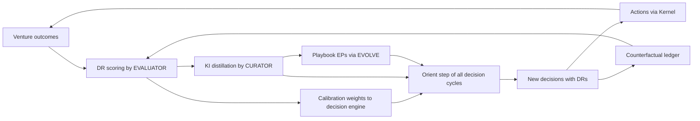
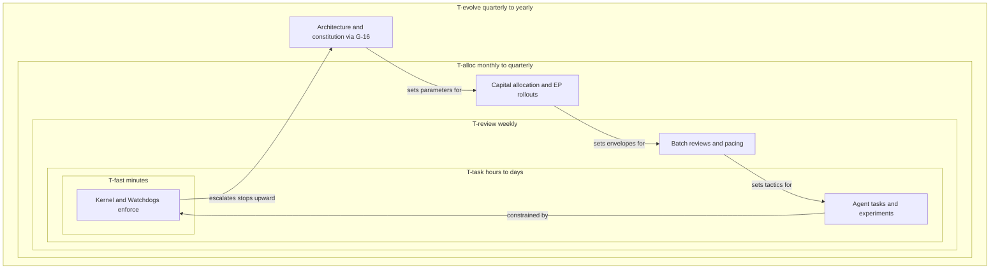
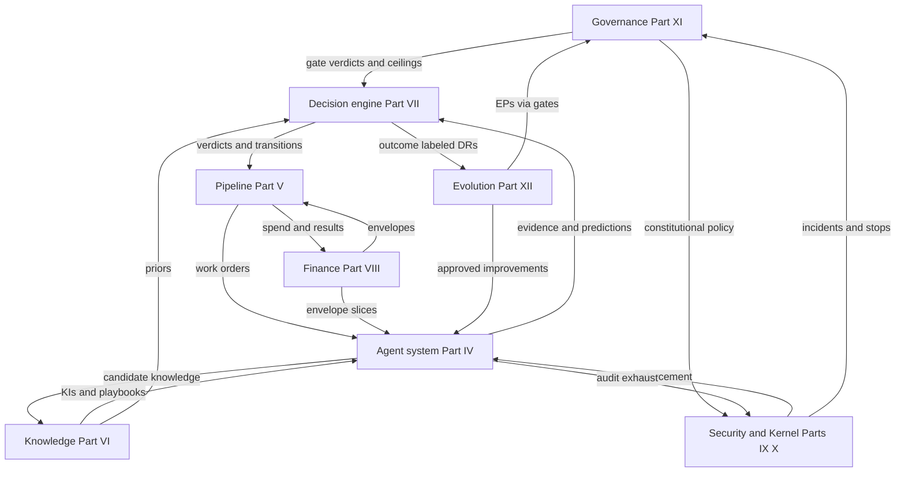

# EvolveOS Specification — Part II: System Thinking

**Status:** Draft v0.1 · **Change class:** R3 (standard amendment process, Part XII)

This part models EvolveOS as what it actually is: a **multi-rate control system** wrapped around a portfolio of ventures, embedded in markets it cannot control, improving its own controllers over time. Parts III–XII specify the components; this part specifies how they close into loops, why the loops are stable, and where they would become unstable if the specified damping were removed. Every loop below names its signal, sensor, controller, and actuator using canonical agent IDs (Appendix B), gates (Appendix C), and the R/A taxonomies (Part 0 §5–§6).

**Why model it this way.** A venture factory is not a pipeline that runs once; it is a set of feedback loops that run forever. Systems of feedback loops fail in characteristic ways — runaway positive feedback, oscillation from delayed signals, controllers fighting each other across timescales, sensors being gamed. Naming the loops explicitly is what lets Part XIII register their failure modes and lets Part XII improve them without destabilizing them.

---

## 1. System boundary: inputs and outputs

### 1.1 Inputs

| Input | Nature | Enters through | Rate / cadence | Control notes |
|---|---|---|---|---|
| **Market signals** | Filings, forums, job posts, search trends, tech releases, competitor moves | `SCOUT`, `TRENDS`, `COMP-INTEL`, `REG-WATCH` continuous scanning → G-01 intake | Continuous; high volume, low individual value | The system's primary *reference input*: what the pipeline searches over. Noisy by design; filtering is the pipeline's job, not the sensor's |
| **Capital** | Committed funds, venture cash flows recycled | IC decisions at funding gates (G-07, G-08); treasury operations (`TREASURER`, Part VIII) | Lumpy (tranches) + continuous (revenue) | Capital is the *energy supply*; every internal loop is ultimately bounded by an envelope derived from it (Part VIII owns envelopes) |
| **Human judgment** | Gate approvals, vetoes, quorum decisions, strategic direction | All R3/R4 gates; batched A2 reviews; Board/committee sessions (Part XI) | Weekly batches + per-gate SLAs (Appendix C) | Scarcest input. §6 explains why it is positioned only at slow-loop boundaries; saturating it is a named stability risk (§8, SR-4) |
| **Compute and models** | Inference capacity, model versions, eval infrastructure | `AI-DIR` routing and procurement; `INFRA-DIR` capacity | Continuous, elastic | Priced into every loop's operating cost; model-version changes are *parameter changes to controllers* and therefore route through Part XII, never silently |
| **Talent** | Human officers, gate approvers, specialists, venture hires | `RECRUITER` sourcing → G-09 (human offers) | Slow (weeks–months) | Humans are never actuators inside fast loops; they are controllers of slow loops and approvers at gates |
| **Regulation** | Law, license conditions, regulator communications | `REG-WATCH` monitoring → `COMPL-DIR` → affected ventures | Slow but discontinuous (step changes) | Treated as an exogenous *constraint schedule*, not a negotiable signal; step changes can force R4 decisions (G-11, G-15) |

### 1.2 Outputs

| Output | Nature | Leaves through | Feedback it generates |
|---|---|---|---|
| **Ventures and their products** | Live businesses in cells serving customers | G-06 launches; G-07 entities; G-12/G-14 transactions | Market response loop (§3.1) |
| **Cash flows** | Revenue, expenses, distributions, exit proceeds | Ledger (`LEDGER`) and treasury (Part VIII) | Budget loop (§2, L-1) and capital input recycling |
| **Knowledge items and playbooks** | Validated, versioned learning (Part VI) | `CURATOR`-validated KI store; playbook library | Learning cycle (§5); the only output that also permanently upgrades the system itself |
| **Decision records + counterfactual ledger** | Outcome-labeled decision dataset (Part VII) | Immutable DR store | Calibration scoring (§5); MOAT-2 of Part I (`01-philosophy.md`) |
| **Retired experiments and ventures** | Kills, wind-downs, post-mortems | G-03 kills through G-15 shutdowns | Post-mortem KIs; freed envelope capacity returned to the portfolio |
| **Public communications** | Launch announcements, brand, PR | G-17 only | Competitive and regulatory response loops (§3.3, §3.4) — public outputs are gated precisely because they arm external loops |

## 2. Internal feedback loops

Each internal loop is specified as signal → sensor → controller → actuator, with its period and its known instability mode. **Why this decomposition:** a loop whose four roles are not separately named cannot be audited (who measured? who decided? who acted?), and its instability cannot be assigned an owner in Part XIII.

| ID | Loop | Signal | Sensor | Controller | Actuator | Period | Instability mode |
|---|---|---|---|---|---|---|---|
| L-1 | **Budget control** | Spend vs. envelope, burn vs. plan | `LEDGER` (actuals), `FPA` (variance) | `FIN-DIR` within policy; Kernel enforces hard bounds | Envelope throttle; automatic A→A1 queueing at bound (Appendix C mechanic 3); reallocation proposals to G-08 | Continuous enforcement; weekly variance review | Delayed spend recognition → overshoot then overcorrection (see SR-2). Damping: Kernel enforces on *committed* spend, not booked spend |
| L-2 | **Delivery quality** | Defect escape rate, SLO burn, release health | `QA` (pre-release), `SRE` (production) | `ENG-DIR` per venture; `RELEASE` policy | Progressive rollout, automatic rollback, `W-CODE` fix tasks | Minutes (rollback) to per-release | Rollback flapping when health signals are noisy. Damping: hysteresis — re-promotion after rollback requires a higher evidence bar than initial release |
| L-3 | **Agent performance** | Calibration scores, benchmark drift, task acceptance rates | `EVALUATOR` (continuous scoring vs. outcomes) | `AI-DIR`; escalation to `EVOLVE` for structural fixes | Consensus-weight adjustment (Part VII); `PROMPT-SMITH` EPs; agent retraining/retirement (Part XII) | Weekly scoring; quarterly structural review | Overfitting to the benchmark (Goodhart, SR-3). Damping: held-out evals, shadow baselines, benchmark rotation owned by Part XII |
| L-4 | **Pipeline flow** | Stage conversion rates, WIP per stage, gate queue depth | `INSIGHT` dashboards; `PORTFOLIO` stage telemetry | `PORTFOLIO` (A2) | Intake throttle at G-01/G-02; stage envelope pacing; kill-review scheduling | Weekly | Bullwhip: over-throttling intake on a temporary downstream clog, starving the funnel two quarters later. Damping: throttle on trailing-4-week WIP, not instantaneous queue depth |
| L-5 | **Risk limits** | Exposure vs. limits, anomaly scores, fraud signals | `RISK-QUANT` (quantitative), `FRAUD-WATCH` (transactions), Watchdogs (behavioral) | `RISK-DIR` (A3 monitoring; A0 on limit changes — limits are changed by humans) | Automatic holds (`FRAUD-WATCH`); envelope freezes; G-00 escalation | Continuous | Alert fatigue → threshold creep → missed true positives. Damping: alert-precision SLO on the sensors themselves; threshold changes are logged limit changes, never silent tuning |
| L-6 | **Knowledge quality** | Retrieval precision, KI contradiction rate, staleness, citation rate | `CURATOR` (validation, dedup, contradiction detection) | `KNOW-DIR` | Expiry, merge, quarantine of KIs; re-validation tasks to `W-RESEARCH` | Weekly review; continuous contradiction detection | Contamination runaway: a wrong KI cited by DRs that generate KIs citing it (SR-1c). Damping: provenance chains — quarantining a KI auto-flags every downstream DR/KI |
| L-7 | **Cash and treasury** | Runway, concentration, counterparty exposure | `TREASURER` (positions), `FPA` (forecast) | `FIN-DIR` + CFO (human); IC for allocation | Sweep proposals (A1 — movements are R3+), tranche release via G-08 | Weekly positioning; monthly forecast | Pro-cyclical squeeze: cutting experiment budgets on a short revenue dip, gutting the option pipeline that funds recovery. Damping: experiment budget floor set at IC cadence, not operational cadence (Part VIII) |
| L-8 | **Support and customer health** | Ticket volume/severity, CSAT, health scores | `SUPPORT`, `ONBOARD` telemetry | `CS-DIR` per venture | Playbook interventions, escalations, voice-of-customer KIs into L-6 | Hours (tickets) to weekly (health) | Palliative loop: support absorbing a product defect signal that should be escalating to L-2. Damping: recurring-cause detection MUST auto-file to `ENG-DIR` above a recurrence threshold (Part V SLA) |

**Cross-loop rule.** A loop's actuator MUST NOT modify another loop's setpoints or sensor thresholds directly; cross-loop influence flows only through the shared artifacts (envelopes, DRs, gates) at the slower loop's cadence. *Why:* two loops silently tuning each other's parameters is the textbook construction of an oscillator (§6).

## 3. External feedback loops

External loops close through the world. Their defining property is **long, variable, unobservable delay** — which is why their controllers MUST be slow-cadence (see §6) and why acting on them at fast-loop speed is a named instability (SR-2).

### 3.1 Market response
Signal: unit economics of live ventures — CAC, conversion, churn, payback. Sensor: `UNIT-ECON`, `INSIGHT` cohort analysis. Controller: `GROWTH-DIR` within envelope; `VENTURE-ORCH` for tactic changes; `PORTFOLIO`/IC for capital response at G-08/G-15. Actuator: channel budget shifts (within envelope, A2), pricing proposals (`PRICER`, A1 — live price changes are R3), scale/kill decisions. Delay: weeks to quarters (cohorts must mature). **Binding rule:** scale decisions MUST use cohort-mature data; spot metrics may only *shrink* spend, never expand it — expansion on immature data is how the loop goes unstable.

### 3.2 Customer feedback
Signal: feature demand, complaints, usage patterns, interviews. Sensor: `SUPPORT`, `CUST-DISC`, `ONBOARD`, product telemetry via `INSIGHT`. Controller: `PROD-DIR` per venture. Actuator: roadmap changes, spec revisions to `BUILDER`. Delay: days to months. Instability: whipsawing the roadmap on vocal-minority feedback; damping is aggregation discipline (`CUST-DISC` insight extraction weights by segment evidence, Part V methodology).

### 3.3 Competitive response
Signal: competitor launches, pricing moves, positioning shifts — *partly caused by EvolveOS's own public outputs*. Sensor: `COMP-INTEL`. Controller: `STRAT-DIR`; `PRIME` for cross-portfolio posture. Actuator: positioning updates (`MKT-DIR`), thesis revisions, occasionally accelerated or cancelled launches via `PORTFOLIO`. Delay: weeks to quarters. Note: this loop is *adversarial* — the counterparty adapts strategically. G-17 gating of public outputs exists partly to keep this loop's input under deliberate control.

### 3.4 Regulatory response
Signal: rule changes, inquiries, license conditions — increasingly, responses to autonomous-business operation itself. Sensor: `REG-WATCH`. Controller: `COMPL-DIR` under GC (A1 — deliberately low autonomy; regulatory interpretation is not delegated). Actuator: compliance plans, feature/market changes, G-11 jurisdiction decisions, G-18 data-use decisions. Delay: months to years, with discontinuous step changes. **Why lowest autonomy of all loops:** the cost of a wrong regulatory move is R4-class and the signal is interpretive, not statistical — the two conditions under which the matrix (Part 0 §6) demands humans.

## 4. Decision cycles — the OODA middle layer

Every non-trivial action in EvolveOS runs one canonical decision cycle, specified fully in Part VII (`07-decision-engine.md`); this section fixes its systemic role.

- **Observe.** Sensors (§2, §3) write typed telemetry and evidence to the event bus and evidence packs. No controller consumes raw world-data directly; everything is provenance-carrying (Part VI).
- **Orient.** Retrieval against the knowledge base (KIs, playbooks, prior DRs including counterfactuals); scoring and uncertainty quantification by the decision engine; `RISK-QUANT` simulation for R2+ decisions.
- **Decide.** Classify reversibility (R1–R4) → determine the deciding authority from the autonomy–reversibility matrix → either act within envelope, or queue at the owning gate (G-01 – G-18). Emit a DR for every R2+ decision.
- **Act.** Actuators execute **through the Kernel only** — every tool call passes policy enforcement and audit logging. Outcomes become observations, closing the cycle.

**Why OODA rather than plan-execute:** the portfolio's environment changes faster than any plan's horizon; a loop that re-orients on every pass degrades gracefully under surprise, while a plan-executor degrades catastrophically. The decision cycle is the *unit of clock speed* for the whole system: L-1 – L-8 are decision cycles running at different periods over different signals.

## 5. Learning cycles

The learning cycle converts operating exhaust into permanent capability. It is the mechanism behind Part I metrics M-1/M-7 and moats MOAT-1/2/4.

1. **Outcome capture.** Every DR carries predictions with horizons (Part I, P-7). When horizons expire, observed outcomes are attached — including for rejected options via the counterfactual ledger where observable.
2. **Decision-record scoring.** `EVALUATOR` computes calibration deltas per agent and per playbook; the decision engine updates consensus weights (Part VII).
3. **Knowledge distillation.** `CURATOR` extracts candidate KIs from scored DRs, post-mortems, and experiment readouts; validates against existing KIs (contradiction detection); assigns confidence, scope, expiry.
4. **Playbook update.** Recurring successful procedures are promoted into playbooks or amended in existing ones — as evolution proposals (EPs) with benchmark evidence, per Part XII discipline, because a playbook change alters future behavior system-wide.
5. **Redeployment.** Updated weights, KIs, and playbooks flow back into the Orient step of every decision cycle (§4).

**Why the loop routes through validation twice** (`EVALUATOR` scoring, then `CURATOR` validation): a learning loop with a single quality check learns its own mistakes at compound interest. Scoring establishes *what happened*; curation establishes *what it means and where it applies*. Collapsing them is prohibited.

## 6. Nested timescales — the stability architecture

EvolveOS runs loops at five separated timescales. **The separation is deliberate and binding, not incidental.**

| Tier | Period | Loops / processes | Parameters it may change | Parameters it MUST NOT change |
|---|---|---|---|---|
| T-fast | Milliseconds–minutes | Kernel enforcement, Watchdogs, `FRAUD-WATCH` holds, `SRE`/`RELEASE` rollbacks | Nothing durable — only action execution and halts | Anything. Fast tier *applies* policy, never edits it |
| T-task | Hours–days | Agent task execution (T4 workers), support (L-8), builds, experiments | Task-local state; R1 artifacts | Envelopes, thresholds, playbooks, prompts |
| T-review | Weekly | Batch gate reviews (G-03, G-04 per Appendix C mechanic 4), L-1/L-3 – L-8 reviews, envelope pacing | Tactic selection within envelopes; WIP pacing; consensus weights (per Part VII rules) | Envelope sizes, kill criteria (frozen at registration), agent rosters |
| T-alloc | Monthly–quarterly | IC capital allocation (G-08), learning-rate measurement (M-1), playbook/EP rollouts (Part XII), limit reviews | Envelopes (via gates), playbooks (via EPs), agent rosters, risk limits (human, via `RISK-DIR` A0 path) | Constitutional Layer, autonomy ceilings |
| T-evolve | Quarterly–yearly | Architecture and org evolution (Part XII, `12-self-evolution.md`), constitutional amendments (G-16), threshold re-ratification (Appendix C), strategy revision, Part XIV roadmap updates | Everything above, through their owning gates | Nothing exempt — but every change at this tier is R3/R4 gated |

**Why separation of timescales prevents instability.** This is standard multi-rate control doctrine, and it is the reason the table's "MUST NOT change" column exists:

1. **Fast loops treat slow-loop parameters as constants.** A fast loop is stable *given* its setpoints. If a fast loop can modify its own setpoints (an agent enlarging its envelope, a sensor tuning its own alert threshold), the setpoint becomes part of the fast dynamics and the stability analysis is void — this is exactly how A-6 of Part I (`01-philosophy.md`) manifests as an engineering rule, not just an alignment rule.
2. **Slow loops see time-averaged fast behavior.** Weekly reviews act on trailing aggregates, so fast-loop noise is filtered before it can drive slow decisions. Reacting at slow cadence to fast noise is how organizations whipsaw (SR-2).
3. **Comparable-rate coupled loops oscillate.** Two controllers adjusting the same quantity at similar periods with delays produce hunting behavior. EvolveOS avoids shared control by ownership rules (Part 0 §9: every number owned by exactly one part; every loop's actuator set is disjoint) and by frequency separation of roughly an order of magnitude between adjacent tiers **[ASSUMPTION]** — an order of magnitude is the conventional engineering margin for treating an outer loop as quasi-static relative to an inner one; tighter spacing would require explicit coupled-stability analysis per pair, which is unjustifiable complexity at this stage.
4. **The stop path is exempt from tier discipline in one direction only.** G-00 lets any tier halt any faster tier immediately (stop asymmetry); no tier may *start* or *speed up* anything except through owning gates. Halting is stabilizing; starting is not.

## 7. Subsystem interaction matrix

Subsystems (with owning parts): **PIPE** = venture pipeline (Part V); **AGT** = agent system (Part IV); **KNOW** = knowledge system (Part VI); **DEC** = decision engine (Part VII); **FIN** = finance (Part VIII); **SEC** = security incl. Kernel enforcement (Parts IX/X); **GOV** = governance (Part XI); **EVO** = evolution (Part XII).

Channels: **TC** = task contracts; **BUS** = Kernel event bus (telemetry, typed events); **DRS** = decision-record store; **KB** = knowledge base API; **LGR** = ledger; **GQ** = gate queue; **AUD** = audit log. All channels are Kernel-mediated and audit-logged (Part IX/X).

Cell = what the **row** subsystem sends to the **column** subsystem (channel in caps). ● = internal.

| from \ to | PIPE | AGT | KNOW | DEC | FIN | SEC | GOV | EVO |
|---|---|---|---|---|---|---|---|---|
| **PIPE** | ● | stage work orders TC | stage artifacts, post-mortems KB | gate submissions, evidence GQ/DRS | stage spend requests, forecasts BUS | venture cell events BUS | R3/R4 gate items GQ | pipeline telemetry BUS |
| **AGT** | stage execution results BUS | ● | candidate KIs, retrieval queries KB | option analyses, predictions DRS | spend events, commitments LGR | all tool calls via Kernel AUD | escalations, exception queue GQ | behavior telemetry, calibration data BUS |
| **KNOW** | playbooks for stages KB | retrieval results, KIs KB | ● | prior DRs, KIs for Orient KB | cost/benchmark KIs KB | data-classification labels BUS | audit-ready provenance AUD | KI quality metrics, contradiction reports BUS |
| **DEC** | verdicts, stage transitions GQ | consensus weights, task priorities TC | scored DRs, counterfactuals KB | ● | approved envelope draws BUS | anomalous-decision flags BUS | DRs for human gates GQ | decision-quality dataset DRS |
| **FIN** | envelope grants and freezes BUS | budget envelope slices BUS | unit-economics KIs KB | financial scores, runway inputs DRS | ● | payment anomalies to watch BUS | financial reports, limits GQ | cost curves for EP benchmarks BUS |
| **SEC** | cell isolation, launch security checks BUS | identity, permissions, rate limits — enforced | integrity attestation of stores AUD | tamper-evidence for DRs AUD | transaction holds BUS | ● | incident reports, G-00 invocations GQ | red-team findings as EP inputs BUS |
| **GOV** | gate verdicts, kill orders GQ | autonomy ceilings via G-16 | retention/disposition policy BUS | approval decisions, vetoes GQ | capital authorizations GQ | constitutional policy content BUS | ● | G-16 rulings on EPs GQ |
| **EVO** | pipeline process EPs GQ | agent/prompt updates post-approval TC | playbook updates via EPs KB | scoring-methodology EPs GQ | efficiency EPs GQ | (proposals only — never touches enforcement directly) GQ | constitutional EPs to G-16 GQ | ● |

**Load-bearing asymmetries in this matrix** (deliberate, binding):

- **SEC → AGT is enforcement, not messaging.** Security/Kernel does not *ask* agents; it constrains them. There is no channel by which AGT configures SEC — the reverse edge (AGT → SEC) is only the audit exhaust of tool calls. This is P-10 of Part I as wiring.
- **EVO reaches every subsystem only through GQ.** Evolution proposes; it never deploys directly into SEC or GOV, and deploys into others only after the owning gate clears the EP. The EVO row is the most gate-mediated row in the matrix by design — it is the row that changes the other rows.
- **GOV has no inbound "control" edges, only information edges.** Nothing configures governance; governance configures the system. Inputs to GOV are submissions and reports, never parameters.
- **KNOW is read-mostly infrastructure.** Everything reads KB; only `CURATOR`-validated writes mutate it. Uncurated agent output never enters the KB directly (L-6 contamination defense).

## 8. Self-improvement and evolution cycles

**Self-improvement (T-alloc cadence).** `EVOLVE` runs the standing loop specified in Part XII (`12-self-evolution.md`): benchmark current agents/playbooks (`EVALUATOR`) → generate EPs (`PROMPT-SMITH` for prompts/policies; `EVOLVE` for workflows) → shadow-mode candidates on live inputs without effect → compare against incumbent → staged rollout with rollback plan → post-rollout scoring. R2 changes ride the standard EP process; anything touching autonomy ceilings, Kernel rules, or Constitutional documents is R4 → G-16, always.

**Evolution (T-evolve cadence) — the slowest loop.** Organizational architecture, department structure (Part III), agent-registry changes (Part IV §7–§9), pipeline stage redesign (Part V), and constitutional amendments. **Why slowest:** these changes alter the *parameters of every faster loop simultaneously*; running them faster than the system can measure their consequences (at least one full T-alloc measurement cycle, typically one M-1 learning-rate observation quarter) would make cause-and-effect unattributable and turn evolution into random drift. The evolution cycle is also the layer where K-criteria from Part I §6 are formally evaluated — the system's own kill criteria are a T-evolve agenda item, permanently.

## 9. Stability risks and damping mechanisms

Part XIII owns the full risk register; this section identifies the *systemic* (loop-structural) risks and the damping that is architecturally load-bearing. Removing any damping mechanism listed here is a change to system stability and MUST be treated as R4 (G-16) regardless of how small the diff looks.

### SR-1 · Positive-feedback runaways

The moat flywheel (Part I §11) is deliberately positive feedback; the risk is that the same amplification applies to errors.

- **SR-1a Spend runaway.** Mis-measured CAC → apparent great unit economics → budget shift into the broken channel → more spend on noise. *Damping:* hard envelope caps enforced by Kernel regardless of apparent performance (L-1); cohort-maturity rule (§3.1: expansion only on mature data); `UNIT-ECON` methodology owned separately from `GROWTH-DIR` incentives (sensor–controller separation).
- **SR-1b Worker-spawn runaway.** Agents spawning T4 workers that spawn work generating more workers. *Damping:* Kernel rate limits on spawn depth and count; worker lifetimes capped (≤ 24–72 h per Appendix B); workers inherit strict envelope *subsets*, so total resource claim is bounded by the root envelope no matter the fan-out.
- **SR-1c Knowledge contamination.** Wrong KI → cited in DRs → outcomes misattributed → confirming KIs. *Damping:* dual validation (§5); provenance chains enabling recursive quarantine (L-6); contradiction detection treating high-citation KIs with *more* suspicion, not less (citation count is exposure, not truth).
- **SR-1d Eval-optimization runaway.** L-3 improving agents against benchmarks that drift from reality → confidently miscalibrated fleet. *Damping:* benchmarks anchored to *outcome-labeled* DRs (ground truth, not synthetic evals); shadow baselines (Part I K-2 machinery); benchmark rotation at T-alloc cadence.

### SR-2 · Oscillation from delayed signals

Revenue recognition, cohort maturation, and hiring all have delays comparable to or longer than review periods; naive control on delayed signals alternates over- and under-correction.

*Damping, uniformly applied:* (a) controllers act on trailing aggregates, never point readings (L-4 rule); (b) asymmetric response — contraction may be fast, expansion must be slow (§3.1, and the G-00 asymmetry generalized); (c) hysteresis at all promote/demote boundaries (L-2 re-promotion bar; Part V stage re-entry rules); (d) matched cadences — a controller MUST NOT act at a period shorter than its signal's settling time, which is precisely why market-response controllers sit at T-alloc, not T-review (§3).

### SR-3 · Goodhart effects

Every target metric invites gaming by the optimizer it steers — agents killing everything to protect M-2 precision, hedged predictions to protect calibration scores, support deflection to protect L-8 metrics.

*Damping:* paired counter-metrics as a standing requirement (Part I, A-7 — the pairing applies to every loop metric in §2); metric *definitions* owned by parts and changed only through amendment, never by the teams/agents measured (Part 0 §9); `EVALUATOR` and `INSIGHT` organizationally separated from the directors whose domains they measure (sensor independence — visible in Appendix B reporting lines); periodic `RED-CELL` engagements explicitly scoped to "game this metric within the rules" as a Goodhart probe.

### SR-4 · Human-oversight saturation

The system's throughput scales with compute; its gates scale with human attention. Unchecked, queue growth converts real oversight into theater (Part I, A-4) — a *stability* failure, because the human tier is the outermost controller.

*Damping:* saturation alarms on gate queues with a binding rule — when a gate's queue exceeds its approver's review capacity, the Kernel throttles *upstream intake* (L-4) rather than diluting review depth; oversight-health floors (Part I, M-8) alarm on review-time collapse; the response to persistent saturation is adding approvers or shrinking intake (a GOV/T-alloc decision), never widening envelopes to route around humans — that direction is constitutionally closed (P-1, A-10).

### SR-5 · Cross-tier parameter leakage

The subtlest risk: a fast process finding an *indirect* path to a slow parameter — e.g., an agent crafting evidence packs that reliably steer weekly batch approvals toward envelope expansion (persuasion as parameter capture).

*Damping:* evidence-pack format constraints and mandatory inclusion of disconfirming evidence (Part VII DR schema); retroactive-veto sampling audits comparing batch decisions against fuller post-hoc analysis (Part XI); `EVALUATOR` monitoring for systematic divergence between an agent's evidence packs and realized outcomes — persistent persuasive-but-wrong is a retirement trigger (L-3). **[UNCERTAIN]** Persuasion-pressure on human reviewers is the least measurable channel in the system; Part XI SHOULD develop explicit review-quality instrumentation, and this is flagged as an open design obligation rather than a solved problem.

## 10. Summary invariants

The system-thinking content of this part reduces to five binding invariants that every other part MUST preserve:

1. **Every loop has named sensor, controller, actuator — and they are different actors** (sensor independence; §2, SR-1a).
2. **Faster never edits slower.** Parameter changes flow downward in frequency only, through owning gates (§6); the sole upward fast-path is stopping (G-00).
3. **All action passes the Kernel; all learning passes validation.** No side doors for either execution (§4) or knowledge (§5).
4. **External loops get slow controllers.** Delay-dominated signals are never controlled at fast cadence (§3, SR-2).
5. **Damping is constitutional.** The mechanisms in §9 are part of the stability case; removing or weakening any of them is R4 regardless of apparent size (§9 preamble).

These invariants are the bridge to Part III (departments as loop owners), Part IV (agents as sensors/controllers/actuators), Part V (the pipeline as the plant), Part VII (the decision cycle in full), and Part XII (how the loops themselves are allowed to change).
