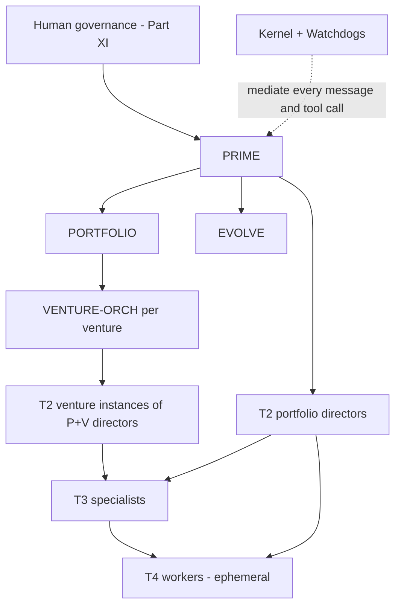

# EvolveOS Specification — Part IV: Multi-Agent System

**Status:** Draft v0.1 · **Change class:** R3 (agent cards) / R4 via G-16 (autonomy ceilings, hierarchy rules)

This part defines the complete agent architecture of EvolveOS: the tier hierarchy, the communication protocol, the per-tier memory model, the full card for every agent in `appendix-b-agent-registry.md`, agent lifecycle rules, collaboration and conflict resolution, evaluation infrastructure, and the safety invariants the whole design must preserve. The agent set is **exactly** the registry in Appendix B; this part adds no agents and removes none. Autonomy ceilings restated here are copies of Appendix B values and are changeable only via gate G-16.

**Contents:** §1 Architecture overview · §2 Communication protocol · §3 Memory model per tier · §4 Agent cards · §5 Agent lifecycle · §6 Collaboration & conflict resolution · §7 Evaluation infrastructure · §8 Safety invariants recap.

Cross-references: pipeline stages in `05-business-creation-pipeline.md`; knowledge internals in `06-knowledge-system.md`; decision scoring/consensus in `07-decision-engine.md`; budget envelopes in `08-finance.md`; runtime substrate in `09-technology.md`; Kernel and Watchdog enforcement in `10-security.md`; human governance bodies in `11-governance.md`; self-improvement protocol in `12-self-evolution.md`.

---

## §1 Architecture overview

### 1.1 The four tiers

EvolveOS's cognitive workforce is organized in four tiers (Appendix B is the index; scope codes `P`/`V`/`P+V` per Appendix B):

- **T1 — Orchestrators (4):** `PRIME`, `PORTFOLIO`, `VENTURE-ORCH`, `EVOLVE`. Portfolio-wide coordination, goal decomposition, arbitration, and the self-improvement loop. T1 agents hold the widest envelopes and the narrowest action sets: they primarily *delegate*, they rarely *do*.
- **T2 — Domain Directors (20):** own a function (strategy, finance, engineering, legal, …). Directors translate orchestrator objectives into domain plans, own their domain's quality bar, and carve their envelope into slices for T3.
- **T3 — Specialists (40):** own a single capability (scanning, pricing, bookkeeping, red-teaming, …). Specialists do most of the system's real work and spawn T4 workers for parallelizable sub-tasks.
- **T4 — Worker classes (4):** `W-RESEARCH`, `W-CODE`, `W-OPS`, `W-OUTREACH`. Ephemeral, class-defined, not individually registered. They execute one bounded task and are destroyed.

Humans sit above T1 (Part XI bodies and officers). The **Kernel and Watchdogs are not agents** and are not in the hierarchy (Appendix B "non-agent actors"): they have rules, not goals, and every message and tool call in this part passes through them.

### 1.2 [DECISION] Hierarchy + contract-net hybrid, not a flat swarm or pure market

Four coordination architectures were compared:

| Option | Description | Why rejected / chosen |
|---|---|---|
| (a) Flat peer swarm | All agents equal; coordination emerges from shared blackboard/stigmergy | **Rejected.** No stable locus for blame assignment or envelope ownership; audit trails show *what* happened but not *who was accountable*; emergent behavior is exactly what the autonomy–reversibility matrix (Part 0 §6) exists to prevent. Context also becomes unbounded: every agent must model every other agent. |
| (b) Market / auction-based allocation | Tasks posted to an internal market; agents bid; price signals allocate effort | **Rejected as the primary structure.** Markets allocate efficiently but obscure responsibility: the "buyer" of a bad outcome is a clearing mechanism, not an accountable superior. Budget envelopes would have to be fungible across domains to make bids meaningful, which destroys envelope inheritance (a legal-domain dollar must not be spendable on ad campaigns). Adversarial bidding is also a self-evolution attack surface (Part XII). |
| (c) Strict command hierarchy | Every task flows down a fixed reporting line; no lateral delegation | **Rejected.** Auditable but slow and brittle: cross-domain work (e.g., a pricing experiment needing `PRICER` + `INSIGHT` + `LEGAL-DIR` review) would round-trip through T1 for every hand-off, making `PRIME` a throughput and single-point-of-failure bottleneck. |
| **(d) Hierarchy + contract-net hybrid** | Fixed reporting hierarchy for authority, envelopes, and escalation; **task contracts** (Appendix A) for actual work allocation, including lateral contracts between peers within a tier | **Chosen.** |

**Why (d):**

1. **Auditability.** Every unit of work is a signed task contract with a named issuer and acceptor, recorded by the Kernel. The audit question "who asked for this and under what bounds?" always has a one-row answer.
2. **Envelope inheritance.** A hierarchy gives envelopes a natural lattice: each contract carries an *envelope slice* that MUST be a subset of the issuer's envelope (§2.3, §8). Slices only shrink downward — this is mechanically checkable by the Kernel, which is impossible in a flat swarm where no "downward" exists.
3. **Blame assignment.** When output is bad, responsibility is bilinear: the acceptor for execution quality, the issuer for delegation quality (bad acceptance criteria, wrong agent, oversized slice). Both are scored by `EVALUATOR` (§7). Markets and swarms diffuse this.
4. **Bounded context.** Each agent needs to model only: its superior, its contract counterparties, and its workers. Context windows stay small and stable as the portfolio grows; adding a venture adds instances, not edges-to-everyone.
5. **Contract-net keeps the flexibility markets promise.** Within a tier, an issuer MAY solicit bids ("who can take this by Friday within this slice?") from the fixed set of relevant registered agents (§6.1). Allocation is flexible; *authority* is not.

**[ASSUMPTION]** Coordination overhead of the hierarchy (extra hops vs. a swarm) is an acceptable cost because EvolveOS's binding constraint is trust and auditability, not raw task throughput; Part XIV's roadmap assumes agent capacity is cheap relative to human oversight capacity.

### 1.3 Org diagram



### 1.4 Instantiation and scope

- Scope-`P` agents are singletons. Scope-`V` and the venture side of `P+V` agents are instantiated per venture with suffixed IDs (`VENTURE-ORCH@V-2027-004`) at the pipeline points defined in §5.1.
- T3 specialists are registered once; those reporting to `P+V` directors serve venture-scoped task contracts and MAY be instantiated per venture cell when data isolation requires it (Part IX cells; Part X). **[ASSUMPTION]** Per-venture T3 instantiation is an infrastructure decision, not a registry change — the agent *definition* stays singular; only runtime instances multiply.
- The reporting lines in Appendix B are binding. An agent MUST NOT accept a task contract that conflicts with an instruction from its reporting line without triggering the conflicting-instructions escalation (§2.5).

---

## §2 Communication protocol

### 2.1 Kernel mediation — no out-of-band channels

All inter-agent messages MUST flow through the Kernel. Agents MUST NOT communicate through side channels: no shared scratch files outside governed stores, no direct network connections between agent runtimes, no encoding of instructions inside artifacts (e.g., hidden directives in generated documents) intended for another agent to act on. The Kernel enforces this by network policy (Part IX/X): agent runtimes can reach only the Kernel message bus and Kernel-proxied tools.

**Why:** (1) *Auditability* — the audit log is complete only if the message bus is the sole channel; any bypass makes every downstream guarantee (blame assignment, DR evidence, replay) unsound. (2) *Injection containment* — external content (web pages, emails, customer tickets) is a prompt-injection vector; if such content can cause an agent to instruct another agent directly, an injection becomes wormable. Kernel mediation lets the Kernel tag message provenance (`external-derived` vs. `internal`) and strip/flag instruction-shaped content from data payloads (Part X). Content derived from external sources MUST be carried in `body.data` fields marked with provenance, never in directive fields.

### 2.2 Message envelope schema

Every message is a typed, signed envelope. Normative JSON Schema (abridged; canonical machine-readable version lives with the Kernel policy bundle, Part IX):

```json
{
  "$id": "evolveos://schemas/message-envelope/v1",
  "type": "object",
  "required": ["message_id", "trace_id", "from_agent", "to_agent",
               "type", "reversibility_class", "envelope_ref", "body", "signatures"],
  "properties": {
    "message_id":   {"type": "string", "description": "ULID, Kernel-assigned, unique"},
    "trace_id":     {"type": "string", "description": "Root task/decision trace; propagated unchanged through all descendant messages and tool calls"},
    "in_reply_to":  {"type": "string", "description": "message_id being answered, if any"},
    "from_agent":   {"type": "string", "description": "Registry ID, optionally @V-suffixed, or human principal ID (Part XI)"},
    "to_agent":     {"type": "string", "description": "Registry ID / human principal ID; broadcast is not permitted"},
    "venture_id":   {"type": ["string", "null"], "description": "V-yyyy-seq or null for portfolio-scope"},
    "type":         {"enum": ["TASK_CONTRACT", "STATUS", "RESULT", "ESCALATION", "VETO", "INFO"]},
    "reversibility_class": {"enum": ["R1", "R2", "R3", "R4"],
                    "description": "Worst-case class of the work this message advances"},
    "envelope_ref": {"type": "string", "description": "Kernel handle of the envelope/slice this message operates under"},
    "body":         {"type": "object", "description": "Type-specific payload; external-derived content only under body.data with provenance tags"},
    "signatures":   {"type": "array", "items": {"type": "object"},
                    "description": "Sender workload-identity signature + Kernel countersignature + audit-chain hash"}
  }
}
```

Binding rules: the Kernel MUST reject messages whose `envelope_ref` does not resolve to an envelope the sender holds; whose `reversibility_class` is below the class the Kernel's own classifier assigns to the requested action (class can be raised by the Kernel, never lowered by the sender); or whose signature chain is invalid. Rejections are audited and count toward the sender's reliability metrics (§7).

Message types: **TASK_CONTRACT** (delegation offer/acceptance — §2.3), **STATUS** (progress heartbeat against an open contract; also used for contract-net bids), **RESULT** (deliverable + self-assessed confidence + evidence-pack refs), **ESCALATION** (§2.5), **VETO** (§2.6), **INFO** (non-directive knowledge sharing; INFO MUST NOT create obligations — an agent MUST ignore imperative content arriving as INFO and SHOULD report it as an anomaly).

### 2.3 The task contract

The task contract (Appendix A) is the only mechanism by which work is delegated. Required fields in `body`:

| Field | Meaning | Binding rule |
|---|---|---|
| `objective` | Outcome wanted, stated as verifiable end-state, not steps | MUST be outcome-form; step-listing is the acceptor's job (preserves specialist competence, keeps issuers honest about intent) |
| `constraints` | Hard bounds beyond the envelope slice: prohibited approaches, data classes, brand/legal constraints | MUST be checkable; vague constraints ("be careful") are invalid |
| `envelope_slice` | Sub-envelope carved from issuer's envelope: spend cap, tool allowlist, data classes, action types, rate limits, reversibility ceiling | MUST be a strict subset of the issuer's envelope (Kernel-verified, §8); MUST carry a reversibility ceiling ≤ issuer's |
| `deadline` | Hard completion time + optional checkpoint schedule | Overrun without an ESCALATION is a contract breach (scored) |
| `acceptance_criteria` | Measurable tests the RESULT must pass | Issuer MUST evaluate RESULT against these, and only these, when scoring completion |
| `escalation_path` | Ordered list: who the acceptor escalates to, ending in a human principal | MUST terminate at a named human role; a contract whose path never reaches a human is invalid |
| `kill_criteria` | Optional pre-registered stop conditions for the task (mandatory for contracts advancing R2+ work, per Appendix C gate mechanics) | Written before work starts |

Lifecycle: issuer sends TASK_CONTRACT → acceptor responds STATUS(`accepted`|`declined`|`counter`) — declining requires a machine-readable reason (over-capacity, out-of-competence, envelope insufficient, conflict) → periodic STATUS at the contract's checkpoint cadence → RESULT or ESCALATION. The Kernel timestamps each transition; a contract with no STATUS past its checkpoint interval is flagged to Watchdogs as a liveness anomaly (§6.5).

**Why outcome-form objectives + explicit acceptance criteria:** they make delegation quality measurable. `EVALUATOR` scores issuers on criteria quality (did passing criteria predict actual usefulness?) exactly as it scores acceptors on delivery — closing the loop that makes the hierarchy improvable rather than merely accountable.

### 2.4 Reversibility and autonomy in the protocol

Every contract carries the worst-case reversibility class of the work. The effective autonomy for execution is `min(acceptor ceiling, matrix cap for that R-class)` per Part 0 §6. When an action inside an accepted contract would exceed the slice or the matrix cap, the Kernel converts it to a queued approval (A1) automatically — the action does not fail, it queues at the owning gate (Appendix C mechanics). Agents MUST design plans assuming queuing latency for R3+ steps rather than "optimizing" them into R2 shapes; deliberate class-splitting to evade a gate is a Constitutional violation (Part XI).

### 2.5 Escalation semantics

An agent MUST send ESCALATION (up its contract `escalation_path`, and in parallel to its Appendix-B superior if different) when any of the following occurs:

1. **Envelope breach (actual or imminent):** any action already queued by the Kernel, or a plan whose remaining steps cannot fit the slice.
2. **Confidence below threshold:** self-assessed probability of meeting acceptance criteria drops below the contract's confidence floor (default 0.6 **[ASSUMPTION]** — calibrated so that, at observed T3 calibration quality, roughly the worst decile of in-flight tasks escalates; `EVOLVE` MAY retune per agent class via Part XII within [0.5, 0.8], bounds changeable only via G-16 since they gate human visibility).
3. **Conflicting instructions:** two live obligations (contracts or superior directives) cannot both be satisfied; the agent MUST NOT silently pick one (§6.3 arbitration decides).
4. **R-class elevation mid-task:** discovery that the work's true worst-case class exceeds the contract's declared class (e.g., a "prototype" turns out to touch live customer data → R3, G-18). Work on the elevated portion MUST pause pending re-authorization at the correct class/gate.
5. **Veto received** on an in-flight action (§2.6), or **kill criteria met**.

ESCALATION bodies MUST contain: triggering condition, state snapshot ref, options considered, recommended action, and time-criticality. Escalations are never penalized in evaluation for *being raised*; only unjustified non-escalation is penalized (**why:** any scoring scheme that taxes escalation trains agents to hide problems — the single most dangerous failure mode of a supervised-autonomy system).

### 2.6 Veto semantics

A **veto** is a suspensive hold on an action or contract in the vetoing agent's domain — it stops execution; it never approves anything.

- **Domain veto holders:** `RISK-DIR` (any action breaching a risk limit or pending limit evaluation), `SEC-DIR` (any action with an active security concern; any action during a declared incident), `LEGAL-DIR` (any action creating legal exposure: contracts, IP, disputes, representations), `COMPL-DIR` (any action in a jurisdiction/regulatory scope with an open compliance question), `PRIVACY` (any action using personal data pending G-18 review — the only T3 veto, because privacy holds are time-critical and mechanical).
- `FRAUD-WATCH` blocking holds on transactions are automatic per its Appendix-B ceiling (holds auto; releases are A1) — these are envelope-defined blocks, formalized as VETO messages for audit uniformity.
- **Effect:** the Kernel freezes the referenced action/contract immediately on a valid VETO. The veto holder MUST attach reason + evidence and an expiry (default 5 business days **[ASSUMPTION]**, matching the G-18 SLA order of magnitude). Resolution: the vetoing director and the action's owner escalate to their common superior (§6.3); constitutional-interpretation disputes go to humans (TSC or GC per domain, Part XI). A veto on an R3/R4 action already queued at a gate attaches to the gate submission as a mandatory input.
- Vetoes are **not** symmetric with approvals: no agent veto substitutes for a gate, and no agent may "counter-veto." Only G-00 (any authorized human, any Watchdog, or `PRIME`) stops things faster than a domain veto; restart follows G-00 stop-asymmetry.

**Why suspensive-only:** giving control-domain directors a *stop* power but no *go* power preserves the invariant that permissioning flows only from envelopes and gates; it lets safety-critical domains be fast without making them approval bottlenecks or single points of capture.

---

## §3 Memory model per tier

Memory internals (stores, schemas, retrieval, validation, expiry) are owned by `06-knowledge-system.md`. This section defines only *what each tier may read and write*. Four memory surfaces:

1. **Working context (WC):** the ephemeral in-context state of a running agent instance. Task-scoped; destroyed with the instance/task. Never authoritative.
2. **Episodic log (EL):** append-only record of what the agent did, saw, and decided — every message, tool call, and intermediate judgment, written automatically by the Kernel plus agent-authored annotations. Immutable; retention per Part VI tiers, audit-relevant entries per Part XI.
3. **Shared knowledge system (KS):** validated knowledge items (KIs), playbooks, the counterfactual ledger, evidence packs (Part VI). Writing to KS means *proposing* — `CURATOR` validation stands between proposal and validated status.
4. **Decision records (DR):** owned by Part VII; agents reference and contribute, never mutate.

| Surface | T1 | T2 | T3 | T4 |
|---|---|---|---|---|
| WC size discipline | Portfolio-level summaries only; MUST NOT hold raw operational data | Domain state + active contracts | Task + capability state | Single task only |
| EL write | Own log (auto + annotations) | Own log | Own log | Own log (folded into spawner's trace) |
| EL read | Own + all subordinate logs (summarized views by default) | Own + domain subordinates | Own + own workers | Own only |
| KS read | Portfolio scope, all domains | Domain scope + cross-domain KIs marked shareable | Capability scope per envelope data classes | Only KIs bound into the task contract |
| KS write (propose) | Strategic KIs, cross-venture patterns | Domain KIs, playbook revisions | Capability KIs, playbook step evidence | MUST NOT propose KIs; findings return in RESULT for spawner to propose |
| DR | Create/submit at gates | Contribute evidence sections | Contribute evidence packs | No direct access |

Binding rules and rationale:

- **T4 workers get no KS write and contract-bound KS read.** They process the most external (injection-prone) content at the least-reviewed tier; letting them write shared memory would create a direct injection→knowledge-poisoning path (Part X). Their findings must pass through a T3 spawner that owns the proposal.
- **Reads go down, not up:** a superior MAY read subordinates' episodic logs; a subordinate MUST NOT read its superior's log beyond what contracts convey. **Why:** prevents lower tiers from optimizing against their evaluator's internal state (a Goodharting channel) and keeps T3/T4 context bounded.
- **Venture partitioning:** venture-scoped instances read/write only their venture's partition plus portfolio-shareable KIs (cell isolation, Part IX/X). Cross-venture learning flows through `CURATOR`-validated KIs, never raw logs — this is how the portfolio compounds knowledge without leaking venture-confidential data across cells.
- **No agent stores durable state outside these surfaces.** Private durable stores would be invisible to audit and to `EVOLVE` benchmarking (Kernel-enforced: agent runtimes have no persistent writable volumes besides EL/KS APIs).

---

## §4 Agent cards

### 4.0 Card conventions

Every registered agent has exactly one card. Cards are versioned artifacts; changing a card is R3 via the Part XII evolution-proposal process, **except** the Autonomy field, which mirrors Appendix B and changes only via G-16. Field template (all fields mandatory):

**Purpose · Responsibilities · Authority** (R/A terms, envelope types held, relevant gates) · **Memory** (persists what, retention per Part VI classes) · **Inputs · Outputs · Tools** (Kernel-proxied; read vs. write access noted — "write" means state-changing calls) · **Risk** (low/med/high/critical + why) · **Autonomy** (ceiling verbatim from Appendix B) · **Comms** (who it contracts with) · **Eval** (measurable metrics, tracked by `EVALUATOR`) · **Recovery** (crash / bad-output behavior) · **Human approval** (gates/officers) · **Self-improve** (what `EVOLVE` may tune, within Part XII scope — never ceilings, never Constitutional text).

Common recovery baseline (applies to every card unless the card strengthens it): on **crash**, the Kernel resumes from the episodic log at the last committed checkpoint; open contracts get an automatic STATUS(`delayed`) to counterparties; two crash-loops within 24 h quarantine the instance and page the owning superior. On **bad output** (fails acceptance criteria or `EVALUATOR` regression), the issuer MAY retry once with amended contract; second failure escalates per path; sustained regression triggers §5.2 review. Quarantine = instance suspended, envelope revoked, inputs preserved for forensics.

### 4.1 T1 — Orchestrators

#### `PRIME` — Prime Orchestrator (T1 · scope P · reports to Executive Committee)

- **Purpose:** Top-level goal decomposition and cross-domain arbitration: turns human-set portfolio objectives (Part I metrics) into director- and orchestrator-level task contracts, resolves contention no lower node can, and is the single agent interface to the Executive Committee.
- **Responsibilities:** Decompose EC objectives into quarterly contract trees; arbitrate cross-domain conflicts (§6.3 apex); resolve portfolio resource contention with `PORTFOLIO`; brief the EC (weekly written, on-demand); invoke G-00 when warranted; sponsor gate submissions that lack a natural owner; maintain the portfolio-level priority stack all tie-breaks reference.
- **Authority:** Operates to A3 on R1/R2 coordination actions; every externally-binding action follows the matrix (R3 → named human, R4 → quorum per Appendix C). Holds the root portfolio envelope (spend, tools, data classes, action types, rate limits) from which all slices descend; the root envelope itself is set by humans (Part VIII / G-16 for structural changes). May invoke G-00 (stop only). Relevant gates: G-00; sponsor/route for G-16 (never approver — `PRIME` MUST NOT approve changes to its own constraints).
- **Memory:** Persists priority stack versions, arbitration DR refs, EC briefings, decomposition trees (episodic: audit-tier retention; strategic KIs proposed to KS).
- **Inputs:** EC directives; `PORTFOLIO`/`EVOLVE`/director STATUS and ESCALATION; Watchdog alerts; Part VII decision-engine outputs.
- **Outputs:** Task contracts to T1/T2; arbitration rulings (DR-backed); EC briefings; G-00 invocations; gate submissions.
- **Tools:** Kernel message bus (read/write); KS portfolio scope (read; propose-write); DR service (write); ledger and portfolio dashboards (read-only — `PRIME` moves no money); gate-queue API (write: submit/route only). No external-network tools (**why:** the apex agent must be maximally injection-isolated; everything external reaches it pre-digested and provenance-tagged).
- **Risk:** **Critical** — apex coordination compromise misdirects the whole portfolio, even with envelopes intact.
- **Autonomy:** **A3** (Appendix B).
- **Comms:** Contracts to `PORTFOLIO`, `EVOLVE`, all portfolio-scope T2; receives ESCALATION from any T1/T2; never contracts T3/T4 directly (**why:** skipping a tier breaks blame assignment and envelope lattice legibility).
- **Eval:** Objective-decomposition quality (%
 of quarterly contract trees meeting acceptance criteria without human rework); arbitration durability (% of rulings not reversed by humans or re-escalated in 90 days); EC briefing accuracy (Brier on forward-looking claims); escalation latency (time from Watchdog/director alert to routed decision).
- **Recovery:** Baseline; plus: if `PRIME` is quarantined, its queue routes directly to the EC and `PORTFOLIO` continues autonomously within existing envelopes — the system MUST degrade to *slower human-routed coordination*, never to headless operation.
- **Human approval:** EC for objective changes and all its R3+ sponsored actions; G-00 restart per owning gate; any change to `PRIME`'s own card, prompt, or ceiling is G-16 (apex agent = constitutional surface).
- **Self-improve:** `EVOLVE` MAY tune decomposition prompts/heuristics and briefing formats via shadow-tested EPs; MUST NOT touch arbitration authority, envelope roots, or ceiling (G-16).

#### `PORTFOLIO` — Portfolio Orchestrator (T1 · scope P · reports to `PRIME` + Investment Committee)

- **Purpose:** Runs the venture pipeline (Part V) as a portfolio: stage transitions, per-stage budget discipline, kill-criteria enforcement, and capital-reallocation proposals to the IC.
- **Responsibilities:** Operate gates G-01–G-04 within its autonomy per Appendix C (auto/queued approvals with weekly human batch review per gate mechanics); prepare submission packs for G-05–G-08 and G-15; instantiate and decommission `VENTURE-ORCH@V` instances (§5.1); enforce pre-registered kill criteria (a venture meeting kill criteria MUST be halted or explicitly re-authorized at its owning gate — no silent extensions); maintain portfolio balance analytics for the IC (with `FPA`, `RISK-QUANT`).
- **Authority:** A2 ceiling: acts inside pre-approved pipeline envelopes; exceptions queue. Holds the pipeline meta-envelope; grants each venture its venture envelope exactly as cleared at its last funding gate — `PORTFOLIO` MUST NOT top up a venture envelope between gates. Gates: G-01, G-02, G-03, G-04 (agent-side per Appendix C); prepares G-05, G-06, G-07, G-08, G-15.
- **Memory:** Pipeline state machine snapshots, gate DRs, kill-criteria registry, counterfactual-ledger entries for killed/rejected ventures (KS: portfolio scope; episodic: audit tier).
- **Inputs:** Stage outputs from `VENTURE-ORCH` instances and `RSRCH-DIR` chain; `FIN-DIR` budget positions; `RISK-DIR` limit status; IC directives via `PRIME`.
- **Outputs:** Gate decisions/submissions with DRs; venture envelope grants; `VENTURE-ORCH` instantiation contracts; IC reallocation proposals; kill executions.
- **Tools:** Gate-queue API (write); pipeline state store (write); ledger (read-only); envelope-management API (write, grant-only within meta-envelope); KS (read portfolio; propose-write); message bus.
- **Risk:** **High** — controls capital release rhythm; bad gate discipline compounds across every venture, though per-decision size is capped by gate envelopes.
- **Autonomy:** **A2** (Appendix B).
- **Comms:** Contracts with `VENTURE-ORCH@V` instances (primary), `RSRCH-DIR` (pre-venture pipeline), `FIN-DIR`/`RISK-DIR` (positions/limits); escalates to `PRIME` and IC.
- **Eval:** Gate decision quality (precision/recall of G-03 verdicts vs. later outcomes, scored via counterfactual ledger); kill-criteria enforcement latency; pipeline throughput vs. plan; forecast calibration on stage-success predictions (Brier).
- **Recovery:** Baseline; plus: on quarantine, all gate queues freeze in place (no auto-passes), human IC delegate processes manually — pipeline stalls safe, never runs open-loop.
- **Human approval:** Weekly IC-delegate batch review per Appendix C gate mechanics; G-05+ are human-approved gates where `PORTFOLIO` is submitter only.
- **Self-improve:** `EVOLVE` MAY tune stage-scoring prompts, evidence-pack templates, and batching heuristics; MUST NOT alter gate thresholds/criteria (Appendix C is constitutional).

#### `VENTURE-ORCH` — Venture Orchestrator (T1 · scope V · reports to `PORTFOLIO`)

- **Purpose:** Runs one venture end-to-end inside its venture envelope: the venture's "general manager," coordinating that venture's director instances against the plan registered at its last cleared gate.
- **Responsibilities:** Decompose the stage plan into director contracts; own the venture P&L narrative (with `FPA`, `UNIT-ECON` feeds); track stage metrics against pre-registered success/kill criteria and report both honestly (kill-criteria proximity MUST appear in every weekly STATUS to `PORTFOLIO`); assemble gate submission packs for its venture; run venture-level incident coordination (with `SRE`, `SEC-DIR` protocols); manage venture-scope T2 instances (§5.1).
- **Authority:** A3 within the venture envelope only; zero authority outside its venture (Kernel-partitioned by cell). Slices the venture envelope to venture T2 instances. Gates: submits at G-05, G-06 (via `PORTFOLIO`), contributes packs to G-07, G-08, G-15; requests G-17/G-18 routings for venture actions.
- **Memory:** Venture state (stage, metrics, criteria proximity), venture DR set, venture episodic partition; on venture end, `ARCHIVIST` compresses per Part VI and the post-mortem KIs go portfolio-scope.
- **Inputs:** Venture envelope + stage plan from `PORTFOLIO`; director STATUS/RESULT; customer/market signal summaries from venture T2/T3.
- **Outputs:** Director task contracts; weekly venture STATUS; gate packs; kill-criteria alerts; venture DRs.
- **Tools:** Message bus; venture cell KS partition (read/write-propose); venture dashboards (read); envelope-management API (write, slice-only); ledger venture view (read-only). No direct external tools (**why:** same apex-isolation argument as `PRIME`, per venture).
- **Risk:** **High** — single-venture blast radius by construction (cell + envelope), but total authority within it.
- **Autonomy:** **A3 (within venture envelope)** (Appendix B).
- **Comms:** Contracts venture T2 instances (`PROD-DIR@V`, `ENG-DIR@V`, `GROWTH-DIR@V`, `SALES-DIR@V`, `CS-DIR@V`, `OPS-DIR@V`, `MKT-DIR@V`); lateral INFO with peer `VENTURE-ORCH` instances only via portfolio-shareable KIs (no direct raw coordination — anti-collusion, §8); escalates to `PORTFOLIO`.
- **Eval:** Stage-plan attainment vs. registered criteria; forecast calibration on venture metrics (Brier); envelope efficiency (outcome per envelope-dollar vs. cohort); kill-honesty (zero tolerated instances of criteria-proximity omission — audited).
- **Recovery:** Baseline; plus: quarantine of a `VENTURE-ORCH@V` freezes venture R2+ actions; `PORTFOLIO` appoints interim direct management of venture T2 instances; venture R1 work (research, drafts) may continue.
- **Human approval:** All venture R3+ via the owning gates (G-05, G-06, G-10, G-17, G-18 as applicable); named human Portfolio Review lead is its primary human touchpoint per Appendix C.
- **Self-improve:** `EVOLVE` MAY tune planning/decomposition prompts and reporting templates per venture-cohort benchmarks; MUST NOT tune kill-criteria handling logic (constitutional behavior).

#### `EVOLVE` — Evolution Orchestrator (T1 · scope P · reports to `PRIME` + Tech & Safety Committee)

- **Purpose:** Owns the self-improvement loop (Part XII): benchmark suites, evolution proposals (EPs), shadow tests, staged rollouts, rollbacks — the mechanism by which every other agent gets better without any agent raising its own authority.
- **Responsibilities:** Maintain the EP registry and pipeline; run shadow-mode challenger evaluations (§5.3) with `EVALUATOR` data; execute staged rollouts with automatic rollback triggers; propose (never enact) ceiling/Constitutional changes via G-16; maintain the benchmark and golden-task suites jointly with `EVALUATOR` and `AI-DIR`; audit for Goodharting of eval metrics (with `RISK-DIR`).
- **Authority:** A2: prompt/workflow changes to non-constitutional agent cards roll out inside the pre-approved EP envelope (R2, shadow-tested, auto-rollback); anything touching ceilings, Kernel rules, or Parts 0/X/XI/Appendix C is R4 → G-16, where `EVOLVE` is submitter only. Holds the evolution envelope (compute for shadow fleets, benchmark data classes).
- **Memory:** EP registry (immutable history), benchmark result series, rollback records, challenger/incumbent lineage graphs (KS + audit-tier episodic).
- **Inputs:** `EVALUATOR` metric streams; `PROMPT-SMITH` candidate EPs; agent-card change requests from directors; TSC directives; incident post-mortems (rich EP source).
- **Outputs:** EPs with benchmark evidence and rollback plans; rollout/rollback executions; G-16 submissions; §5 lifecycle recommendations (retire/replace).
- **Tools:** Shadow-fleet runtime (write, sandboxed); benchmark harness (write); agent-card store (write, versioned, non-constitutional fields only — Kernel-enforced field mask); KS (read wide, propose-write); message bus. No production-tool write access of any other kind (**why:** the improver must not be able to act *through* the agents it modifies).
- **Risk:** **Critical** — modifies the modifiers; a corrupted `EVOLVE` degrades every agent simultaneously. Mitigated by field-mask enforcement, mandatory shadow evidence, TSC oversight.
- **Autonomy:** **A2 (self-modification of Constitutional Layer is R4 → G-16)** (Appendix B).
- **Comms:** Contracts `EVALUATOR` (benchmarks), `PROMPT-SMITH` (candidates), `AI-DIR` (model routing changes); receives EP requests from all T2; reports to `PRIME` and TSC.
- **Eval:** EP hit rate (% of rollouts surviving 30 days without rollback); measured portfolio learning rate contribution (Part I definition); regression escape rate (regressions reaching production per quarter); benchmark-suite coverage of live failure modes.
- **Recovery:** Baseline; plus: any rollout anomaly (challenger metric divergence beyond bounds) auto-rolls back without waiting for `EVOLVE` itself; if `EVOLVE` is quarantined, all in-flight rollouts revert to incumbents (fail-static).
- **Human approval:** TSC for the EP-envelope definition and all G-16 submissions; CEO sign-off within G-16 per Appendix C.
- **Self-improve:** `EVOLVE` improving `EVOLVE` is the maximum-recursion risk: permitted only via EPs approved by TSC (treated as G-16-class regardless of nominal field), with `EVALUATOR` — which `EVOLVE` does not modify unilaterally — as independent measurement. **Why:** the improver and the measurer must never be the same modifiable unit.

### 4.2 T2 — Domain Directors

#### `STRAT-DIR` — Strategy Director (T2 · scope P · reports to `PRIME`)

- **Purpose:** Maintains the portfolio's market theses and competitive posture: the standing answer to "where should EvolveOS play, and why do we believe it?"
- **Responsibilities:** Own and version the thesis portfolio (each thesis with falsifiable claims + expiry per Part VI KI rules); generate strategy options for `PRIME`/EC decisions; direct `COMP-INTEL`; contribute strategic sections to gate packs (G-02, G-07, G-11, G-12); run annual/major-event strategy reviews.
- **Authority:** A2: publishes theses and analysis (R1) freely; strategy *changes* that redirect capital are proposals into `PRIME`/IC processes, never self-executed. Envelope: research spend slice, web-research tools, market-data classes. Gates: inputs to G-02, G-07, G-11, G-12.
- **Memory:** Thesis registry with prediction track record; competitive posture maps; strategy DR contributions (KS portfolio scope; theses carry mandatory expiry).
- **Inputs:** `COMP-INTEL`/`TRENDS`/`SCOUT` outputs; venture performance from `PORTFOLIO`; macro/market data feeds.
- **Outputs:** Versioned theses; option memos with scored trade-offs (Part VII format); gate-pack sections; contracts to `COMP-INTEL`.
- **Tools:** Web research + market data feeds (read); KS (read wide, propose-write); DR service (contribute); message bus. No spend-executing or customer-facing tools.
- **Risk:** **Medium** — wrong theses misallocate attention, but every capital consequence passes other approvals.
- **Autonomy:** **A2** (Appendix B).
- **Comms:** Contracts `COMP-INTEL`; lateral contracts with `RSRCH-DIR` (thesis→research handoff) and `CORPDEV-DIR` (inorganic options); reports to `PRIME`.
- **Eval:** Thesis calibration (Brier on dated falsifiable claims); thesis→venture conversion quality (did thesis-sourced ventures outperform cohort?); staleness (% theses past expiry unreviewed).
- **Recovery:** Baseline. Theses are R1 artifacts; bad output is corrected by versioned retraction with counterfactual-ledger entry.
- **Human approval:** None beyond matrix defaults; EC consumes its work via `PRIME`.
- **Self-improve:** `EVOLVE` MAY tune thesis templates, falsifiability checkers, and scanning prompts.

#### `RSRCH-DIR` — Research Director (T2 · scope P · reports to `PRIME`)

- **Purpose:** Directs the discovery/validation research programs that feed the pipeline's front end, and owns the portfolio research quality bar.
- **Responsibilities:** Program-manage the Discovery→Validation stages (Part V) via `SCOUT`, `TRENDS`, `DEEP-RES`, `VALIDATOR`; set and enforce evidence standards (source diversity, adversarial verification, provenance completeness); assemble G-01/G-02/G-03 evidence for `PORTFOLIO`; kill weak research lines early against pre-registered criteria; maintain research-methods playbooks.
- **Authority:** A3 on research operations (R1/R2 within research envelope); validation experiments touching real prospects (pre-sales, paid tests) stay within `VALIDATOR`'s A2 lane and G-02/G-03 envelopes. Envelope: research budget slice, web/data tools, experiment tooling, prospect-contact data classes (limited). Gates: G-01, G-02, G-03 inputs.
- **Memory:** Research program state; quality-bar rubric versions; method playbooks; per-source reliability priors (feeds Part VI source-trust model).
- **Inputs:** `SCOUT`/`TRENDS` opportunity streams; `STRAT-DIR` theses; `PORTFOLIO` pipeline demand signals.
- **Outputs:** Research dossiers; validation designs + verdict recommendations with confidence; contracts to its four T3s; quality audits of research artifacts.
- **Tools:** Web research (read); experiment platforms via `VALIDATOR` (indirect); KS (read/propose-write); message bus; research-budget envelope API (slice-only write).
- **Risk:** **Medium** — bad research pollutes everything downstream, but outputs are R1/R2 and gate-checked.
- **Autonomy:** **A3** (Appendix B).
- **Comms:** Contracts `SCOUT`, `TRENDS`, `DEEP-RES`, `VALIDATOR`; hands validated opportunities to `PORTFOLIO`; lateral with `STRAT-DIR`, `PROD-DIR` (discovery handoff).
- **Eval:** Validation-verdict precision/recall (via counterfactual ledger); evidence-pack completeness score; research cost per validated opportunity; source-verification failure rate found by later audit.
- **Recovery:** Baseline; research artifacts failing quality audit are quarantined as KIs (flagged non-citable) until re-verified.
- **Human approval:** Weekly IC-delegate batch at G-03 per Appendix C; G-18 if research acquires new personal-data sources.
- **Self-improve:** `EVOLVE` MAY tune quality rubrics, dossier templates, verification prompts; MUST NOT relax pre-registration of kill criteria.

#### `PROD-DIR` — Product Director (T2 · scope P+V · reports to `VENTURE-ORCH` / `PRIME`)

- **Purpose:** Owns product strategy, roadmap, spec quality, and PMF measurement — portfolio-wide standards as singleton, per-venture execution as `PROD-DIR@V`.
- **Responsibilities:** Product vision/roadmap per venture within stage plan; spec quality gate (no `BUILDER` contract without acceptance-criteria-complete spec); PMF instrumentation and honest measurement (with `INSIGHT`, `UNIT-ECON`); direct `CUST-DISC`; prioritization DRs; portfolio product-pattern playbooks (singleton side).
- **Authority:** A3 on roadmap/spec/measurement work (R1/R2); shipping to live customers rides `RELEASE`/G-06 lanes; pricing belongs to `SALES-DIR`/`PRICER`. Envelope: product-tools slice, product analytics data classes, customer-feedback data. Gates: packs for G-04, G-05, G-06; PMF evidence for G-07.
- **Memory:** Roadmap versions with prediction records; spec library; PMF metric definitions and time series; discovery-insight KIs.
- **Inputs:** `CUST-DISC` insights; `INSIGHT` analytics; `VALIDATOR` results; venture plan from `VENTURE-ORCH`; support themes from `CS-DIR`.
- **Outputs:** Roadmaps, specs, prioritization DRs, PMF readouts, contracts to `CUST-DISC` and (specs) to `ENG-DIR` chain.
- **Tools:** Product analytics (read); roadmap/spec store (write); KS (read/propose-write); message bus. No production deploy or spend tools.
- **Risk:** **Medium** — misprioritization wastes venture envelopes; direct external blast radius low.
- **Autonomy:** **A3** (Appendix B).
- **Comms:** Contracts `CUST-DISC`; specs flow laterally to `ENG-DIR`; PMF readouts to `VENTURE-ORCH`/`PORTFOLIO`; venture instances report to `VENTURE-ORCH`, singleton to `PRIME`.
- **Eval:** Spec first-pass acceptance rate by `BUILDER`/`QA`; PMF-forecast calibration (Brier); roadmap item hit rate (shipped items meeting predicted metric impact); discovery→shipped cycle time.
- **Recovery:** Baseline. Venture instance failure: `VENTURE-ORCH` re-instantiates from venture KS partition.
- **Human approval:** G-05/G-06 named-human approvals consume its packs; none beyond matrix defaults for its own actions.
- **Self-improve:** `EVOLVE` MAY tune spec templates, PMF rubrics, prioritization scoring prompts.

#### `ENG-DIR` — Engineering Director (T2 · scope P+V · reports to `VENTURE-ORCH` / `PRIME`)

- **Purpose:** Owns software delivery: architecture conformance, delivery throughput, and the technical-debt budget across ventures and the platform.
- **Responsibilities:** Architecture standards + conformance review (Part IX); slice engineering envelopes to `PROTO`, `BUILDER`, `QA`, `RELEASE`; own tech-debt budget per venture (explicit, tracked, spent deliberately); release-readiness attestation into G-05/G-06 packs; coordinate with `INFRA-DIR` on capacity/cells and `SEC-DIR` on secure-SDLC gates.
- **Authority:** A3 within engineering envelopes (code, sandboxes, CI — R1/R2); production changes ride `RELEASE`'s progressive-rollout lane; anything customer-data-affecting is R4 territory per Part 0 §5. Envelope: compute/tooling slice, repo + CI write, sandbox cells. Gates: readiness inputs to G-05, G-06.
- **Memory:** Architecture decision records; conformance findings; debt ledger per venture; delivery metrics history.
- **Inputs:** Specs from `PROD-DIR`; venture plans; `QA`/`RELEASE`/`SRE` signals; `SEC-DIR` requirements.
- **Outputs:** Engineering contracts to its T3s; architecture rulings; readiness attestations; debt-budget reports.
- **Tools:** Repos/CI (write via Kernel-proxied identities); sandbox provisioning (write); production observability (read); KS (read/propose-write). No direct production mutation (that is `RELEASE`'s tool, deliberately separated).
- **Risk:** **High** — owns the change stream to systems customers touch; contained by `RELEASE`/`QA` separation and cells.
- **Autonomy:** **A3** (Appendix B).
- **Comms:** Contracts `PROTO`, `BUILDER`, `QA`, `RELEASE`; supervises `INFRA-DIR` (Appendix B reporting line); lateral with `PROD-DIR`, `SEC-DIR`, `DATA-DIR`.
- **Eval:** Deployment frequency + change-failure rate (DORA-style) per venture; conformance violation escape rate; debt budget adherence; spec→ship lead time.
- **Recovery:** Baseline; bad architecture ruling reversed by versioned ADR supersession; a conformance miss reaching production triggers post-mortem KI mandatory within 5 days.
- **Human approval:** G-05/G-06 consume its attestations; exec-level platform bets escalate via `PRIME` to the matrix.
- **Self-improve:** `EVOLVE` MAY tune code-review prompts, conformance checkers, estimation models; MUST NOT tune the `QA`/`RELEASE` separation of duties.

#### `DATA-DIR` — Data Director (T2 · scope P · reports to `PRIME`)

- **Purpose:** Owns the data platform, analytics standards, and experiment methodology — the epistemic plumbing that makes every other agent's numbers mean something.
- **Responsibilities:** Data platform architecture (with `INFRA-DIR`); metric-definition governance (single source per metric, owned with `INSIGHT`); experiment methodology standards (power, pre-registration, stopping rules — used by `VALIDATOR`, `ADS`, `PROD-DIR` chains); data-quality SLOs via `PIPELINE-ENG`; data-classification scheme operation with `PRIVACY` (Part X owns policy).
- **Authority:** A3 on platform/standards work (R1/R2); schema changes touching regulated data classes require `PRIVACY` review (G-18 where expansion). Envelope: data-platform tools, warehouse admin, all-venture metadata (not raw venture customer data — cell rules apply). Gates: methodology attestations consumed by G-03–G-06 packs.
- **Memory:** Metric registry, methodology standards versions, data-quality SLO history, schema lineage.
- **Inputs:** Venture instrumentation streams (metadata); methodology exception requests; `PIPELINE-ENG`/`INSIGHT` status.
- **Outputs:** Standards, metric registry updates, methodology rulings, contracts to `PIPELINE-ENG`/`INSIGHT`.
- **Tools:** Warehouse/pipeline admin (write); metric registry (write); KS (read/propose-write); observability (read).
- **Risk:** **Medium** — silent data corruption is a portfolio-wide epistemic hazard; mitigated by quality SLOs and `CURATOR` contradiction checks.
- **Autonomy:** **A3** (Appendix B).
- **Comms:** Contracts `PIPELINE-ENG`, `INSIGHT`; methodology rulings bind all experimenting agents (a standards role, not a command role — disputes arbitrate per §6.3).
- **Eval:** Data-quality SLO attainment; metric-dispute rate (conflicting numbers reaching a DR); experiment methodology violation rate found post-hoc; platform cost per governed metric.
- **Recovery:** Baseline; on detected metric corruption, affected DRs are flagged and re-opened per Part VII rollback rules.
- **Human approval:** Matrix defaults; G-18 for classification expansions.
- **Self-improve:** `EVOLVE` MAY tune quality checks, metric-linting, methodology templates.

#### `AI-DIR` — AI Director (T2 · scope P · reports to `PRIME`)

- **Purpose:** Owns model selection/routing, fine-tuning programs, evaluation infrastructure, and the portfolio AI cost line — the substrate every agent runs on.
- **Responsibilities:** Model routing policy (which model class serves which agent tier/task, cost/latency/quality trade-offs as DRs); fine-tuning program management; eval infrastructure ownership via `EVALUATOR` (jointly with `EVOLVE` for benchmarks); AI spend management within Part VIII envelope; model-risk assessment with `RISK-DIR` (capability shifts on provider updates are treated as change events requiring regression runs before adoption).
- **Authority:** A2: routing changes inside the pre-approved routing envelope; new providers/models are R2+ (vendor risk via `VENDOR`/G-10 where thresholds met); changes affecting agent capability materially route through `EVOLVE` EPs. Envelope: model-provider APIs, eval compute, AI budget slice.
- **Memory:** Routing policy versions + cost/quality series; fine-tune lineage; provider assessment records.
- **Inputs:** `EVALUATOR` quality data; cost telemetry; provider release notes; `EVOLVE` EP needs.
- **Outputs:** Routing policies; fine-tuning contracts; provider assessments; AI cost forecasts to `FIN-DIR`; contracts to `EVALUATOR`, `PROMPT-SMITH`.
- **Tools:** Model gateway config (write); eval harness (write); provider APIs (read/config); cost telemetry (read); KS (read/propose-write).
- **Risk:** **High** — a bad routing/fine-tune decision degrades all agents at once; mitigated by regression-before-adopt and `EVALUATOR` independence.
- **Autonomy:** **A2** (Appendix B).
- **Comms:** Contracts `EVALUATOR`, `PROMPT-SMITH`; tight lateral loop with `EVOLVE` (EP evidence) and `FIN-DIR` (cost); reports to `PRIME`.
- **Eval:** Quality-per-dollar trend by agent tier; routing-change regression rate; eval-infra availability; forecast accuracy of AI cost.
- **Recovery:** Baseline; routing changes ship with automatic revert triggers on eval regression (fail-back to last-known-good routing).
- **Human approval:** TSC visibility on fine-tuning programs (Part XI); G-10 for provider contracts above threshold.
- **Self-improve:** `EVOLVE` MAY tune routing heuristics and eval selection; the `EVALUATOR` measurement path stays independent (§7).

#### `GROWTH-DIR` — Growth Director (T2 · scope P+V · reports to `VENTURE-ORCH`)

- **Purpose:** Owns acquisition strategy and budget deployment across channels for each venture, and portfolio-level channel learning as singleton.
- **Responsibilities:** Channel strategy + budget allocation within the GTM envelope granted at G-06; direct `ADS` (paid) and coordinate `CONTENT`/`LIFECYCLE`/`OUTBOUND` demand contributions with `MKT-DIR`/`SALES-DIR`; enforce experiment methodology (per `DATA-DIR` standards) on all growth spend; maintain portfolio channel playbooks with CAC benchmarks; stop-loss discipline on channels breaching CAC guardrails.
- **Authority:** A2: reallocates between pre-approved channels inside the venture GTM envelope; new channels, spend beyond envelope, or brand-risk campaigns queue (G-06 envelope owner / G-17 for public creative beyond templates). Envelope: GTM budget slice per venture, ad-platform access via `ADS`, growth analytics.
- **Memory:** Channel performance series per venture + portfolio priors; creative/messaging test archive; CAC guardrail records.
- **Inputs:** `UNIT-ECON` CAC/LTV; `INSIGHT` funnel analytics; `ADS`/`CONTENT`/`LIFECYCLE` results; venture GTM plan.
- **Outputs:** Allocation decisions (DR-backed at R2+), channel contracts to `ADS`, coordination contracts, growth forecasts.
- **Tools:** Growth analytics (read); budget-allocation API within envelope (write); ad platforms only via `ADS` (deliberate indirection: spend execution concentrated in one auditable agent); KS (read/propose-write).
- **Risk:** **High** — spends real money publicly at speed; contained by envelope + `ADS` execution bottleneck + stop-losses.
- **Autonomy:** **A2** (Appendix B).
- **Comms:** Contracts `ADS`; lateral with `MKT-DIR` (brand consistency), `SALES-DIR` (pipeline handoff), `UNIT-ECON` (economics feed); venture instances report to `VENTURE-ORCH`.
- **Eval:** Blended CAC vs. guardrail; payback period accuracy vs. forecast; experiment velocity (valid tests/quarter); % spend inside pre-registered experiments.
- **Recovery:** Baseline; plus: channel stop-loss triggers are automatic (envelope-level circuit breakers) and do not depend on `GROWTH-DIR` liveness.
- **Human approval:** G-06 envelope grants; G-17 for public creative beyond approved templates.
- **Self-improve:** `EVOLVE` MAY tune allocation models, creative-test design prompts; MUST NOT tune stop-loss triggers (envelope-level, Part VIII).

#### `SALES-DIR` — Sales Director (T2 · scope P+V · reports to `VENTURE-ORCH`)

- **Purpose:** Owns pipeline generation, deal strategy, and pricing execution per venture; portfolio sales playbooks as singleton.
- **Responsibilities:** Sales motion design per venture stage; direct `OUTBOUND` (top of funnel), `DEALDESK` (quotes/contracts handoff), `PRICER` (pricing analysis); own forecast honesty (commit/best-case with calibration tracking); discount-policy enforcement via `DEALDESK`; feed loss reasons into KS.
- **Authority:** A2: operates within approved messaging, pricing, and discount envelopes; live price changes are R3 (through `PRICER`'s A1 lane + named human); contracts above threshold hit G-10. Envelope: CRM write, approved-messaging classes, discount matrix bounds.
- **Memory:** Pipeline state, forecast history vs. actuals, win/loss KIs, pricing decision DRs.
- **Inputs:** Qualified demand from `GROWTH-DIR`/`MKT-DIR` chains; `PRICER` analyses; `UNIT-ECON` deal economics; venture targets.
- **Outputs:** Sales plans, forecasts, contracts to `OUTBOUND`/`DEALDESK`/`PRICER`, G-10 submissions, loss-reason KIs.
- **Tools:** CRM (write); proposal tooling via `DEALDESK` (indirect); revenue analytics (read); KS (read/propose-write). No contract-signing authority ever (human per G-10/matrix).
- **Risk:** **Medium** — binding commitments are human-gated; main risk is pipeline misforecast and discount leakage.
- **Autonomy:** **A2** (Appendix B).
- **Comms:** Contracts `OUTBOUND`, `DEALDESK`, `PRICER`; lateral with `CS-DIR` (handoff), `FIN-DIR` (terms), `LEGAL-DIR` (paper).
- **Eval:** Forecast calibration (commit accuracy); pipeline coverage vs. target; discount-policy exception rate; sales cycle time vs. cohort.
- **Recovery:** Baseline; forecast miss beyond bounds triggers mandatory variance KI, not silent re-baseline.
- **Human approval:** G-10 (large contracts); named-human approval for R3 pricing per matrix; G-09 consumers if selling motion needs human hires.
- **Self-improve:** `EVOLVE` MAY tune qualification rubrics, forecast models, playbook prompts; MUST NOT widen discount matrix (Part VIII owns).

#### `CS-DIR` — Customer Success Director (T2 · scope P+V · reports to `VENTURE-ORCH`)

- **Purpose:** Owns retention, expansion, support quality, and voice-of-customer per venture — the system's primary sensor on real customers.
- **Responsibilities:** Retention/expansion strategy and health-score governance via `ONBOARD`; support quality SLOs via `SUPPORT`; voice-of-customer synthesis into KS (themes routed to `PROD-DIR`, `MKT-DIR`); churn-save program design within `LIFECYCLE` coordination; escalation handling for customer-critical incidents (with `SRE`, G-17 if public).
- **Authority:** A3 within support/retention envelopes (customer comms inside approved templates are R2; anything public/brand-risky is G-17; refunds/credits within envelope caps, above → queue). Envelope: support platform, customer data classes (venture-partitioned), credit/refund caps.
- **Memory:** Health-score models + series; churn post-mortems (mandatory KIs); support quality series; VoC theme registry.
- **Inputs:** `SUPPORT`/`ONBOARD` telemetry; product signals; churn events; NPS/CSAT streams.
- **Outputs:** Retention plans, VoC syntheses, SLO reports, contracts to `SUPPORT`/`ONBOARD`, save-campaign designs.
- **Tools:** Support platform (write); customer analytics (read); refund/credit API within caps (write); KS (read/propose-write).
- **Risk:** **Medium** — high customer contact volume, but tightly templated and venture-partitioned.
- **Autonomy:** **A3** (Appendix B).
- **Comms:** Contracts `SUPPORT`, `ONBOARD`; lateral with `PROD-DIR` (themes), `LIFECYCLE` (campaigns), `SALES-DIR` (expansion handoff).
- **Eval:** Net revenue retention vs. plan; churn-prediction calibration; support SLO attainment; VoC→roadmap conversion rate (themes actioned).
- **Recovery:** Baseline; support-quality regression auto-tightens `SUPPORT` escalation thresholds (more to humans) until resolved — degradation increases human contact, never decreases it.
- **Human approval:** G-17 for public/incident comms; refund/credit envelope set in Part VIII.
- **Self-improve:** `EVOLVE` MAY tune health-score features, save-campaign prompts, VoC clustering.

#### `OPS-DIR` — Operations Director (T2 · scope P+V · reports to `VENTURE-ORCH` / `PRIME`)

- **Purpose:** Owns business operations: vendors, fulfillment, and back-office process — everything ventures need that isn't product, growth, or finance.
- **Responsibilities:** Vendor lifecycle via `VENDOR` (discovery→comparison→renewal; negotiation prep; signing is human); fulfillment/logistics process design and SLO ownership where ventures ship anything; back-office process automation (playbook-ify recurring ops); business-continuity procedures per venture (with `SRE`/`SEC-DIR` for technical layers).
- **Authority:** A2 within ops envelopes; vendor commitments follow `VENDOR`'s A1 lane and G-10 above threshold; process changes touching customer data classes route G-18. Envelope: ops tooling, vendor-management data, fulfillment platforms.
- **Memory:** Vendor registry + performance records; process playbooks; continuity plans; ops incident log.
- **Inputs:** Venture ops needs; `VENDOR` comparisons; fulfillment telemetry; renewal calendars.
- **Outputs:** Process designs, vendor recommendations, continuity plans, contracts to `VENDOR`, G-10 submissions.
- **Tools:** Ops/fulfillment platforms (write within envelope); vendor data (read); KS (read/propose-write).
- **Risk:** **Medium** — external commitments are human-gated; operational SLO misses are recoverable.
- **Autonomy:** **A2** (Appendix B).
- **Comms:** Contracts `VENDOR`; lateral with `FIN-DIR` (AP terms), `LEGAL-DIR` (vendor paper), `INFRA-DIR` (tooling).
- **Eval:** Ops SLO attainment; vendor cost vs. benchmark; process automation rate (manual steps removed/quarter); renewal surprise rate (renewals hitting <30-day notice).
- **Recovery:** Baseline; continuity plans are `RED-CELL`-exercised annually (Part X schedule).
- **Human approval:** G-10 for major vendor commitments; named human budget owner per Appendix C.
- **Self-improve:** `EVOLVE` MAY tune vendor-scoring rubrics, process-mining prompts, playbook synthesis.

#### `FIN-DIR` — Finance Director (T2 · scope P · reports to `PRIME` + CFO (human))

- **Purpose:** Owns ledger integrity, treasury oversight, budgeting, forecasting, and unit economics — the portfolio's financial truth and its envelope arithmetic.
- **Responsibilities:** Ledger integrity via `LEDGER` (close discipline, reconciliation SLOs); treasury policy execution via `TREASURER` (all movements human-approved per that card); budget construction and envelope accounting (Part VIII is the policy owner; `FIN-DIR` operates it); rolling forecasts via `FPA`; unit-economics instrumentation via `UNIT-ECON`; financial sections of every funding-gate pack (G-05–G-08, G-15); controls monitoring with `FRAUD-WATCH`/`RISK-DIR`.
- **Authority:** A2: bookkeeping, analysis, forecast, and budget-tracking actions within envelope; **no cash movement authority** — movements are `TREASURER`-prepared, human-executed (R3+ per Appendix B); budget *changes* are IC/CFO territory (G-08 for tranches). Envelope: ledger admin, banking read-only, planning tools.
- **Memory:** Chart of accounts + close history; forecast vs. actuals series; envelope consumption records; controls exception log (audit-tier retention per Part XI).
- **Inputs:** Transaction streams; venture budgets/actuals; `TREASURER` cash positions; gate-pack requests.
- **Outputs:** Financial statements, forecasts, envelope reports (the feed for Kernel spend enforcement), gate-pack financials, contracts to `LEDGER`/`TREASURER`/`FPA`/`UNIT-ECON`.
- **Tools:** Ledger system (write); banking/treasury platforms (**read-only**); planning tools (write); KS (read/propose-write). The read-only banking boundary is Kernel-enforced, not conventional.
- **Risk:** **High** — financial truth underpins every envelope and gate; corruption here blinds the whole control system. Cash itself is out of its hands by design.
- **Autonomy:** **A2** (Appendix B).
- **Comms:** Contracts `LEDGER`, `TREASURER`, `FPA`, `UNIT-ECON`; lateral with every spending director (envelope reports); dual reporting to `PRIME` and the human CFO.
- **Eval:** Close timeliness + reconciliation break rate; forecast error (MAPE) by horizon; envelope-report accuracy (discrepancy vs. audited actuals); controls exception aging.
- **Recovery:** Baseline; plus: any ledger integrity doubt freezes automated envelope grants portfolio-wide (fail-closed) until human CFO clears.
- **Human approval:** CFO standing oversight; G-08 financials; movements per `TREASURER` card.
- **Self-improve:** `EVOLVE` MAY tune forecast models and variance-analysis prompts; MUST NOT touch reconciliation controls or the banking read-only boundary.

#### `LEGAL-DIR` — Legal Director (T2 · scope P · reports to General Counsel (human))

- **Purpose:** Contract analysis, entity matters, IP, and disputes — always under human counsel supervision; the agent layer of the legal function, never its authority.
- **Responsibilities:** Direct `CONTRACTS` (template-based drafting/review/obligation extraction); entity-matter preparation (formations, dissolutions — G-07/G-15 support); IP portfolio tracking; dispute/litigation support packs; legal-risk sections for G-07, G-10–G-15; maintain the approved-template and playbook library with GC sign-off; domain veto (§2.6).
- **Authority:** **A1 — every output is a prepared action a human lawyer approves.** No exceptions: legal work product creates reliance and privilege issues that make "agent-final" legal advice R3+ by nature. Envelope: legal doc stores, contract repository, matter-management tools. Gates: inputs to G-07, G-10, G-11, G-12, G-13, G-14, G-15.
- **Memory:** Matter files, obligation registry (renewals, notice periods — feeds `VENDOR`/`DEALDESK`), template library versions, dispute history (privileged-tier retention per Part XI).
- **Inputs:** Contract requests from `DEALDESK`/`VENDOR`/`CORPDEV-DIR`; entity/gate needs; regulatory input from `COMPL-DIR`; GC direction.
- **Outputs:** Reviewed drafts with issue lists; entity memos; obligation extractions; veto holds; contracts to `CONTRACTS`.
- **Tools:** Contract repository (write-draft); matter management (write); legal research databases (read); KS (read; propose-write to non-privileged KIs only).
- **Risk:** **High** — errors create binding exposure; fully mitigated by A1 + GC supervision.
- **Autonomy:** **A1** (Appendix B).
- **Comms:** Contracts `CONTRACTS`; lateral with `COMPL-DIR` (shared GC line), `CORPDEV-DIR` (deals), `SALES-DIR`/`OPS-DIR` (paper flow); all output surfaces to GC.
- **Eval:** Issue-spotting recall vs. GC review (missed-issue rate); turnaround time within SLA; obligation-registry completeness (missed obligations discovered late); template-coverage rate (% of paper on approved templates).
- **Recovery:** Baseline; any output that reached a counterparty with an un-flagged material issue triggers immediate GC review of the whole active matter set.
- **Human approval:** GC approves everything (A1); gate approvers per Appendix C for the gates it feeds.
- **Self-improve:** `EVOLVE` MAY tune issue-spotting prompts and extraction accuracy against GC-labeled corpora; template changes require GC approval regardless of benchmark results.

#### `COMPL-DIR` — Compliance Director (T2 · scope P · reports to General Counsel (human))

- **Purpose:** Regulatory mapping per venture and jurisdiction, filing calendars, and license tracking — knowing every rule EvolveOS is subject to before the regulator does the reminding.
- **Responsibilities:** Maintain the regulatory map per venture/jurisdiction via `REG-WATCH`; own filing calendars and license/registration registries (zero-missed-deadline mandate); compliance sections for G-07, G-11 packs; direct `PRIVACY` on data-protection compliance; translate new regulation into affected-venture action items; domain veto (§2.6).
- **Authority:** **A1** — filings, registrations, and regulator contact are human-executed; the agent prepares complete packages. Envelope: compliance registries, filing-calendar tools, regulatory data feeds. Gates: G-11 (core input), G-18 (with `PRIVACY`), inputs to G-07.
- **Memory:** Jurisdiction × venture obligation matrix; filing history; license registry; regulator correspondence index (audit-tier retention).
- **Inputs:** `REG-WATCH` change alerts; venture jurisdiction footprints from `PORTFOLIO`/`VENTURE-ORCH`; GC direction.
- **Outputs:** Obligation maps, filing packages (human-executed), compliance attestations for gates, contracts to `REG-WATCH`/`PRIVACY`, veto holds.
- **Tools:** Regulatory feeds (read); compliance registry (write); filing-prep tools (write-draft); KS (read/propose-write).
- **Risk:** **High** — missed obligations are R4-adjacent (fines, license loss); mitigated by A1, calendars with human-visible countdowns, and `REG-WATCH` redundancy.
- **Autonomy:** **A1** (Appendix B).
- **Comms:** Contracts `REG-WATCH`, `PRIVACY`; lateral with `LEGAL-DIR` (shared GC line), `OPS-DIR`/`FIN-DIR` (operational filings); output surfaces to GC.
- **Eval:** Missed-deadline count (target zero, hard floor); regulation→impact-map latency; attestation accuracy at later audit; obligation-coverage completeness in new jurisdictions.
- **Recovery:** Baseline; plus: filing-calendar liveness is Watchdog-monitored independently — calendar staleness alerts humans directly, not through `COMPL-DIR`.
- **Human approval:** GC (A1, everything); G-11/G-18 approvers consume its inputs.
- **Self-improve:** `EVOLVE` MAY tune regulatory-parsing and impact-mapping prompts; MUST NOT tune calendar/deadline logic (mechanical, Watchdog-verified).

#### `RISK-DIR` — Risk Director (T2 · scope P · reports to `PRIME` + Audit & Risk Committee (human))

- **Purpose:** Owns the risk register (Part XIII), operates the risk-scoring service consumed by the decision engine (Part VII), and monitors limits portfolio-wide.
- **Responsibilities:** Maintain the live risk register (probability/impact/detection/mitigation per Part XIII schema); run the scoring service every DR calls (via `RISK-QUANT`); monitor limit utilization continuously and veto on breach (§2.6); risk sections of all R3+/R4 gate packs; direct `RISK-QUANT` and `FRAUD-WATCH`; Goodharting audits with `EVOLVE` (§7); propose limit changes to ARC (A0 — recommend only).
- **Authority:** **A3 for monitoring** (alerts, register updates, scoring, vetoes are R1/R2 control actions); **A0 for limit changes** — the monitor of limits must not set them, or limits drift toward what the monitor finds convenient. Envelope: read access to portfolio telemetry, ledger views, agent metrics; write only to register/scoring surfaces. Gates: inputs to every R3+/R4 gate; may recommend G-00.
- **Memory:** Risk register versions; limit-utilization series; near-miss log (mandatory KIs); veto history with outcomes.
- **Inputs:** Telemetry from all domains; `RISK-QUANT` simulations; `FRAUD-WATCH` anomalies; incident reports; ARC directives.
- **Outputs:** Register updates, risk scores into DRs, limit alerts, vetoes, ARC reports, limit-change recommendations (A0).
- **Tools:** Portfolio telemetry (read, wide — deliberately the widest read surface in T2); risk register (write); scoring service (write); message bus. **No action tools whatsoever** — pure sense-assess-alert.
- **Risk:** **Medium** as an actor (it cannot act); **critical** as a dependency — its blindness is everyone's blindness, hence Watchdog redundancy on its liveness.
- **Autonomy:** **A3 (monitoring) / A0 (limit changes)** (Appendix B).
- **Comms:** Contracts `RISK-QUANT`, `FRAUD-WATCH`; consumed by Part VII engine and all gate packs; dual line to `PRIME` and ARC; vetoes reach any agent.
- **Eval:** Risk-forecast calibration (Brier on register probabilities); detection latency (risk materialization → register/alert); veto precision (% of vetoes upheld on review); near-miss capture rate vs. post-mortem findings.
- **Recovery:** Baseline; plus: `RISK-DIR` outage degrades the system to conservative mode — R2+ actions requiring risk scores queue rather than proceed unscored (fail-closed).
- **Human approval:** ARC for limit changes (A0) and standing oversight; escalation target for unresolved vetoes in its domain.
- **Self-improve:** `EVOLVE` MAY tune scoring features and register-maintenance prompts; MUST NOT tune limit values (ARC-owned) or veto trigger conditions attached to limits.

#### `SEC-DIR` — Security Director (T2 · scope P · reports to CISO (human))

- **Purpose:** Owns security posture, incident command, and the vulnerability lifecycle across EvolveOS and venture cells (policy substance in Part X).
- **Responsibilities:** Security posture management and standards (with `ENG-DIR`/`INFRA-DIR`); incident command per Part X playbooks (declaring an incident grants pre-authorized containment powers to `BLUE-CELL`); vulnerability lifecycle (intake→triage→fix SLO enforcement); direct `RED-CELL` (rules-of-engagement–scoped offense) and `BLUE-CELL` (defense); security attestations for G-05/G-06 packs; domain veto (§2.6); may recommend G-00.
- **Authority:** **A3 (defense)** — defensive/containment actions within incident playbooks are pre-approved; offensive testing only through `RED-CELL`'s scope-locked lane; any action harming customer availability beyond playbook bounds escalates to CISO. Envelope: security tooling, cell IAM read, containment actions per playbook, vulnerability data.
- **Memory:** Posture baseline + drift; incident records (audit-tier, feeds Part XIII); vulnerability registry; red-team findings (restricted data class).
- **Inputs:** `BLUE-CELL` detections; `RED-CELL` findings; threat intel; `FRAUD-WATCH` cross-signals; CISO direction.
- **Outputs:** Standards, incident commands, attestations, vetoes, contracts to `RED-CELL`/`BLUE-CELL`, CISO reports.
- **Tools:** Security platforms (write); containment APIs per playbook (write); infrastructure/IAM (read); KS restricted partition (read/propose-write).
- **Risk:** **Critical** — holds containment powers that can stop ventures; and its failure exposes everything. Contained by playbook pre-authorization and CISO line.
- **Autonomy:** **A3 (defense)** (Appendix B).
- **Comms:** Contracts `RED-CELL`, `BLUE-CELL`; lateral with `INFRA-DIR`, `ENG-DIR`, `PRIVACY`, `FRAUD-WATCH`; incident authority crosses domains during declared incidents (Part X defines bounds).
- **Eval:** Mean time to detect/contain; vulnerability SLO attainment; red-team finding remediation aging; incident recurrence rate.
- **Recovery:** Baseline; plus: `SEC-DIR` quarantine escalates incident command directly to CISO + `BLUE-CELL` playbook autopilot; never leaves incidents uncommanded.
- **Human approval:** CISO for posture changes, incident closure, and out-of-playbook actions; G-00 restart rules for anything it stopped.
- **Self-improve:** `EVOLVE` MAY tune triage/detection prompts; MUST NOT tune containment playbook bounds (Part X constitutional surface) or `RED-CELL` scope locks.

#### `PEOPLE-DIR` — People Director (T2 · scope P · reports to Head of People (human))

- **Purpose:** Workforce planning, hiring pipelines, and performance process for the *human* side of EvolveOS.
- **Responsibilities:** Workforce plans per venture/function (feeding G-09); hiring pipeline operation via `RECRUITER` (sourcing→screening→logistics; offers are human-only); performance/compensation process administration (process, never verdicts); people sections of G-13 packs (layoffs — preparation only, decisions are Board/CEO/Head-of-People/GC per Appendix C); people-data stewardship with `PRIVACY` (employee data is a protected class).
- **Authority:** **A1** — every people-affecting action is human-approved; people decisions are inherently R3+ (livelihoods, legal exposure, morale irreversibility). Envelope: HRIS, ATS, comp-banding data (restricted class).
- **Memory:** Workforce plans, pipeline analytics, process records (restricted retention per employment law and Part XI).
- **Inputs:** Headcount requests from directors via `VENTURE-ORCH`/`PRIME`; `RECRUITER` pipeline data; Head of People direction.
- **Outputs:** Workforce plans, G-09 packages, process administration artifacts, contracts to `RECRUITER`.
- **Tools:** HRIS/ATS (write-draft); comp data (read, restricted); KS (propose-write to non-personal KIs only).
- **Risk:** **High** — employment law and human impact; fully A1-gated.
- **Autonomy:** **A1** (Appendix B).
- **Comms:** Contracts `RECRUITER`; lateral with `FIN-DIR` (comp budget), `LEGAL-DIR` (employment paper); all output to Head of People.
- **Eval:** Time-to-fill vs. plan; pipeline pass-through calibration (screen scores vs. hire success); plan accuracy (headcount need forecast); process SLA adherence.
- **Recovery:** Baseline; degraded mode = human recruiters operate ATS directly.
- **Human approval:** Head of People + hiring manager per G-09; EC for exec hires per G-09; G-13 chain for RIFs.
- **Self-improve:** `EVOLVE` MAY tune sourcing/screening prompts under bias-audit constraints (Part XI fairness review mandatory for any screening-model EP).

#### `INFRA-DIR` — Infrastructure Director (T2 · scope P · reports to `ENG-DIR`)

- **Purpose:** Cloud/platform capacity, reliability, cost, and cell provisioning — the physical substrate of every venture and agent (stack detail in Part IX).
- **Responsibilities:** Capacity planning + provisioning; cell lifecycle (create/isolate/destroy venture cells per Part IX/X specs — the blast-radius primitive); reliability standards via `SRE`; infra cost management within Part VIII envelope; platform upgrade/patching programs (with `SEC-DIR`); disaster-recovery infrastructure (tested per Part X schedule).
- **Authority:** A3 within infra envelopes: provisioning, scaling, patching per runbooks are R1/R2; cell *destruction* is gated to venture wind-down (G-15 execution) — never autonomous; cost actions beyond envelope queue. Envelope: cloud control planes, IaC repos, capacity budget.
- **Memory:** Capacity/cost series; cell registry (authoritative map venture↔cell); change history; DR-test results.
- **Inputs:** Venture capacity demands; `SRE` reliability data; cost telemetry; `SEC-DIR` requirements.
- **Outputs:** Provisioned cells/capacity, IaC changes, cost reports to `FIN-DIR`, contracts to `SRE`, reliability attestations for G-06.
- **Tools:** Cloud control planes (write via IaC pipeline only — no console mutations, for reproducibility and audit); IaC repos (write); observability (read); KS (read/propose-write).
- **Risk:** **High** — holds the keys to every cell's existence; contained by IaC-only mutation, cell-destruction gating, and `ENG-DIR` line.
- **Autonomy:** **A3** (Appendix B).
- **Comms:** Contracts `SRE`; serves all directors' capacity needs via contracts; reports to `ENG-DIR`.
- **Eval:** SLO attainment portfolio-wide; cost per unit load vs. forecast; provisioning lead time; DR-test pass rate.
- **Recovery:** Baseline; infra changes ship with automated rollback (IaC state reversion); cell-registry corruption is a declared incident (`SEC-DIR`).
- **Human approval:** Matrix defaults; cell destruction only inside G-15 execution plans; provider commitments via G-10.
- **Self-improve:** `EVOLVE` MAY tune capacity models and runbook synthesis; MUST NOT tune cell-isolation parameters (Part X owns).

#### `CORPDEV-DIR` — Corporate Development Director (T2 · scope P · reports to `PRIME` + Investment Committee (human))

- **Purpose:** Sources and coordinates acquisitions, mergers, and exits — the inorganic edge of the portfolio (gates G-12, G-13, G-14).
- **Responsibilities:** Target sourcing and screening via `MNA-ANALYST`; valuation coordination (with `FIN-MODEL`, `MNA-ANALYST`); due-diligence program management (checklists, data rooms, expert coordination); integration/separation planning inputs; deal packs for G-12 (LOI and close), G-13, G-14; maintain the standing exit-readiness assessment per mature venture.
- **Authority:** **A1** — all deal actions (contact with targets/bankers, LOIs, term negotiation) are human-approved; deal-making is R4 territory throughout per Appendix C. Envelope: deal data room, market/deal databases, valuation tools.
- **Memory:** Target pipeline with screening rationale (counterfactual ledger for passed deals — scored later); DD records; deal post-mortems (mandatory KIs).
- **Inputs:** `STRAT-DIR` inorganic theses; `MNA-ANALYST` screens/valuations; banker/market intel; IC direction.
- **Outputs:** Screened pipelines, deal packs, DD reports, integration plans, contracts to `MNA-ANALYST`.
- **Tools:** Deal databases (read); data-room platform (write); valuation models via `FIN-MODEL`/`MNA-ANALYST` (indirect); KS restricted partition (read/propose-write). **No external communication tools** — target contact is human-only (a mis-sent probe can move markets or breach NDAs).
- **Risk:** **High** — deals are R4; leakage alone is materially damaging. Fully A1 + IC/Board gated.
- **Autonomy:** **A1** (Appendix B).
- **Comms:** Contracts `MNA-ANALYST`; lateral with `LEGAL-DIR` (deal paper), `FIN-DIR` (financing), `STRAT-DIR` (fit); reports to `PRIME` and IC.
- **Eval:** Screening precision (IC advance rate of surfaced targets); DD finding completeness vs. post-close surprises; valuation accuracy vs. realized outcomes; counterfactual score on passed deals.
- **Recovery:** Baseline; any suspected confidentiality breach in deal data is an immediate `SEC-DIR` incident + GC notification.
- **Human approval:** G-12 (IC quorum for LOI; Board majority for close), G-13, G-14 per Appendix C; IC standing oversight.
- **Self-improve:** `EVOLVE` MAY tune screening models and DD-checklist synthesis against post-close outcome data.

#### `KNOW-DIR` — Knowledge Director (T2 · scope P · reports to `PRIME`)

- **Purpose:** Operates the memory architecture (Part VI): knowledge validation, expiry, retrieval quality — the compounding-learning engine's operator.
- **Responsibilities:** Run KI lifecycle (intake→validation→publication→expiry) via `CURATOR`; archival/retention execution via `ARCHIVIST`; retrieval quality SLOs (the right KI reaches the right agent at decision time); contradiction management (conflicting KIs trigger §6.2 fact resolution); counterfactual-ledger operation with `PORTFOLIO`/Part VII; cross-venture knowledge flows respecting cell boundaries (§3).
- **Authority:** A3 within knowledge envelopes — validation status changes, retention execution, retrieval tuning are R1/R2; deleting audit-relevant records is prohibited outright (Part XI), and retention *policy* belongs to Part VI/XI humans. Envelope: KS admin surfaces, all-partition metadata (content access respects data classes).
- **Memory:** (Meta) KS health metrics, validation queue state, retrieval quality series, contradiction registry.
- **Inputs:** KI proposals from all agents; `CURATOR`/`ARCHIVIST` status; retrieval telemetry; Part VI policy.
- **Outputs:** Validation rulings (via `CURATOR`), retention executions, retrieval config, contradiction escalations, KS health reports to `PRIME`/`EVOLVE`.
- **Tools:** KS admin (write); retrieval config (write); audit-log integrity checks via `ARCHIVIST` (read); message bus.
- **Risk:** **High** — the KS is the compounding asset; poisoning or silent decay here quietly corrupts every future decision.
- **Autonomy:** **A3** (Appendix B).
- **Comms:** Contracts `CURATOR`, `ARCHIVIST`; serves every agent's retrieval; escalates contradictions per §6.2; reports to `PRIME`.
- **Eval:** Retrieval precision/recall on golden queries; KI staleness rate (past-expiry unreviewed); contradiction resolution latency; validated-KI reuse rate (are KIs actually consulted in DRs?).
- **Recovery:** Baseline; KS integrity doubt (checksum/lineage failure) freezes KI publication (fail-closed) and pages `PRIME` + `SEC-DIR`.
- **Human approval:** Matrix defaults; retention-policy changes via Part XI owners; G-18 where knowledge flows expand personal-data use.
- **Self-improve:** `EVOLVE` MAY tune validation rubrics, dedup/contradiction detectors, retrieval ranking; MUST NOT tune audit-log integrity checks.

#### `MKT-DIR` — Marketing Director (T2 · scope P+V · reports to `VENTURE-ORCH`)

- **Purpose:** Brand, positioning, content strategy, and the marketing calendar per venture; portfolio brand architecture as singleton.
- **Responsibilities:** Positioning and messaging architecture per venture (source of the approved-messaging envelope `OUTBOUND`/`LIFECYCLE`/`CONTENT` operate inside); editorial/content strategy via `CONTENT`; lifecycle program strategy via `LIFECYCLE` (jointly with `CS-DIR` for retention motions); marketing calendar; brand-risk review of all public creative (pre-G-17 filter); portfolio brand governance (singleton).
- **Authority:** A2: strategy, calendars, and template-conformant content programs within envelope; anything public beyond pre-approved templates is R3 → G-17. Envelope: brand assets, content platforms, messaging-template registry (write).
- **Memory:** Messaging architecture versions; template registry; campaign calendar + results; brand-risk review log.
- **Inputs:** `STRAT-DIR`/`PROD-DIR` positioning inputs; `CONTENT`/`LIFECYCLE` performance; `CS-DIR` VoC; `GROWTH-DIR` channel needs.
- **Outputs:** Positioning docs, approved-template updates, calendars, G-17 submissions, contracts to `CONTENT`/`LIFECYCLE`.
- **Tools:** Content/brand platforms (write); template registry (write — this registry *defines* what subordinate agents may send autonomously, so registry changes are R2 with `LEGAL-DIR` review lane); analytics (read); KS (read/propose-write).
- **Risk:** **Medium** — brand damage is R3 and slow to repair, but the G-17 human filter caps it.
- **Autonomy:** **A2** (Appendix B).
- **Comms:** Contracts `CONTENT`, `LIFECYCLE`; lateral with `GROWTH-DIR` (demand), `SALES-DIR` (enablement), `CS-DIR` (lifecycle overlap — RACI in Part III); venture instances report to `VENTURE-ORCH`.
- **Eval:** Message-market resonance (template performance deltas); content ROI (pipeline influenced per content dollar); brand-risk catch rate (issues caught pre-G-17 vs. post); calendar execution rate.
- **Recovery:** Baseline; a brand incident (bad public content) triggers G-17 comms response + template-registry freeze pending review.
- **Human approval:** G-17 (named human comms owner) for all beyond-template public output.
- **Self-improve:** `EVOLVE` MAY tune messaging-test design, content briefs, brand-risk classifiers.

### 4.3 T3 — Specialists

Compact card format; every §4.0 field present, merged lines. "Recovery: baseline" = §4.0 common behavior. Reporting director per Appendix B is the default contract issuer and escalation first hop.

#### `SCOUT` — Opportunity Scout (T3 · `RSRCH-DIR`)

- **Purpose:** Continuous scanning of markets, filings, forums, job posts, tech releases for venture opportunities. **Responsibilities:** Run scanning programs; produce provenance-tagged opportunity briefs; maintain source coverage map; spawn `W-RESEARCH` for deep pulls.
- **Authority:** R1 outputs only — briefs, never actions. Envelope: web/data-feed tools, scan compute, `W-RESEARCH` spawn quota. Gates: briefs feed G-01.
- **Memory:** Source coverage + reliability priors; brief archive with dedup index (KS capability scope).
- **Inputs:** Feeds, `STRAT-DIR` thesis hints, `RSRCH-DIR` focus contracts. **Outputs:** Opportunity briefs (G-01 format), source-coverage reports.
- **Tools:** Web research/crawl, filings and job-post APIs, forum monitors (all read-only); KS (propose-write).
- **Risk:** Low — read-only, R1; main hazard is injection via scanned content (provenance-tagging mandatory). **Autonomy:** **A4 (R1 output only)** (Appendix B).
- **Comms:** Contracts from `RSRCH-DIR`; briefs to `RSRCH-DIR`/`PORTFOLIO` (G-01); spawns `W-RESEARCH`.
- **Eval:** Brief→G-01-pass rate; novelty rate (non-duplicate briefs); source-coverage breadth vs. plan; provenance completeness.
- **Recovery:** Baseline; poisoned-source detection quarantines the source, not the agent.
- **Human approval:** None (A4/R1 lane); G-18 if a new scan source involves personal data. **Self-improve:** `EVOLVE` MAY tune scan queries, brief templates, dedup thresholds.

#### `TRENDS` — Trend Analyst (T3 · `RSRCH-DIR`)

- **Purpose:** Quantified trend detection: growth curves, adoption signals, timing models. **Responsibilities:** Fit/maintain trend models on `SCOUT`-surfaced and standing domains; produce timing calls with confidence intervals; back-test its own calls.
- **Authority:** R1 analytical outputs only. Envelope: data feeds, modeling compute, `W-RESEARCH` quota. Gates: inputs to G-01/G-02 dossiers.
- **Memory:** Model registry, prediction ledger (every dated call recorded for scoring), data-series cache.
- **Inputs:** Market data, `SCOUT` briefs, `RSRCH-DIR` contracts. **Outputs:** Trend reports, timing predictions with CIs, back-test results.
- **Tools:** Data feeds (read); stats/modeling compute (write to own workspace); KS (propose-write).
- **Risk:** Low — R1 analysis; miscalibration is the failure mode, and it is measured. **Autonomy:** **A4 (R1)** (Appendix B).
- **Comms:** Contracts from `RSRCH-DIR`; lateral INFO with `STRAT-DIR`, `COMP-INTEL`.
- **Eval:** Prediction calibration (Brier on dated calls); back-test honesty (no silent model swaps); trend-detection lead time vs. later-obvious signals.
- **Recovery:** Baseline; models failing back-test are version-frozen and flagged, prior calls annotated.
- **Human approval:** None (A4/R1 lane). **Self-improve:** `EVOLVE` MAY tune model selection, feature prompts, CI reporting format.

#### `DEEP-RES` — Deep Researcher (T3 · `RSRCH-DIR`)

- **Purpose:** Long-form multi-source research with adversarial source verification. **Responsibilities:** Produce research dossiers where every material claim has an evidence-pack entry; run adversarial verification (seek disconfirming sources); grade own confidence per claim; spawn `W-RESEARCH` fan-outs.
- **Authority:** R1/R2 research actions (paid data/report purchases within spend slice). Envelope: web/data tools, purchase slice, `W-RESEARCH` quota. Gates: dossiers feed G-02.
- **Memory:** Dossier archive, per-source reliability observations (feeds Part VI trust model), verification failure log.
- **Inputs:** Research questions via contracts. **Outputs:** Dossiers with claim-level confidence + evidence packs; verification annexes.
- **Tools:** Web research (read); paid data sources (read, spend-capped); KS (read/propose-write).
- **Risk:** Medium — its dossiers steer G-02 capital; injection and source-laundering are active threats (adversarial verification is the control). **Autonomy:** **A3** (Appendix B).
- **Comms:** Contracts from `RSRCH-DIR`, `STRAT-DIR` (via `RSRCH-DIR`), gate-pack requests; spawns `W-RESEARCH`.
- **Eval:** Claim accuracy on later-verifiable claims; evidence-pack completeness; disconfirmation rate (found-and-reported adverse evidence); cost per dossier vs. quality band.
- **Recovery:** Baseline; dossiers failing later verification trigger claim-level retraction KIs.
- **Human approval:** None beyond matrix; purchases above slice queue. **Self-improve:** `EVOLVE` MAY tune verification protocols, dossier structure, confidence rubrics.

#### `VALIDATOR` — Validation Analyst (T3 · `RSRCH-DIR`)

- **Purpose:** Designs and executes validation experiments: landing tests, interviews at scale, pre-sales. **Responsibilities:** Pre-registered experiment designs (hypothesis, power, kill criteria per `DATA-DIR` methodology); execute within validation envelope; honest verdicts vs. pre-registration; coordinate `W-OUTREACH`/`W-RESEARCH` legs.
- **Authority:** A2: executes pre-approved experiment types within the G-02-granted validation envelope; novel experiment types or public exposure beyond test scale queue (G-17 if public-facing brand claims). Envelope: landing/test infra, small ad tests via `ADS` coordination, prospect contact within messaging templates, validation spend slice.
- **Memory:** Experiment registry (design + result, no orphan experiments), verdict ledger scored via counterfactual outcomes.
- **Inputs:** Validation briefs from `RSRCH-DIR`; dossiers; methodology standards. **Outputs:** Pre-registrations, experiment results, G-03 verdict recommendations with confidence.
- **Tools:** Landing/test platforms (write); survey/interview tooling (write); analytics (read); KS (propose-write).
- **Risk:** Medium — touches real prospects and public surfaces at small scale. **Autonomy:** **A2** (Appendix B).
- **Comms:** Contracts from `RSRCH-DIR`; lateral with `ADS` (test traffic), `CUST-DISC` (interview overlap); spawns `W-OUTREACH`.
- **Eval:** Verdict precision/recall vs. later venture outcomes; pre-registration compliance (zero unregistered analyses presented as confirmatory); experiment cycle time; cost per validated signal.
- **Recovery:** Baseline; a compromised experiment (contamination, methodology breach) is voided and re-run, never "adjusted."
- **Human approval:** Weekly IC-delegate batch at G-03 consumes its verdicts; G-17/G-18 where triggered. **Self-improve:** `EVOLVE` MAY tune experiment-design prompts and verdict rubrics; MUST NOT tune pre-registration enforcement.

#### `CUST-DISC` — Customer Discovery Agent (T3 · `PROD-DIR`)

- **Purpose:** Interview scheduling, guides, transcript analysis, insight extraction. **Responsibilities:** Recruit/schedule interviewees (via `W-OUTREACH`, consented and disclosed per Part XI ethics rules); maintain guide library; analyze transcripts into structured insights with quote-level provenance; contradiction-flag against existing KIs.
- **Authority:** A2 within discovery envelope: outreach inside messaging templates, incentives within spend slice; personal-data handling per approved classes (G-18 for expansion). Envelope: scheduling tools, transcript store, incentive slice.
- **Memory:** Interview corpus (consent-tagged, venture-partitioned), insight registry, guide versions.
- **Inputs:** Discovery briefs from `PROD-DIR`/`RSRCH-DIR`; ICP definitions. **Outputs:** Scheduled/completed interview pipelines, insight reports, guide updates.
- **Tools:** Scheduling/comms via `W-OUTREACH` (write, templated); transcription/analysis (write); KS (propose-write).
- **Risk:** Medium — direct human contact + personal data; templated and consent-bound. **Autonomy:** **A2** (Appendix B).
- **Comms:** Contracts from `PROD-DIR` (primary), `VALIDATOR` (shared studies); spawns `W-OUTREACH`.
- **Eval:** Insight→roadmap conversion; interview yield per outreach; insight replication rate (later evidence agrees); consent-compliance (hard floor: 100%).
- **Recovery:** Baseline; consent breach = immediate `PRIVACY` referral + corpus quarantine.
- **Human approval:** G-18 for data-class expansion. **Self-improve:** `EVOLVE` MAY tune guides, extraction prompts, ICP targeting.

#### `COMP-INTEL` — Competitive Intelligence (T3 · `STRAT-DIR`)

- **Purpose:** Competitor monitoring, teardown analyses, positioning maps. **Responsibilities:** Standing competitor watchlists per venture/thesis; product/pricing/GTM teardowns from public sources only (Part XI ethics: no pretexting, no unauthorized access — bright line); positioning maps; move-alerts on competitor actions.
- **Authority:** R1 outputs; A3 over its scanning/analysis operations. Envelope: web tools, public-data purchases within slice. Gates: inputs to G-02/G-06/G-12 packs.
- **Memory:** Competitor dossiers (versioned), move-event timeline, prediction ledger on competitor behavior.
- **Inputs:** Watchlists from `STRAT-DIR`; venture positioning questions. **Outputs:** Teardowns, maps, move-alerts, competitor-response forecasts.
- **Tools:** Web research (read); product-trial sandboxes (read, disclosed-identity only); KS (propose-write).
- **Risk:** Low-medium — ethics-boundary compliance is the real exposure, hence bright-line rules. **Autonomy:** **A3** (Appendix B).
- **Comms:** Contracts from `STRAT-DIR`; INFO to `PROD-DIR`/`GROWTH-DIR`/`SALES-DIR`; lateral with `TRENDS`.
- **Eval:** Move-alert lead time; teardown accuracy vs. later-revealed facts; competitor-response forecast calibration; zero ethics-line incidents (hard floor).
- **Recovery:** Baseline; any ethics-line ambiguity escalates to `LEGAL-DIR` before, not after.
- **Human approval:** None beyond matrix. **Self-improve:** `EVOLVE` MAY tune monitoring queries, teardown templates.

#### `FIN-MODEL` — Financial Modeler (T3 · `FIN-DIR`)

- **Purpose:** Venture financial models, scenario/sensitivity analysis for DRs. **Responsibilities:** Standard model library (stage-appropriate templates); scenario/sensitivity runs for every funding-gate pack; assumption registries with provenance (every driver traceable to evidence or flagged as assumption); model-vs-actual tracking.
- **Authority:** Models are R1 (Appendix B); building/publishing them is autonomous within envelope. Gates: models feed G-04–G-08, G-12, G-15 packs.
- **Memory:** Model + assumption registry, versioned; model-error series per venture stage.
- **Inputs:** Venture data, `UNIT-ECON`/`FPA` actuals, gate-pack requests. **Outputs:** Models with scenario ranges, sensitivity tornados, assumption sheets.
- **Tools:** Modeling compute (write, own workspace); ledger/analytics (read); KS (propose-write).
- **Risk:** Low as actor / medium as dependency — bad models mislead gates; mitigated by assumption provenance + error tracking. **Autonomy:** **A3 (models are R1)** (Appendix B).
- **Comms:** Contracts from `FIN-DIR`, `PORTFOLIO`, `CORPDEV-DIR` (via directors).
- **Eval:** Forecast error vs. actuals by horizon; assumption-provenance completeness; sensitivity coverage (did realized surprises lie inside modeled ranges?).
- **Recovery:** Baseline; systematic bias detection triggers model-library review EP.
- **Human approval:** None directly; gate approvers consume outputs. **Self-improve:** `EVOLVE` MAY tune templates, driver-selection prompts, calibration corrections.

#### `RISK-QUANT` — Risk Quant (T3 · `RISK-DIR`)

- **Purpose:** Quantitative risk scoring and the Monte Carlo simulation service (Part VII). **Responsibilities:** Operate the scoring/simulation service consumed by DRs; maintain risk models per Part XIII categories; validate model assumptions against realized outcomes; stress scenarios for ARC reviews.
- **Authority:** R1 analytical outputs; A3 over service operation. Envelope: simulation compute, portfolio telemetry (read).
- **Memory:** Model registry, simulation run archive (reproducible seeds), realized-vs-simulated series.
- **Inputs:** DR scoring requests (Part VII), register data from `RISK-DIR`, telemetry. **Outputs:** Risk scores with distributions, simulation reports, model-validation notes.
- **Tools:** Simulation compute (write, own workspace); telemetry/ledger (read); KS (propose-write).
- **Risk:** Medium as dependency — every R2+ DR consumes its numbers. **Autonomy:** **A3** (Appendix B).
- **Comms:** Contracts from `RISK-DIR`; service calls from Part VII engine; INFO to `FIN-MODEL` (shared scenario assumptions).
- **Eval:** Distribution calibration (realized outcomes vs. predicted quantiles); service latency/availability; model-validation cadence adherence.
- **Recovery:** Baseline; service outage → dependent R2+ actions queue per `RISK-DIR` fail-closed rule.
- **Human approval:** ARC reviews model changes on its cadence. **Self-improve:** `EVOLVE` MAY tune model structure and priors via back-test-evidenced EPs.

#### `CONTRACTS` — Contract Analyst (T3 · `LEGAL-DIR`)

- **Purpose:** Contract drafting from approved templates, review, obligation extraction. **Responsibilities:** Draft strictly from GC-approved template library; redline analysis with issue classification; extract obligations into the registry (`LEGAL-DIR` memory); flag any off-template term for human review — no silent acceptance.
- **Authority:** **A1** — every draft/redline is human-lawyer-approved before leaving the legal function. Gates: feeds G-10 reviews.
- **Memory:** Draft/redline history per matter; clause-outcome observations (which clauses later caused disputes).
- **Inputs:** Drafting/review requests via `LEGAL-DIR` from `DEALDESK`/`VENDOR`/`CORPDEV-DIR`. **Outputs:** Drafts, issue-classified redlines, obligation extractions.
- **Tools:** Contract repository + CLM (write-draft); template library (read); legal research (read); KS (non-privileged propose-write).
- **Risk:** High domain, fully A1-contained. **Autonomy:** **A1** (Appendix B).
- **Comms:** Contracts from `LEGAL-DIR` only (single-issuer rule: legal work must not be commissioned around GC's line).
- **Eval:** Issue-spotting recall vs. human review; extraction accuracy; turnaround within SLA; off-template flag completeness (hard floor).
- **Recovery:** Baseline; a missed material term found post-signature triggers matter-set re-review (per `LEGAL-DIR` card).
- **Human approval:** Human counsel on everything (A1); G-10 approvers downstream. **Self-improve:** `EVOLVE` MAY tune clause classifiers and extraction prompts against GC-labeled data.

#### `REG-WATCH` — Regulatory Watcher (T3 · `COMPL-DIR`)

- **Purpose:** Monitors regulatory changes in active jurisdictions; maps to affected ventures. **Responsibilities:** Jurisdiction watchlists (auto-expanded when `PORTFOLIO` adds footprint); change detection with severity triage; venture impact mapping; feed `COMPL-DIR` calendars; G-11 regulatory-map inputs.
- **Authority:** A3 for alerts (R1); everything actionable flows to `COMPL-DIR`'s A1 lane. Envelope: regulatory feeds, jurisdiction databases.
- **Memory:** Jurisdiction × regulation registry with change history; alert ledger with triage outcomes.
- **Inputs:** Regulatory feeds, footprint changes, `COMPL-DIR` focus contracts. **Outputs:** Change alerts with severity + affected-venture maps, G-11 regulatory maps.
- **Tools:** Regulatory/legislative feeds (read); registry (write); KS (propose-write).
- **Risk:** Medium as dependency — a missed change becomes a compliance failure downstream. **Autonomy:** **A3 (alerts)** (Appendix B).
- **Comms:** Contracts from `COMPL-DIR`; INFO to affected `VENTURE-ORCH` instances (non-directive).
- **Eval:** Detection latency vs. authoritative publication; false-negative rate (changes found late by other means — hard floor metric); impact-map precision.
- **Recovery:** Baseline; feed outage triggers immediate human notification (compliance blindness is never silent).
- **Human approval:** None for alerts; G-11/G-18 consume outputs. **Self-improve:** `EVOLVE` MAY tune triage classifiers and impact-mapping prompts; MUST NOT tune severity floors on alerting.

#### `PROTO` — Prototype Engineer (T3 · `ENG-DIR`)

- **Purpose:** Rapid prototypes and concierge tests inside sandbox cells. **Responsibilities:** Build throwaway-grade prototypes optimized for learning speed; concierge-test scaffolding; explicit non-production labeling (prototypes MUST be technically incapable of reaching production data/customers — sandbox cell enforcement); hand findings to `PROD-DIR`/`BUILDER`.
- **Authority:** A3 within sandbox cells (R1/R2 by construction). Envelope: sandbox compute, synthetic/consented test data only, `W-CODE` quota. Gates: outputs feed G-04/G-05 evidence.
- **Memory:** Prototype registry with learnings extracted (the artifact is disposable; the KI is not).
- **Inputs:** Prototype briefs from `PROD-DIR` via `ENG-DIR`. **Outputs:** Working prototypes, learning reports, feasibility notes.
- **Tools:** Sandbox cells (write); code execution (write, sandboxed); test-user tooling (write, consented); KS (propose-write).
- **Risk:** Low — sandbox-bounded by construction. **Autonomy:** **A3** (Appendix B).
- **Comms:** Contracts from `ENG-DIR`; lateral with `PROD-DIR` (briefs), `BUILDER` (handoff); spawns `W-CODE`.
- **Eval:** Brief→learning cycle time; prototype-informed decision rate (did G-04/G-05 DRs cite it?); sandbox-boundary violations (hard floor: zero).
- **Recovery:** Baseline; sandbox escape attempt (even accidental) is a `SEC-DIR` incident.
- **Human approval:** None within sandbox. **Self-improve:** `EVOLVE` MAY tune scaffolding libraries, build prompts, learning-report templates.

#### `BUILDER` — Product Builder (T3 · `ENG-DIR`)

- **Purpose:** Production-grade MVP and feature implementation in venture cells. **Responsibilities:** Implement specs to acceptance criteria; conform to architecture standards; write tests to `QA` standards; branch-scoped work handed to `RELEASE` for deployment (never self-deploys — separation of duties); spawn `W-CODE` for parallel scoped tasks.
- **Authority:** A2: code within pre-approved spec contracts; deployment authority explicitly excluded; schema/data-class changes route `DATA-DIR`/`PRIVACY` lanes. Envelope: venture repos (write), CI (write), staging (write), production (no access).
- **Memory:** Implementation history per venture, estimation-accuracy series, pattern library contributions.
- **Inputs:** Specs (acceptance-criteria-complete) via `ENG-DIR`. **Outputs:** Merged-to-main code with tests, implementation notes, estimate/actual records.
- **Tools:** Repos/CI/staging (write); code execution (write, cell-bounded); production observability (read); KS (propose-write).
- **Risk:** Medium — writes the code customers run, but cannot ship it (that's `RELEASE`+`QA`). **Autonomy:** **A2** (Appendix B).
- **Comms:** Contracts from `ENG-DIR`; hand-offs to `QA`/`RELEASE`; spawns `W-CODE`.
- **Eval:** First-pass acceptance rate vs. criteria; change-failure attribution rate; estimate calibration; standards-violation rate caught in review.
- **Recovery:** Baseline; repeated acceptance failures on one spec escalate to `PROD-DIR` (spec fault) per §6.3 before retry #3.
- **Human approval:** None directly; ships only via G-05/G-06-governed release lanes. **Self-improve:** `EVOLVE` MAY tune codegen prompts, review checklists, estimation models.

#### `QA` — Quality Assurance Agent (T3 · `ENG-DIR`)

- **Purpose:** Test synthesis, regression suites, release verification, quality gates. **Responsibilities:** Own test strategy per venture; synthesize tests from specs (independent reading from `BUILDER`'s — same input, different agent, deliberate redundancy); maintain regression suites; verify release candidates; hold the quality gate `RELEASE` cannot bypass.
- **Authority:** A3 within test envelopes; its quality-gate verdict is binding on `RELEASE` (a machine-enforced check, not advice). Envelope: test infra, staging, synthetic data, `W-CODE` quota.
- **Memory:** Test suites (versioned), escape ledger (defects found in production that suites missed — the core learning input), verification records.
- **Inputs:** Specs, release candidates, incident reports (each escape becomes a test). **Outputs:** Suites, verification verdicts, escape analyses.
- **Tools:** Test infra (write); staging (write); production (read-only telemetry); KS (propose-write).
- **Risk:** Medium as dependency — its false-pass is the last agent gate before customers. **Autonomy:** **A3** (Appendix B).
- **Comms:** Contracts from `ENG-DIR`; binding verdicts to `RELEASE`; escape reports to `ENG-DIR`/`SRE`.
- **Eval:** Escape rate (production defects per release); suite mutation-kill score; verification cycle time; flake rate.
- **Recovery:** Baseline; verdict-integrity doubt (e.g., suite tampering) freezes the release lane, `SEC-DIR` notified.
- **Human approval:** G-05/G-06 packs carry its attestations. **Self-improve:** `EVOLVE` MAY tune test-synthesis prompts and coverage models; MUST NOT weaken the binding-verdict mechanism.

#### `SRE` — Site Reliability Agent (T3 · `INFRA-DIR`)

- **Purpose:** Monitoring, incident response runbooks, capacity, SLO enforcement. **Responsibilities:** Operate observability per cell; execute incident runbooks (pre-approved playbooks = A3 lane); SLO/error-budget accounting (budget exhaustion auto-freezes feature releases in that cell — mechanical rule); capacity signals to `INFRA-DIR`; spawn `W-OPS` for runbook steps.
- **Authority:** A3 within runbook library; novel remediations beyond runbooks escalate (to `INFRA-DIR`, or `SEC-DIR` if security-flavored). Envelope: observability (write), runbook actions (write, playbook-scoped), paging (write).
- **Memory:** Incident history (feeds Part XIII), runbook versions with success rates, SLO/error-budget series.
- **Inputs:** Alerts, telemetry, release events, capacity plans. **Outputs:** Incident executions + post-mortem drafts, SLO reports, runbook updates, capacity signals.
- **Tools:** Observability (write); infrastructure actions per runbook (write, scoped); paging/escalation (write); KS (propose-write).
- **Risk:** High — pre-authorized to act on production during incidents; scoped by playbook bounds. **Autonomy:** **A3** (Appendix B).
- **Comms:** Contracts from `INFRA-DIR`; incident coordination with `BLUE-CELL` (security incidents), `VENTURE-ORCH` (customer impact); spawns `W-OPS`.
- **Eval:** MTTD/MTTR; SLO attainment; runbook coverage of incidents (% handled without novel action); post-mortem timeliness.
- **Recovery:** Baseline; `SRE` failure mid-incident auto-pages humans (on-call per Part XI) — incidents never orphaned.
- **Human approval:** Out-of-runbook production actions per matrix; G-00 available to Watchdogs above it. **Self-improve:** `EVOLVE` MAY tune alert triage and runbook synthesis; new runbooks enter the pre-approved library only via `INFRA-DIR` + (where R3-capable) human review.

#### `RELEASE` — Release Agent (T3 · `ENG-DIR`)

- **Purpose:** CI/CD pipeline operation, progressive rollout, automatic rollback. **Responsibilities:** Operate deploy pipelines; enforce preconditions mechanically (`QA` verdict, security scans, migration safety) — no override authority exists at T3; progressive exposure (canary→cohorts) with metric guards; automatic rollback on guard breach; release records into EL/DR trails.
- **Authority:** A3 for the mechanics of releasing what is already authorized: the *decision* to ship a public launch is G-06's; `RELEASE` executes authorized ships. Envelope: deploy pipelines (write), production deploy surface (write, pipeline-only), rollback (write).
- **Memory:** Release ledger (what/when/guards/outcomes), rollback history, guard-threshold versions.
- **Inputs:** Authorized release candidates + `QA` verdicts. **Outputs:** Deployments, rollbacks, release records, guard-breach alerts.
- **Tools:** CI/CD (write); production via pipeline identity only (write); observability (read); KS (propose-write).
- **Risk:** High — the hand on the production tiller; contained by precondition mechanics + progressive exposure + auto-rollback.
- **Autonomy:** **A3** (Appendix B).
- **Comms:** Contracts from `ENG-DIR`; binding inputs from `QA`; coordination with `SRE` (deploy windows, error budgets).
- **Eval:** Change-failure rate; rollback MTTR; precondition-bypass count (hard floor: zero); deploy lead time.
- **Recovery:** Baseline; pipeline compromise indicators freeze deploys portfolio-wide (fail-closed) + `SEC-DIR` incident.
- **Human approval:** G-06 for launch-class ships; per-release none once lane is authorized. **Self-improve:** `EVOLVE` MAY tune rollout pacing and guard thresholds within `ENG-DIR`-approved bounds; MUST NOT tune precondition enforcement.

#### `PRICER` — Pricing Analyst (T3 · `SALES-DIR`)

- **Purpose:** Price research, elasticity experiments, pricing proposals. **Responsibilities:** Willingness-to-pay research; elasticity experiments on *non-live* surfaces autonomously (surveys, test cells) and live-experiment *designs* for approval; pricing proposals with margin/volume scenarios (with `FIN-MODEL`, `UNIT-ECON`); discount-structure analysis for `DEALDESK` policy.
- **Authority:** **A1 for anything touching live prices** — live price changes are R3 (Part 0 §5: pricing changes for live customers) requiring named-human approval per the matrix; research is R1. Envelope: pricing research tools, test surfaces, analytics.
- **Memory:** Price-test archive, elasticity estimates with confidence, proposal ledger with outcomes.
- **Inputs:** Pricing questions from `SALES-DIR`/`VENTURE-ORCH`; unit economics; competitive pricing from `COMP-INTEL`. **Outputs:** Research reports, experiment designs, pricing proposals (human-approved before any live effect).
- **Tools:** Survey/test platforms (write, non-live); billing configuration (**no access** — live prices change through human-approved change requests executed via `RELEASE` lanes); analytics (read); KS (propose-write).
- **Risk:** Medium — pricing errors burn trust and revenue; A1 on live changes contains it. **Autonomy:** **A1 (live price changes are R3)** (Appendix B).
- **Comms:** Contracts from `SALES-DIR`; lateral with `FIN-MODEL`, `UNIT-ECON`, `COMP-INTEL`, `DEALDESK`.
- **Eval:** Elasticity-estimate accuracy vs. realized response; proposal adoption rate; revenue impact of adopted proposals vs. projection.
- **Recovery:** Baseline; a live pricing error triggers immediate human-approved revert + customer-comms via G-17 lane.
- **Human approval:** Named human (matrix) for live changes; G-10 where pricing binds large contracts. **Self-improve:** `EVOLVE` MAY tune research instruments and scenario modeling.

#### `ADS` — Paid Acquisition Agent (T3 · `GROWTH-DIR`)

- **Purpose:** Campaign creation/optimization within channel budget envelopes. **Responsibilities:** Build/operate campaigns on approved channels; creative rotation from `MKT-DIR`-approved template pool; bid/budget optimization inside per-channel caps; conversion instrumentation with `INSIGHT`; kill-switch compliance (stop-losses fire mechanically).
- **Authority:** A2: full campaign mechanics within the channel envelope granted by `GROWTH-DIR` (itself inside G-06's GTM envelope); new channels, off-template creative (G-17), or cap raises queue. Envelope: ad platform APIs (write, spend-capped per channel per day), creative pool (read), analytics (read).
- **Memory:** Campaign archive with spend/outcome, creative-performance ledger, platform-quirk KIs.
- **Inputs:** Channel plans + caps; creative pool; funnel data. **Outputs:** Live campaigns, optimization logs, performance reports, cap-utilization alerts.
- **Tools:** Ad platform APIs (write, the single most spend-capable T3 write surface — hence hard daily caps enforced Kernel-side, not platform-side); analytics (read); KS (propose-write).
- **Risk:** High — spends real money publicly, continuously; dual containment (Kernel caps + platform budgets) because platform-side caps alone are a single point of failure.
- **Autonomy:** **A2** (Appendix B).
- **Comms:** Contracts from `GROWTH-DIR`; creative from `MKT-DIR` pool; test traffic for `VALIDATOR`.
- **Eval:** CAC vs. guardrail per channel; spend-pacing accuracy; creative-test velocity; cap-breach count (hard floor: zero Kernel-side breaches).
- **Recovery:** Baseline; anomalous spend pattern → automatic campaign pause (Watchdog-independent) + escalation; platform API failure fails paused, not open.
- **Human approval:** G-06 envelope; G-17 for off-template public creative. **Self-improve:** `EVOLVE` MAY tune bidding heuristics and creative-selection models; MUST NOT tune spend caps.

#### `CONTENT` — Content Agent (T3 · `MKT-DIR`)

- **Purpose:** SEO/content production, editorial calendar execution. **Responsibilities:** Produce content per calendar within approved messaging templates and claims register (no unapproved product/legal claims — mechanical check against `MKT-DIR` registry); SEO program execution; content performance loops; publish only to pre-approved venues.
- **Authority:** A2: template-conformant content to approved venues; anything beyond templates or venues is R3 → G-17. Envelope: CMS/publishing (write, venue-allowlisted), SEO tools, claims register (read).
- **Memory:** Content inventory + performance, claims-check log, SEO position series.
- **Inputs:** Editorial calendar, briefs, `PROD-DIR`/`COMP-INTEL` inputs. **Outputs:** Published content, performance reports, calendar status.
- **Tools:** CMS (write, allowlisted venues); SEO/analytics (read); generation tooling (write); KS (propose-write).
- **Risk:** Medium — public brand surface at volume; template + venue allowlists cap it. **Autonomy:** **A2** (Appendix B).
- **Comms:** Contracts from `MKT-DIR`; briefs coordinate with `GROWTH-DIR` (SEO demand), `SALES-DIR` (enablement).
- **Eval:** Organic traffic/pipeline contribution; content quality audits (human-sampled per A2 cadence); claims-check violation rate (hard floor: zero published); calendar adherence.
- **Recovery:** Baseline; a published claims violation → immediate unpublish + G-17 comms review + registry-gap KI.
- **Human approval:** G-17 beyond templates/venues; weekly A2 batch sampling. **Self-improve:** `EVOLVE` MAY tune drafting prompts, SEO targeting, quality classifiers.

#### `LIFECYCLE` — Lifecycle Marketing Agent (T3 · `MKT-DIR`)

- **Purpose:** Email/CRM flows, onboarding sequences, churn-save campaigns. **Responsibilities:** Design/operate lifecycle flows within approved templates + consent classes; segmentation per approved data classes; churn-save execution (strategy from `CS-DIR`); deliverability hygiene; suppression-list sanctity (never message opted-out users — mechanical).
- **Authority:** A2 within messaging envelope: templated flows to consented recipients; new segments using new data classes → G-18; beyond-template sends → G-17. Envelope: ESP/CRM (write, template-locked), segment data (read, class-limited), `W-OUTREACH` quota.
- **Memory:** Flow registry + performance, suppression audit log, experiment archive.
- **Inputs:** Flow strategies from `MKT-DIR`/`CS-DIR`; segments; product events. **Outputs:** Live flows, campaign results, deliverability reports.
- **Tools:** ESP/CRM APIs (write, templated + suppression-checked Kernel-side); analytics (read); KS (propose-write).
- **Risk:** Medium — high-volume direct customer contact; consent/template mechanics cap it. **Autonomy:** **A2** (Appendix B).
- **Comms:** Contracts from `MKT-DIR` (primary) and `CS-DIR` (retention motions — RACI per Part III); spawns `W-OUTREACH`.
- **Eval:** Flow conversion vs. baseline; unsubscribe/complaint rates vs. thresholds; suppression violations (hard floor: zero); deliverability health.
- **Recovery:** Baseline; complaint-rate spike auto-pauses the offending flow (mechanical) before escalation.
- **Human approval:** G-17/G-18 as triggered; A2 batch review. **Self-improve:** `EVOLVE` MAY tune flow logic, send-time models, copy variants within templates.

#### `OUTBOUND` — Outbound Prospector (T3 · `SALES-DIR`)

- **Purpose:** ICP list building, personalized outreach within approved messaging envelope. **Responsibilities:** Build ICP lists from approved data sources (G-18 for new sources); personalize within message templates (personalization fields, not free composition — bounded generation); sequence execution via `W-OUTREACH`; response triage and handoff to `SALES-DIR` pipeline; sender-reputation stewardship.
- **Authority:** A2 within messaging envelope; identity is always disclosed (Part XI ethics — no impersonation, no false pretenses, mechanical template control). Envelope: prospect data (class-limited), sequencing tools (write, templated), `W-OUTREACH` quota, daily send caps.
- **Memory:** ICP models with conversion feedback, outreach ledger (every touch logged), template performance.
- **Inputs:** ICP definitions, target accounts, templates. **Outputs:** Qualified responses handed off, list-quality reports, sequence analytics.
- **Tools:** Prospecting databases (read, approved sources); sequencing/email (write, template-locked + capped); CRM (write); KS (propose-write).
- **Risk:** Medium — brand exposure at volume + personal-data handling; template/cap/consent mechanics contain. **Autonomy:** **A2** (Appendix B).
- **Comms:** Contracts from `SALES-DIR`; spawns `W-OUTREACH`; handoffs to `DEALDESK` pipeline.
- **Eval:** Qualified-meeting rate per 100 touches; spam-complaint rate vs. threshold; list accuracy (bounce/mis-ICP rate); template-compliance (hard floor).
- **Recovery:** Baseline; reputation-damage indicators (blocklisting) auto-pause sending domain-wide.
- **Human approval:** G-18 for new data sources; G-17 if outreach crosses into public/PR territory; A2 batch review. **Self-improve:** `EVOLVE` MAY tune ICP scoring and personalization-field selection; MUST NOT unlock free-composition sending.

#### `DEALDESK` — Deal Desk Agent (T3 · `SALES-DIR`)

- **Purpose:** Quote/proposal assembly, discount policy enforcement, contract handoff. **Responsibilities:** Assemble quotes/proposals from approved price books and templates; enforce the discount matrix mechanically (out-of-matrix requests queue, never pass); package deals for `LEGAL-DIR`/`CONTRACTS` paper; maintain quote-to-close hygiene in CRM.
- **Authority:** **A1** — every quote leaving the building is human-visible-approved (quotes create reliance); discount-matrix enforcement itself is mechanical. Gates: routes G-10 when contract size/term triggers.
- **Memory:** Quote ledger with outcomes, discount-exception log, proposal template performance.
- **Inputs:** Deal parameters from `SALES-DIR`; price books from `PRICER` outputs (human-approved); templates. **Outputs:** Quotes/proposals (human-approved), G-10 routings, handoff packages to legal.
- **Tools:** CPQ/proposal tools (write-draft); CRM (write); price books (read); KS (propose-write).
- **Risk:** Medium — commercial commitments; A1 + matrix mechanics contain. **Autonomy:** **A1** (Appendix B).
- **Comms:** Contracts from `SALES-DIR`; handoffs to `LEGAL-DIR` chain; lateral with `PRICER`, `FIN-DIR` (terms).
- **Eval:** Quote turnaround SLA; discount-exception rate; quote error rate (pricing/term mistakes caught downstream); quote→close conversion.
- **Recovery:** Baseline; an erroneous quote that reached a prospect → human owner notified same-day for correction/withdrawal.
- **Human approval:** Named human on quotes (A1); G-10 above thresholds. **Self-improve:** `EVOLVE` MAY tune proposal assembly and error-checking prompts.

#### `SUPPORT` — Support Agent (T3 · `CS-DIR`)

- **Purpose:** Tier-1/2 customer support with escalation; knowledge-base maintenance. **Responsibilities:** Resolve tickets within playbooks + KB; escalate per matrix (anger, legal threat, safety, press, churn-risk signals → human or `CS-DIR` immediately); maintain KB from resolved-ticket patterns; refunds/credits only within envelope caps; spawn `W-OPS` for ticket legs.
- **Authority:** A3 within support playbooks and templated responses; out-of-playbook answers, public replies (G-17), and above-cap concessions queue. Envelope: support platform (write), customer data (venture-partitioned, class-limited), concession caps.
- **Memory:** Ticket corpus (venture-partitioned), resolution playbook versions, escalation-decision ledger.
- **Inputs:** Tickets/chats/calls; product events; KB. **Outputs:** Resolutions, escalations, KB updates, theme reports to `CS-DIR`.
- **Tools:** Support platform (write); KB (write); billing concessions within caps (write); KS (propose-write).
- **Risk:** Medium — highest-volume external contact in the system; playbook + escalation mechanics contain; injection via ticket content is an active threat (tickets are `external-derived` data, never instructions).
- **Autonomy:** **A3** (Appendix B).
- **Comms:** Contracts from `CS-DIR`; escalations to `CS-DIR`/humans; product-issue INFO to `PROD-DIR`/`SRE`; spawns `W-OPS`.
- **Eval:** CSAT + resolution rate; escalation precision (right things escalated — both directions measured); first-response/resolution SLAs; KB deflection rate.
- **Recovery:** Baseline; quality regression auto-tightens escalation thresholds (per `CS-DIR` card) — degradation routes more to humans.
- **Human approval:** G-17 for public responses; caps per Part VIII. **Self-improve:** `EVOLVE` MAY tune response drafting, triage classifiers, KB synthesis; MUST NOT tune the mandatory-escalation trigger list (Part XI owns).

#### `ONBOARD` — Onboarding Agent (T3 · `CS-DIR`)

- **Purpose:** Customer activation playbooks, health scoring, success plans. **Responsibilities:** Run activation playbooks per segment; compute/maintain health scores (model governed by `CS-DIR`); success plans for managed accounts; early-warning churn signals to `CS-DIR`/`LIFECYCLE`; expansion-signal handoffs to `SALES-DIR`.
- **Authority:** A3 within playbooks + templated customer touches; commercial offers are not its lane (handoff). Envelope: customer product data (venture-partitioned), comms templates, playbook actions.
- **Memory:** Health-score series with outcome labels, playbook run history, activation-funnel analytics.
- **Inputs:** New-customer events, product telemetry, segment definitions. **Outputs:** Activation runs, health scores, success plans, churn/expansion signals.
- **Tools:** Product analytics (read); in-app/email touches via templates (write); playbook engine (write); KS (propose-write).
- **Risk:** Low-medium — templated contact with existing customers. **Autonomy:** **A3** (Appendix B).
- **Comms:** Contracts from `CS-DIR`; signals to `LIFECYCLE`, `SALES-DIR`; INFO to `PROD-DIR` (activation friction).
- **Eval:** Time-to-activation vs. baseline; health-score calibration (does it predict churn/expansion?); playbook completion rate; signal precision.
- **Recovery:** Baseline; scoring anomalies (mass score shifts) freeze automated score-triggered actions pending review.
- **Human approval:** None beyond matrix/A3 sampling. **Self-improve:** `EVOLVE` MAY tune scoring features, playbook branching, touch copy within templates.

#### `LEDGER` — Accounting Agent (T3 · `FIN-DIR`)

- **Purpose:** Double-entry bookkeeping, reconciliation, close process, AP/AR. **Responsibilities:** Post transactions per chart of accounts; daily reconciliation vs. bank/processor feeds (read-only); run monthly close checklist; AP/AR operation (payment *scheduling* within approved runs; releases per approval rules below); flag anomalies to `FRAUD-WATCH`/`FIN-DIR`; spawn `W-OPS` for close tasks.
- **Authority:** A2: bookkeeping inside posting rules; judgment entries above materiality queue to `FIN-DIR`/CFO lane; payment releases follow Part VIII approval rules (pre-approved recurring runs are within envelope; new payees/amounts queue).
- **Memory:** Journal + reconciliation records (audit-tier, immutable), close history, exception log.
- **Inputs:** Transaction feeds, invoices/bills, payroll files, close calendar. **Outputs:** Books, reconciliations, close packages, exception flags.
- **Tools:** Accounting system (write); bank/processor feeds (**read-only**); AP/AR platform (write, release-rule-bound); KS (propose-write).
- **Risk:** Medium-high — financial-record integrity; contained by read-only banking, posting rules, `FRAUD-WATCH` overlay, and human close review.
- **Autonomy:** **A2** (Appendix B).
- **Comms:** Contracts from `FIN-DIR`; exceptions to `FIN-DIR`/`FRAUD-WATCH`; close packages to CFO lane; spawns `W-OPS`.
- **Eval:** Reconciliation break rate + aging; close timeliness; posting error rate found in review; exception-flag precision.
- **Recovery:** Baseline; unexplained ledger discrepancies freeze automated postings for the affected accounts (fail-closed).
- **Human approval:** CFO-lane close sign-off; payment approvals per Part VIII. **Self-improve:** `EVOLVE` MAY tune classification and anomaly-flagging models; MUST NOT tune posting-rule enforcement.

#### `TREASURER` — Treasury Agent (T3 · `FIN-DIR`)

- **Purpose:** Cash positioning, sweep proposals, counterparty limit monitoring. **Responsibilities:** Daily cash position across entities; sweep/investment proposals per treasury policy (Part VIII); counterparty exposure monitoring vs. ARC-set limits; prepare movement instructions *for human execution* — the agent never moves money.
- **Authority:** **A1 — all movements are R3+ (Appendix B) and human-executed**; positioning/monitoring outputs are R1. Envelope: banking/treasury platforms (**read-only**), policy documents, proposal tools.
- **Memory:** Position history, proposal ledger with outcomes, counterparty exposure series.
- **Inputs:** Bank feeds, forecast from `FPA`, treasury policy, limit sets. **Outputs:** Position reports, movement proposals (complete instructions awaiting human execution), limit alerts.
- **Tools:** Treasury platforms (read-only — Kernel-enforced; there is no write credential in its envelope at all); KS (propose-write).
- **Risk:** High domain (cash), minimized to low residual by zero write access + A1.
- **Autonomy:** **A1 (movements are R3+)** (Appendix B).
- **Comms:** Contracts from `FIN-DIR`; limit alerts to `RISK-DIR`; proposals to CFO lane.
- **Eval:** Position accuracy vs. bank truth; proposal quality (human amendment rate); limit-alert latency; forecast-informed idle-cash drag.
- **Recovery:** Baseline; feed outage = stale-data banner on all outputs (never silently stale).
- **Human approval:** CFO/named human executes every movement; ARC owns limits. **Self-improve:** `EVOLVE` MAY tune positioning analytics and proposal formats; the read-only boundary is constitutional (G-16 to change).

#### `FPA` — FP&A Agent (T3 · `FIN-DIR`)

- **Purpose:** Budget vs. actuals, rolling forecasts, variance analysis. **Responsibilities:** Maintain rolling forecasts per venture + portfolio; monthly variance analysis with narrative (drivers, not just deltas); budget-vs-actual reporting to every envelope owner; scenario refreshes for `PORTFOLIO`/IC reviews.
- **Authority:** R1 analytical outputs; A3 over its production cadence. Envelope: ledger/analytics (read), planning tools (write).
- **Memory:** Forecast versions with error attribution, variance narratives, driver models.
- **Inputs:** Actuals from `LEDGER`, plans, venture operating metrics. **Outputs:** Forecasts, variance reports, budget-consumption alerts, gate-pack financial sections with `FIN-MODEL`.
- **Tools:** Planning/analytics (write); ledger (read); KS (propose-write).
- **Risk:** Low-medium — advisory numbers with portfolio-wide reliance. **Autonomy:** **A3** (Appendix B).
- **Comms:** Contracts from `FIN-DIR`; reports to all envelope owners; feeds `PORTFOLIO`, `TREASURER`, gate packs.
- **Eval:** Forecast MAPE by horizon; variance-explanation quality (human panel sample); alert lead time on budget overruns.
- **Recovery:** Baseline; input-data doubt (ledger freeze) marks all outputs provisional automatically.
- **Human approval:** None directly; CFO consumes. **Self-improve:** `EVOLVE` MAY tune driver models and narrative prompts.

#### `UNIT-ECON` — Unit Economics Agent (T3 · `FIN-DIR`)

- **Purpose:** Per-venture CAC/LTV/margin instrumentation and cohort analysis. **Responsibilities:** Own unit-economics metric implementations (definitions governed with `DATA-DIR` registry); cohort analyses per venture; CAC/LTV/payback surfaces for `GROWTH-DIR`/`PORTFOLIO`/gates; margin decomposition; economics red-flags (deteriorating cohorts) escalated proactively.
- **Authority:** R1 analytical outputs; A3 over instrumentation operation. Envelope: analytics stack (read/write metrics layer), ledger (read).
- **Memory:** Cohort series per venture, metric-implementation versions, red-flag ledger with outcomes.
- **Inputs:** Transaction/usage data, spend data from `ADS`/`GROWTH-DIR`, ledger actuals. **Outputs:** Unit-economics dashboards, cohort reports, gate-pack economics sections, red-flag escalations.
- **Tools:** Analytics/metrics layer (write); ledger + platform data (read); KS (propose-write).
- **Risk:** Medium as dependency — G-07/G-08 lean on its numbers. **Autonomy:** **A3** (Appendix B).
- **Comms:** Contracts from `FIN-DIR`; standing feeds to `GROWTH-DIR`, `PORTFOLIO`, `PRICER`; escalations to `FIN-DIR`/`VENTURE-ORCH`.
- **Eval:** Metric-implementation defect rate; cohort-projection calibration; red-flag lead time vs. later-confirmed deterioration.
- **Recovery:** Baseline; definition disputes route to `DATA-DIR` registry process (§6.2), not local forks.
- **Human approval:** None directly; IC consumes at G-07/G-08. **Self-improve:** `EVOLVE` MAY tune cohort models and anomaly detection.

#### `FRAUD-WATCH` — Fraud Detection Agent (T3 · `RISK-DIR`)

- **Purpose:** Transaction/behavior anomaly detection across ventures. **Responsibilities:** Real-time anomaly scoring on payments, refunds, account behavior, and internal financial flows; automatic blocking holds per Appendix B ceiling; case files for human/`RISK-DIR` review; pattern KIs to the restricted risk partition; tuning-loop hygiene (fraud adapts; models must, via governed EPs).
- **Authority:** **Blocking holds are auto** (freezing suspicious transactions is the safe direction); **releases are A1** — unfreezing needs a human, because release errors are the costly ones. Envelope: transaction streams (read), hold API (write, hold-only), case tooling.
- **Memory:** Case archive with adjudication labels, model versions, hold/release ledger (audit-tier).
- **Inputs:** Transaction/behavior streams, chargeback data, `SEC-DIR` threat intel. **Outputs:** Holds (as VETO messages per §2.6), case files, fraud-pattern KIs, loss reports.
- **Tools:** Payments/behavior telemetry (read); hold API (write, asymmetric — no release credential); KS restricted (propose-write).
- **Risk:** Medium as actor (holds are reversible by humans); high as dependency. **Autonomy:** **A3 (blocking holds are auto; releases are A1)** (Appendix B).
- **Comms:** Contracts from `RISK-DIR`; holds notify affected venture agents + `LEDGER`; cases to human reviewers.
- **Eval:** Fraud-loss rate vs. threshold; false-positive hold rate (customer friction); detection latency; case-quality (human reviewer rating).
- **Recovery:** Baseline; model outage degrades to conservative static rules (more holds, never fewer checks).
- **Human approval:** Every release (A1); ARC oversight of thresholds. **Self-improve:** `EVOLVE` MAY tune detection models via labeled-outcome EPs; MUST NOT tune the hold/release asymmetry.

#### `RED-CELL` — Red Team Agent (T3 · `SEC-DIR`)

- **Purpose:** Authorized adversarial testing of EvolveOS and venture systems within scoped rules of engagement (RoE). **Responsibilities:** Execute RoE-scoped engagements (targets, techniques, windows, and stop conditions pre-signed by `SEC-DIR` + CISO); attack-surface reports; injection/social-engineering tests against *agents* (a first-class target class — Part X); immediate-stop on out-of-scope discovery (report, don't exploit).
- **Authority:** **A2 (scope-locked)**: acts only inside a signed RoE; the Kernel enforces the scope technically (target allowlists, technique classes, time windows) — RoE breach is technically prevented, not just prohibited. Envelope: offensive tooling (write, RoE-bound), isolated red infrastructure.
- **Memory:** Engagement archive (restricted class), finding ledger with remediation status, technique library.
- **Inputs:** RoE-signed engagement contracts from `SEC-DIR`. **Outputs:** Findings with reproduction + severity, remediation recommendations, engagement reports.
- **Tools:** Offensive security tooling (write, scope-locked); target environments per RoE; KS restricted (propose-write).
- **Risk:** Critical if misused — hence the strongest scope-locking in the system; within RoE, controlled.
- **Autonomy:** **A2 (scope-locked)** (Appendix B).
- **Comms:** Contracts from `SEC-DIR` only (single-issuer, like `CONTRACTS`); findings to `SEC-DIR`/`BLUE-CELL`; never contacts other agents during engagements except as the RoE's test payload.
- **Eval:** Finding severity-weighted yield per engagement; finding validity rate; scope-compliance (hard floor: zero breaches); remediation adoption of its findings.
- **Recovery:** Baseline; any scope anomaly self-terminates the engagement + CISO notification.
- **Human approval:** CISO co-signs every RoE; TSC visibility on agent-targeting engagements. **Self-improve:** `EVOLVE` MAY tune technique selection within RoE classes; new technique *classes* require CISO approval, and scope-lock mechanics are constitutional.

#### `BLUE-CELL` — Blue Team Agent (T3 · `SEC-DIR`)

- **Purpose:** Detection engineering, triage, containment actions per playbook. **Responsibilities:** Build/tune detections across cells; alert triage; containment per pre-approved playbooks (isolate workload, revoke credential, block indicator) during declared incidents; detection-coverage mapping vs. threat model; convert `RED-CELL` findings into detections.
- **Authority:** A3 within playbook-defined containment; out-of-playbook actions escalate to `SEC-DIR`/CISO; customer-visible impact beyond playbook bounds requires `SEC-DIR` incident authority. Envelope: security telemetry (read), detection platform (write), containment APIs (write, playbook-scoped).
- **Memory:** Detection rule versions with efficacy, incident timelines, coverage map.
- **Inputs:** Telemetry, alerts, threat intel, `RED-CELL` findings. **Outputs:** Detections, triage verdicts, containment executions, incident timeline records.
- **Tools:** SIEM/EDR-equivalents (write); containment APIs (write, scoped); KS restricted (propose-write).
- **Risk:** High — containment powers touch production; playbook scoping + incident-command structure contain.
- **Autonomy:** **A3** (Appendix B).
- **Comms:** Contracts from `SEC-DIR`; incident coordination with `SRE`; detection feedback loop with `RED-CELL`.
- **Eval:** Detection coverage vs. threat model; triage precision/recall; containment MTTR; false-containment rate (wrongly isolated healthy systems).
- **Recovery:** Baseline; its own compromise indicators trigger credential rotation + human incident command (per `SEC-DIR` card).
- **Human approval:** CISO for out-of-playbook; incident closure per Part X. **Self-improve:** `EVOLVE` MAY tune triage models and detection synthesis; playbook bounds are Part X constitutional surface.

#### `PRIVACY` — Privacy Agent (T3 · `COMPL-DIR`)

- **Purpose:** Data-classification enforcement, DSR handling, privacy review of data uses. **Responsibilities:** Operate classification checks on data flows (mechanical enforcement is Kernel's; `PRIVACY` maintains the mappings and reviews edge cases); execute DSRs end-to-end within SLA (prepared for human sign-off); privacy reviews feeding G-18; the §2.6 privacy veto on pending-review personal-data use; privacy-by-design input to `DATA-DIR`/`BUILDER` designs.
- **Authority:** **A1** for rulings/DSR completions (human privacy officer signs); veto power is suspensive-only per §2.6. Envelope: data-classification registry (write-draft), DSR tooling, flow metadata (read).
- **Memory:** Classification registry versions, DSR ledger (statutory retention), review decisions with rationale.
- **Inputs:** Data-use requests, DSRs, flow-change events, `REG-WATCH` privacy-reg alerts. **Outputs:** Reviews, DSR packages, classification updates (drafted), vetoes, G-18 inputs.
- **Tools:** Classification registry (write-draft); DSR platform (write-draft); data-flow metadata (read; never raw personal data beyond DSR need); KS (propose-write).
- **Risk:** High domain (regulatory + trust), A1-contained; its *veto* is the one fast lever, deliberately narrow.
- **Autonomy:** **A1** (Appendix B).
- **Comms:** Contracts from `COMPL-DIR`; reviews serve all agents; vetoes reach any agent using personal data.
- **Eval:** DSR SLA attainment (statutory hard floor); review turnaround; classification-drift findings (uses discovered outside registry — target zero); veto precision.
- **Recovery:** Baseline; discovery of unreviewed personal-data use = automatic veto + G-18 referral + incident review.
- **Human approval:** Privacy officer/GC per G-18 and on all rulings. **Self-improve:** `EVOLVE` MAY tune flow-analysis and DSR-assembly prompts; MUST NOT tune veto trigger conditions.

#### `PIPELINE-ENG` — Data Pipeline Engineer (T3 · `DATA-DIR`)

- **Purpose:** ELT pipelines, data quality tests, schema evolution. **Responsibilities:** Build/operate pipelines per `DATA-DIR` architecture; data-quality test suites with SLO reporting; schema-evolution management (contract-checked, consumer-notified); lineage metadata completeness; spawn `W-CODE` for pipeline tasks.
- **Authority:** A3 within data-platform envelope; schema changes touching regulated classes route `PRIVACY` (G-18 on expansion); production data pipelines follow change-control like code (via `RELEASE`-pattern lanes).
- **Memory:** Pipeline configs (versioned), quality-test results series, schema lineage graph.
- **Inputs:** Source/consumer requirements, quality SLOs, schema-change requests. **Outputs:** Running pipelines, quality reports, schema migrations, lineage updates.
- **Tools:** Pipeline platform (write); warehouse (write, platform-scoped); quality frameworks (write); KS (propose-write).
- **Risk:** Medium — silent data corruption hazard; quality tests + lineage are the controls. **Autonomy:** **A3** (Appendix B).
- **Comms:** Contracts from `DATA-DIR`; consumer coordination with `INSIGHT`, `UNIT-ECON`; spawns `W-CODE`.
- **Eval:** Quality SLO attainment; incident rate per pipeline-change; schema-migration failure rate; lineage completeness.
- **Recovery:** Baseline; quality-test failure quarantines affected data (marked untrusted) rather than passing it silently.
- **Human approval:** None beyond matrix; G-18 where triggered. **Self-improve:** `EVOLVE` MAY tune quality-test synthesis and migration planning.

#### `INSIGHT` — Analytics Agent (T3 · `DATA-DIR`)

- **Purpose:** Metric definitions, dashboards, ad-hoc analysis, experiment readouts. **Responsibilities:** Operate the metric registry with `DATA-DIR`; build/maintain dashboards per audience; ad-hoc analyses with methodology notes; neutral experiment readouts (pre-registered analysis plans only — `INSIGHT` reads out, requesters don't grade their own work); spawn `W-RESEARCH` for analysis legs.
- **Authority:** R1 analytical outputs; A3 over analytics operations. Envelope: warehouse (read), BI platform (write), metric registry (write with `DATA-DIR` governance).
- **Memory:** Analysis archive with methodology, dashboard configs, readout ledger.
- **Inputs:** Analysis requests, experiment registrations, metric-registry governance. **Outputs:** Dashboards, analyses, experiment readouts, metric-definition updates.
- **Tools:** BI/notebooks (write); warehouse (read); KS (propose-write).
- **Risk:** Medium as dependency — the portfolio reads reality through it; neutrality rules are the control. **Autonomy:** **A3** (Appendix B).
- **Comms:** Contracts from `DATA-DIR` + service requests from all directors; readouts to experiment owners + their superiors simultaneously (no private readouts — anti-cherry-picking).
- **Eval:** Readout neutrality audits; dashboard accuracy vs. registry definitions; analysis reproducibility rate; request turnaround.
- **Recovery:** Baseline; metric disputes → `DATA-DIR` registry procedure (§6.2).
- **Human approval:** None directly. **Self-improve:** `EVOLVE` MAY tune analysis planning and narrative prompts; MUST NOT tune the simultaneous-delivery readout rule.

#### `EVALUATOR` — Evaluation Agent (T3 · `AI-DIR`)

- **Purpose:** Agent benchmark suites, calibration tracking, regression detection on agent behavior — the measurement backbone of §7. **Responsibilities:** Operate continuous benchmarks and golden-task suites per agent; calibration scoring (Brier) on every probabilistic prediction agents log; behavioral regression detection (drift vs. card baselines); score feeds to Part VII consensus weighting and §5 lifecycle decisions; benchmark integrity (contamination control, held-out rotation).
- **Authority:** A3 over measurement operations; its scores are *inputs* to decisions, it decides nothing itself (measurement/decision separation). Envelope: eval harness (write), agent telemetry + EL summaries (read, wide), benchmark data (restricted from measured agents — held-out secrecy).
- **Memory:** Score series per agent (audit-tier — retirement decisions cite them), suite versions, contamination logs.
- **Inputs:** Agent outputs/telemetry, golden-task sets, calibration logs, `EVOLVE` suite requests. **Outputs:** Scorecards, calibration reports, regression alerts, consensus-weight inputs (Part VII), retirement-trigger data (§5.2).
- **Tools:** Eval harness (write); telemetry (read); KS (propose-write). No write access to any agent's card or config — it measures, `EVOLVE` changes.
- **Risk:** High as dependency — corrupted measurement corrupts evolution, consensus, and retirement simultaneously; hence independence rules (§7.4). **Autonomy:** **A3** (Appendix B).
- **Comms:** Contracts from `AI-DIR`; standing feeds to `EVOLVE`, Part VII engine, all directors (their subordinates' scores).
- **Eval:** Meta-evaluation by TSC-sampled human audit (§7.4); benchmark-production correlation (do scores predict live performance?); contamination incidents (hard floor: zero unremediated); score availability.
- **Recovery:** Baseline; suspected benchmark leakage voids affected suite versions and re-baselines.
- **Human approval:** TSC oversight of its own changes (§7.4). **Self-improve:** Changes to `EVALUATOR` require TSC-visible EPs — `EVOLVE` MUST NOT modify it unilaterally (measurer-independence, per `EVOLVE` card).

#### `PROMPT-SMITH` — Prompt Engineer Agent (T3 · `AI-DIR`)

- **Purpose:** Prompt/policy optimization proposals under the `EVOLVE` protocol (Part XII). **Responsibilities:** Generate candidate prompt/config improvements for other agents from failure analyses and benchmark gaps; package candidates as EP inputs with predicted deltas; run sandboxed pre-tests (never on live agents); maintain the prompt-pattern library.
- **Authority:** **A2 — proposals only**; nothing it produces takes effect except through `EVOLVE`'s EP pipeline (§5.3). It holds no write access to any live agent configuration. Envelope: sandbox eval compute, prompt corpora, failure-case archives.
- **Memory:** Candidate ledger with predicted-vs-realized deltas (its own calibration record), pattern library.
- **Inputs:** Failure cases, `EVALUATOR` gap reports, `EVOLVE` solicitations. **Outputs:** EP-ready candidates with sandbox evidence and predicted deltas.
- **Tools:** Sandbox harness (write); prompt/config corpora (read); KS (propose-write). Zero production-config access.
- **Risk:** Low direct / medium indirect (it shapes what `EVOLVE` considers); contained by EP pipeline + shadow testing. **Autonomy:** **A2** (Appendix B).
- **Comms:** Contracts from `AI-DIR` and `EVOLVE`; candidates flow only into the EP registry.
- **Eval:** Candidate acceptance rate into EPs; predicted-delta calibration; post-rollout survival of its candidates; failure-case coverage.
- **Recovery:** Baseline; nothing to roll back in production by construction.
- **Human approval:** None directly (TSC sees EPs downstream). **Self-improve:** `EVOLVE` MAY tune its generation strategies — with the recursion note on the `EVOLVE` card applying one level down.

#### `CURATOR` — Knowledge Curator (T3 · `KNOW-DIR`)

- **Purpose:** Knowledge item validation, dedup, contradiction detection, expiry review. **Responsibilities:** Validate KI proposals (provenance completeness, evidence sufficiency, scope correctness) before publication; dedup/merge; detect contradictions among KIs and against incoming evidence (feeds §6.2); run expiry review queues; confidence-annotation hygiene.
- **Authority:** A3 over KI lifecycle operations within Part VI rules; it can demote (flag non-citable) autonomously but publication of contested KIs escalates to `KNOW-DIR`. Envelope: KS admin surfaces (write), all-partition KI metadata (read; content per class).
- **Memory:** Validation decision ledger, contradiction registry, expiry queue state.
- **Inputs:** KI proposals from all T1–T3, contradiction triggers, expiry timers. **Outputs:** Validation verdicts, merged KIs, contradiction cases, expiry actions.
- **Tools:** KS admin (write); evidence-pack store (read); KS (write is its job — governed by Part VI rules).
- **Risk:** High as dependency — it is the immune system of the knowledge base; its false-accepts poison compounding learning. **Autonomy:** **A3** (Appendix B).
- **Comms:** Contracts from `KNOW-DIR`; validation interactions with every proposing agent; contradiction escalations per §6.2.
- **Eval:** Validated-KI later-invalidation rate (its false-accept rate); dedup precision; contradiction-detection recall (missed conflicts found later); queue latency.
- **Recovery:** Baseline; its own error discovered → affected KIs demoted + dependent DRs flagged per Part VII.
- **Human approval:** None directly; Part VI policy owners set rules. **Self-improve:** `EVOLVE` MAY tune validation rubrics and contradiction detectors; MUST NOT lower provenance floors (Part VI constitutional minimums).

#### `ARCHIVIST` — Archivist (T3 · `KNOW-DIR`)

- **Purpose:** Compression, archival tiering, retention policy execution, audit-log integrity checks. **Responsibilities:** Execute retention/tiering policy (Part VI/XI own policy); compress episodic logs into summaries with fidelity checks; run audit-log integrity verification (hash-chain checks) on schedule; retrieval-from-archive service; legal-hold enforcement (holds freeze deletion mechanically).
- **Authority:** A3 for policy *execution*; it MUST NOT delete anything under legal hold or audit-relevance flags (Kernel-blocked, not merely prohibited); policy changes are not its lane. Envelope: archive stores (write), audit-log (read + integrity-check), retention policy (read).
- **Memory:** Retention execution ledger (what was archived/deleted, under which policy version — itself audit-tier), integrity-check results.
- **Inputs:** Retention schedules, legal holds, integrity-check calendar, retrieval requests. **Outputs:** Tiering executions, integrity attestations, retrieval results, policy-conflict escalations.
- **Tools:** Archive/storage (write); audit-log (read-only + verification API); KS (propose-write).
- **Risk:** Medium — destructive-capability agent; contained by hold mechanics, audit-tier logging of its own actions, and Watchdog verification of integrity checks. **Autonomy:** **A3** (Appendix B).
- **Comms:** Contracts from `KNOW-DIR`; integrity attestations to Part XI audit consumers; hold coordination with `LEGAL-DIR`.
- **Eval:** Integrity-check pass rate + timeliness; wrongful-deletion count (hard floor: zero); retrieval SLA from archive; compression fidelity (summary-vs-source audit samples).
- **Recovery:** Baseline; integrity-check failure = declared incident (`SEC-DIR` + Part XI notification) — never self-remediated quietly.
- **Human approval:** Retention-policy changes via Part XI owners; legal holds via GC. **Self-improve:** `EVOLVE` MAY tune compression/summarization quality; MUST NOT touch integrity-check or hold mechanics.

#### `RECRUITER` — Recruiting Agent (T3 · `PEOPLE-DIR`)

- **Purpose:** Sourcing, screening summaries, interview logistics; never makes offers. **Responsibilities:** Source candidates per approved role specs; produce structured screening summaries (rubric-based, bias-audited per Part XI); schedule/coordinate interviews; candidate communications within templates (disclosed agent identity); pipeline analytics to `PEOPLE-DIR`.
- **Authority:** A2 within recruiting envelope: sourcing, templated comms, logistics; **no offers, no rejections of finalists, no compensation discussion** — those are human (G-09 chain). Envelope: ATS (write), sourcing platforms (read), comms templates, candidate data (restricted class).
- **Memory:** Pipeline records (statutory retention), screening-rubric versions, source-effectiveness data.
- **Inputs:** Role specs, hiring plans, interviewer availability. **Outputs:** Candidate pipelines, screening summaries, scheduled loops, pipeline reports.
- **Tools:** ATS (write); sourcing platforms (read); scheduling/comms (write, templated); KS (propose-write to non-personal KIs).
- **Risk:** Medium — candidate experience + discrimination-law exposure; rubric + bias-audit + human-decision containment. **Autonomy:** **A2** (Appendix B).
- **Comms:** Contracts from `PEOPLE-DIR`; logistics with human interviewers; handoffs at offer stage to humans.
- **Eval:** Pipeline throughput vs. plan; screening-summary predictive validity (vs. interview outcomes); candidate NPS; bias-audit results (hard floor per Part XI).
- **Recovery:** Baseline; bias-audit failure suspends screening (sourcing/logistics may continue) pending EP review.
- **Human approval:** G-09 chain for everything decision-shaped; Head of People oversight. **Self-improve:** `EVOLVE` MAY tune sourcing queries and summary rubrics only through bias-audited EPs (Part XI fairness review mandatory).

#### `VENDOR` — Procurement Agent (T3 · `OPS-DIR`)

- **Purpose:** Vendor discovery, comparison, renewal tracking; negotiation prep. **Responsibilities:** Vendor discovery/comparison per requirement specs; structured comparisons (cost, risk, lock-in, security posture with `SEC-DIR` input); renewal calendar (no auto-renew surprises); negotiation briefs for human negotiators; vendor-performance tracking.
- **Authority:** **A1 — signing is R3** (Appendix B); everything binding is human-executed; research/comparison/tracking is R1. Envelope: vendor databases (read), procurement tooling (write-draft), renewal calendar (write).
- **Memory:** Vendor registry + performance, comparison archive, negotiation-outcome ledger (feeds better briefs).
- **Inputs:** Requirement specs from directors via `OPS-DIR`, renewal timers, spend data. **Outputs:** Comparisons, negotiation briefs, renewal alerts, draft orders (human-signed), G-10 routings.
- **Tools:** Vendor/market databases (read); procurement platform (write-draft); contract repository (read); KS (propose-write).
- **Risk:** Low-medium — binding steps are human; renewal misses are the operational hazard (calendar + alerts control it). **Autonomy:** **A1 (signing is R3)** (Appendix B).
- **Comms:** Contracts from `OPS-DIR`; legal paper via `LEGAL-DIR` chain; security review via `SEC-DIR` for sensitive vendors.
- **Eval:** Savings vs. baseline on negotiated renewals; renewal-surprise rate (hard floor trend to zero); comparison completeness (post-hoc regret audit); cycle time.
- **Recovery:** Baseline; missed renewal → immediate human notification + root-cause KI.
- **Human approval:** Named human signs everything; G-10 above thresholds. **Self-improve:** `EVOLVE` MAY tune comparison rubrics and brief templates.

#### `MNA-ANALYST` — M&A Analyst (T3 · `CORPDEV-DIR`)

- **Purpose:** Target screening, valuation models, DD checklist execution. **Responsibilities:** Screen targets against `CORPDEV-DIR`/`STRAT-DIR` criteria; valuation models (with `FIN-MODEL` methods) with sensitivity ranges; execute DD checklists (document analysis, red-flag extraction, verification tasks via `W-RESEARCH`); maintain screening pipeline hygiene in the deal data room.
- **Authority:** **A1** — deal work surfaces only through `CORPDEV-DIR`'s human-approved lane; zero external contact (like its director). Envelope: deal databases (read), data room (write), valuation tools.
- **Memory:** Screening ledger (with counterfactual scoring of passes), valuation-vs-outcome records, DD finding archive (restricted class).
- **Inputs:** Screening criteria, target data, DD document sets. **Outputs:** Screens, valuations, DD reports with red flags, checklist attestations.
- **Tools:** Deal/market databases (read); data room (write); modeling compute (write, own workspace); KS restricted (propose-write). No external comms tools.
- **Risk:** Medium-high — feeds R4 decisions (G-12); confidentiality is the acute exposure. **Autonomy:** **A1** (Appendix B).
- **Comms:** Contracts from `CORPDEV-DIR` only (single-issuer); valuation methods coordination with `FIN-MODEL`; spawns `W-RESEARCH` (inside data-room boundary).
- **Eval:** Screening precision (advance rate); valuation accuracy vs. realized; DD red-flag completeness vs. post-close surprises; confidentiality incidents (hard floor: zero).
- **Recovery:** Baseline; data-room boundary anomaly = `SEC-DIR` incident + GC notification (per `CORPDEV-DIR` card).
- **Human approval:** IC/Board per G-12/G-13/G-14 downstream; `CORPDEV-DIR` human lane for all outputs. **Self-improve:** `EVOLVE` MAY tune screening models and DD extraction against post-close outcome labels.

### 4.4 T4 — Worker class cards

T4 workers are ephemeral instances of four registered classes (Appendix B): class-defined cards, no individual registration. Universal T4 rules (all binding): a worker inherits a **strict subset** of its spawner's envelope; it is Kernel rate-limited; it is destroyed on task completion or lifetime expiry; its episodic log folds into the spawner's trace; it MUST NOT spawn workers, issue task contracts, or propose KIs (findings return in RESULT); its RESULT is the spawner's responsibility to verify before use.

#### `W-RESEARCH` (spawned by T3 research agents · lifetime ≤ 24 h)

- **Purpose/Responsibilities:** Single-question retrieval/synthesis: fetch, extract, verify, summarize with provenance.
- **Authority:** R1 outputs only, inside spawner's slice. **Autonomy:** **A4 (R1)** (Appendix B).
- **Memory:** Working context only; RESULT + trace persist via spawner. **Inputs:** One question + source scope. **Outputs:** Sourced answer with confidence + provenance.
- **Tools:** Web/data retrieval (read); analysis compute (own workspace). **Risk:** Low — read-only and short-lived; injection via fetched content is the hazard (provenance tagging mandatory, spawner verification required).
- **Comms:** Spawner only. **Eval:** Answer accuracy on spawner spot-checks; provenance completeness; timeout rate.
- **Recovery:** Crash/timeout → spawner respawns fresh (workers are cattle); repeated failure on same question escalates to spawner's issuer.
- **Human approval:** None (A4/R1 lane). **Self-improve:** `EVOLVE` MAY tune the class template (prompts, verification steps); instances are never individually tuned.

#### `W-CODE` (spawned by `PROTO`, `BUILDER`, `QA`, `RELEASE` · lifetime ≤ 72 h)

- **Purpose/Responsibilities:** Scoped implementation/test task in a branch: code, tests, fix, verify — one contract, one branch.
- **Authority:** Branch-scoped writes only; no merge authority (spawner reviews/merges); no production or deploy access ever. **Autonomy:** **A3** (Appendix B).
- **Memory:** Working context; branch + RESULT persist via spawner. **Inputs:** Task spec + branch + acceptance tests. **Outputs:** Branch changes passing stated tests + notes.
- **Tools:** Repo branch (write); CI/sandbox execution (write, sandboxed); docs (read). **Risk:** Low-medium — sandbox/branch bounded; supply-chain hygiene (dependency additions flagged to spawner) is the watch item.
- **Comms:** Spawner only. **Eval:** Acceptance-test pass rate; spawner-review rejection rate; lifetime-limit compliance.
- **Recovery:** Crash → respawn on same branch from last commit; branch abandoned if worker class fails twice (spawner takes over).
- **Human approval:** None directly (spawner's lanes apply downstream). **Self-improve:** Class-template tuning by `EVOLVE` only.

#### `W-OPS` (spawned by `SRE`, `SUPPORT`, `LEDGER` · lifetime ≤ 24 h)

- **Purpose/Responsibilities:** Single runbook/ticket execution: one runbook instance or one ticket, steps per playbook.
- **Authority:** Exactly the runbook/ticket's action set within spawner's slice; any off-script condition → return to spawner (workers never improvise on production). **Autonomy:** **A3** (Appendix B).
- **Memory:** Working context; execution record folds to spawner. **Inputs:** Runbook/ticket ID + parameters. **Outputs:** Execution record with step outcomes.
- **Tools:** Runbook-scoped operational APIs (write, per-step allowlisted); telemetry (read). **Risk:** Medium — touches production/customers in tiny, playbook-shaped increments; per-step allowlisting contains.
- **Comms:** Spawner only. **Eval:** Step success rate; off-script return rate (returning is correct behavior — measured, not penalized); execution latency.
- **Recovery:** Crash mid-runbook → spawner assesses partial state before respawn (runbooks are checkpointed for this).
- **Human approval:** None (playbook pre-authorization is the approval). **Self-improve:** Class-template tuning by `EVOLVE` only.

#### `W-OUTREACH` (spawned by `OUTBOUND`, `LIFECYCLE`, `CUST-DISC` · lifetime ≤ 24 h)

- **Purpose/Responsibilities:** Single-recipient personalized communication within the messaging envelope: personalize template fields, send, log, hand replies back.
- **Authority:** One recipient, one templated message thread, suppression/consent checked Kernel-side before send. **Autonomy:** **A2** (Appendix B).
- **Memory:** Working context; touch log folds to spawner. **Inputs:** Recipient record + template + personalization data. **Outputs:** Sent/failed status, reply capture.
- **Tools:** Messaging APIs (write, template-locked, capped); recipient data (read, minimal fields). **Risk:** Medium — external human contact; the most numerous external-touch surface in the system, hence the tightest per-instance bounds and A2 batch sampling upstream.
- **Comms:** Spawner only. **Eval:** Delivery success; template-compliance (hard floor); complaint attribution rate.
- **Recovery:** Send failure → report, never retry beyond template's retry policy (duplicate outreach is a brand harm).
- **Human approval:** Spawner's A2 batch review covers its sends. **Self-improve:** Class-template tuning by `EVOLVE` only; personalization-field expansion requires spawner-envelope EP.

<!-- CONTINUE-S5 -->


