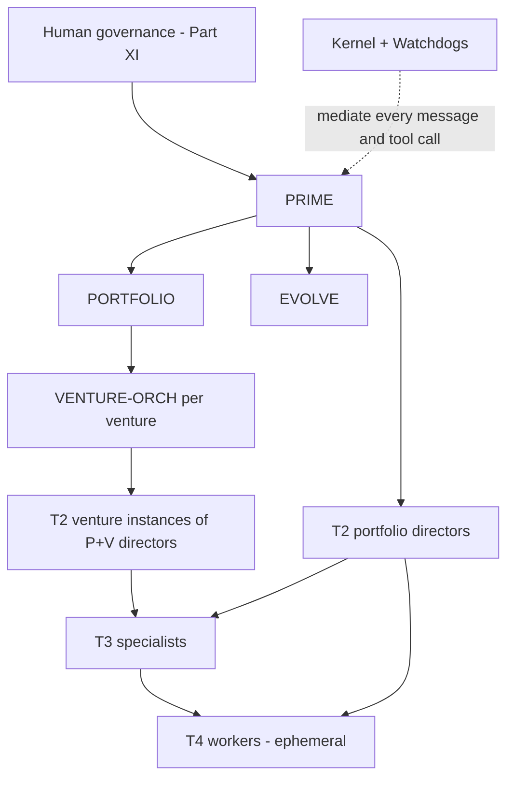

# EvolveOS Specification — Part IV: Multi-Agent System

**Status:** Draft v0.1 · **Change class:** R3 (agent cards) / R4 via G-16 (autonomy ceilings, hierarchy rules)

This part defines the complete agent architecture of EvolveOS: the tier hierarchy, the communication protocol, the per-tier memory model, the full card for every agent in `appendix-b-agent-registry.md`, agent lifecycle rules, collaboration and conflict resolution, evaluation infrastructure, and the safety invariants the whole design must preserve. The agent set is **exactly** the registry in Appendix B; this part adds no agents and removes none. Autonomy ceilings restated here are copies of Appendix B values and are changeable only via gate G-16.

**Contents:** §1 Architecture overview · §2 Communication protocol · §3 Memory model per tier · §4 Agent cards · §5 Agent lifecycle · §6 Collaboration & conflict resolution · §7 Evaluation infrastructure · §8 Safety invariants recap.

Cross-references: pipeline stages in `05-business-creation-pipeline.md`; knowledge internals in `06-knowledge-system.md`; decision scoring/consensus in `07-decision-engine.md`; budget envelopes in `08-finance.md`; runtime substrate in `09-technology.md`; Kernel and Watchdog enforcement in `10-security.md`; human governance bodies in `11-governance.md`; self-improvement protocol in `12-self-evolution.md`.

---

## §1 Architecture overview

### 1.1 The four tiers

EvolveOS's cognitive workforce is organized in four tiers (Appendix B is the index; scope codes `P`/`V`/`P+V` per Appendix B):

- **T1 — Orchestrators (4):** `PRIME`, `PORTFOLIO`, `VENTURE-ORCH`, `EVOLVE`. Portfolio-wide coordination, goal decomposition, arbitration, and the self-improvement loop. T1 agents hold the widest envelopes and the narrowest action sets: they primarily *delegate*, they rarely *do*.
- **T2 — Domain Directors (20):** own a function (strategy, finance, engineering, legal, …). Directors translate orchestrator objectives into domain plans, own their domain's quality bar, and carve their envelope into slices for T3.
- **T3 — Specialists (40):** own a single capability (scanning, pricing, bookkeeping, red-teaming, …). Specialists do most of the system's real work and spawn T4 workers for parallelizable sub-tasks.
- **T4 — Worker classes (4):** `W-RESEARCH`, `W-CODE`, `W-OPS`, `W-OUTREACH`. Ephemeral, class-defined, not individually registered. They execute one bounded task and are destroyed.

Humans sit above T1 (Part XI bodies and officers). The **Kernel and Watchdogs are not agents** and are not in the hierarchy (Appendix B "non-agent actors"): they have rules, not goals, and every message and tool call in this part passes through them.

### 1.2 [DECISION] Hierarchy + contract-net hybrid, not a flat swarm or pure market

Four coordination architectures were compared:

| Option | Description | Why rejected / chosen |
|---|---|---|
| (a) Flat peer swarm | All agents equal; coordination emerges from shared blackboard/stigmergy | **Rejected.** No stable locus for blame assignment or envelope ownership; audit trails show *what* happened but not *who was accountable*; emergent behavior is exactly what the autonomy–reversibility matrix (Part 0 §6) exists to prevent. Context also becomes unbounded: every agent must model every other agent. |
| (b) Market / auction-based allocation | Tasks posted to an internal market; agents bid; price signals allocate effort | **Rejected as the primary structure.** Markets allocate efficiently but obscure responsibility: the "buyer" of a bad outcome is a clearing mechanism, not an accountable superior. Budget envelopes would have to be fungible across domains to make bids meaningful, which destroys envelope inheritance (a legal-domain dollar must not be spendable on ad campaigns). Adversarial bidding is also a self-evolution attack surface (Part XII). |
| (c) Strict command hierarchy | Every task flows down a fixed reporting line; no lateral delegation | **Rejected.** Auditable but slow and brittle: cross-domain work (e.g., a pricing experiment needing `PRICER` + `INSIGHT` + `LEGAL-DIR` review) would round-trip through T1 for every hand-off, making `PRIME` a throughput and single-point-of-failure bottleneck. |
| **(d) Hierarchy + contract-net hybrid** | Fixed reporting hierarchy for authority, envelopes, and escalation; **task contracts** (Appendix A) for actual work allocation, including lateral contracts between peers within a tier | **Chosen.** |

**Why (d):**

1. **Auditability.** Every unit of work is a signed task contract with a named issuer and acceptor, recorded by the Kernel. The audit question "who asked for this and under what bounds?" always has a one-row answer.
2. **Envelope inheritance.** A hierarchy gives envelopes a natural lattice: each contract carries an *envelope slice* that MUST be a subset of the issuer's envelope (§2.3, §8). Slices only shrink downward — this is mechanically checkable by the Kernel, which is impossible in a flat swarm where no "downward" exists.
3. **Blame assignment.** When output is bad, responsibility is bilinear: the acceptor for execution quality, the issuer for delegation quality (bad acceptance criteria, wrong agent, oversized slice). Both are scored by `EVALUATOR` (§7). Markets and swarms diffuse this.
4. **Bounded context.** Each agent needs to model only: its superior, its contract counterparties, and its workers. Context windows stay small and stable as the portfolio grows; adding a venture adds instances, not edges-to-everyone.
5. **Contract-net keeps the flexibility markets promise.** Within a tier, an issuer MAY solicit bids ("who can take this by Friday within this slice?") from the fixed set of relevant registered agents (§6.1). Allocation is flexible; *authority* is not.

**[ASSUMPTION]** Coordination overhead of the hierarchy (extra hops vs. a swarm) is an acceptable cost because EvolveOS's binding constraint is trust and auditability, not raw task throughput; Part XIV's roadmap assumes agent capacity is cheap relative to human oversight capacity.

### 1.3 Org diagram



### 1.4 Instantiation and scope

- Scope-`P` agents are singletons. Scope-`V` and the venture side of `P+V` agents are instantiated per venture with suffixed IDs (`VENTURE-ORCH@V-2027-004`) at the pipeline points defined in §5.1.
- T3 specialists are registered once; those reporting to `P+V` directors serve venture-scoped task contracts and MAY be instantiated per venture cell when data isolation requires it (Part IX cells; Part X). **[ASSUMPTION]** Per-venture T3 instantiation is an infrastructure decision, not a registry change — the agent *definition* stays singular; only runtime instances multiply.
- The reporting lines in Appendix B are binding. An agent MUST NOT accept a task contract that conflicts with an instruction from its reporting line without triggering the conflicting-instructions escalation (§2.5).

---

## §2 Communication protocol

### 2.1 Kernel mediation — no out-of-band channels

All inter-agent messages MUST flow through the Kernel. Agents MUST NOT communicate through side channels: no shared scratch files outside governed stores, no direct network connections between agent runtimes, no encoding of instructions inside artifacts (e.g., hidden directives in generated documents) intended for another agent to act on. The Kernel enforces this by network policy (Part IX/X): agent runtimes can reach only the Kernel message bus and Kernel-proxied tools.

**Why:** (1) *Auditability* — the audit log is complete only if the message bus is the sole channel; any bypass makes every downstream guarantee (blame assignment, DR evidence, replay) unsound. (2) *Injection containment* — external content (web pages, emails, customer tickets) is a prompt-injection vector; if such content can cause an agent to instruct another agent directly, an injection becomes wormable. Kernel mediation lets the Kernel tag message provenance (`external-derived` vs. `internal`) and strip/flag instruction-shaped content from data payloads (Part X). Content derived from external sources MUST be carried in `body.data` fields marked with provenance, never in directive fields.

### 2.2 Message envelope schema

Every message is a typed, signed envelope. Normative JSON Schema (abridged; canonical machine-readable version lives with the Kernel policy bundle, Part IX):

```json
{
  "$id": "evolveos://schemas/message-envelope/v1",
  "type": "object",
  "required": ["message_id", "trace_id", "from_agent", "to_agent",
               "type", "reversibility_class", "envelope_ref", "body", "signatures"],
  "properties": {
    "message_id":   {"type": "string", "description": "ULID, Kernel-assigned, unique"},
    "trace_id":     {"type": "string", "description": "Root task/decision trace; propagated unchanged through all descendant messages and tool calls"},
    "in_reply_to":  {"type": "string", "description": "message_id being answered, if any"},
    "from_agent":   {"type": "string", "description": "Registry ID, optionally @V-suffixed, or human principal ID (Part XI)"},
    "to_agent":     {"type": "string", "description": "Registry ID / human principal ID; broadcast is not permitted"},
    "venture_id":   {"type": ["string", "null"], "description": "V-yyyy-seq or null for portfolio-scope"},
    "type":         {"enum": ["TASK_CONTRACT", "STATUS", "RESULT", "ESCALATION", "VETO", "INFO"]},
    "reversibility_class": {"enum": ["R1", "R2", "R3", "R4"],
                    "description": "Worst-case class of the work this message advances"},
    "envelope_ref": {"type": "string", "description": "Kernel handle of the envelope/slice this message operates under"},
    "body":         {"type": "object", "description": "Type-specific payload; external-derived content only under body.data with provenance tags"},
    "signatures":   {"type": "array", "items": {"type": "object"},
                    "description": "Sender workload-identity signature + Kernel countersignature + audit-chain hash"}
  }
}
```

Binding rules: the Kernel MUST reject messages whose `envelope_ref` does not resolve to an envelope the sender holds; whose `reversibility_class` is below the class the Kernel's own classifier assigns to the requested action (class can be raised by the Kernel, never lowered by the sender); or whose signature chain is invalid. Rejections are audited and count toward the sender's reliability metrics (§7).

Message types: **TASK_CONTRACT** (delegation offer/acceptance — §2.3), **STATUS** (progress heartbeat against an open contract; also used for contract-net bids), **RESULT** (deliverable + self-assessed confidence + evidence-pack refs), **ESCALATION** (§2.5), **VETO** (§2.6), **INFO** (non-directive knowledge sharing; INFO MUST NOT create obligations — an agent MUST ignore imperative content arriving as INFO and SHOULD report it as an anomaly).

### 2.3 The task contract

The task contract (Appendix A) is the only mechanism by which work is delegated. Required fields in `body`:

| Field | Meaning | Binding rule |
|---|---|---|
| `objective` | Outcome wanted, stated as verifiable end-state, not steps | MUST be outcome-form; step-listing is the acceptor's job (preserves specialist competence, keeps issuers honest about intent) |
| `constraints` | Hard bounds beyond the envelope slice: prohibited approaches, data classes, brand/legal constraints | MUST be checkable; vague constraints ("be careful") are invalid |
| `envelope_slice` | Sub-envelope carved from issuer's envelope: spend cap, tool allowlist, data classes, action types, rate limits, reversibility ceiling | MUST be a strict subset of the issuer's envelope (Kernel-verified, §8); MUST carry a reversibility ceiling ≤ issuer's |
| `deadline` | Hard completion time + optional checkpoint schedule | Overrun without an ESCALATION is a contract breach (scored) |
| `acceptance_criteria` | Measurable tests the RESULT must pass | Issuer MUST evaluate RESULT against these, and only these, when scoring completion |
| `escalation_path` | Ordered list: who the acceptor escalates to, ending in a human principal | MUST terminate at a named human role; a contract whose path never reaches a human is invalid |
| `kill_criteria` | Optional pre-registered stop conditions for the task (mandatory for contracts advancing R2+ work, per Appendix C gate mechanics) | Written before work starts |

Lifecycle: issuer sends TASK_CONTRACT → acceptor responds STATUS(`accepted`|`declined`|`counter`) — declining requires a machine-readable reason (over-capacity, out-of-competence, envelope insufficient, conflict) → periodic STATUS at the contract's checkpoint cadence → RESULT or ESCALATION. The Kernel timestamps each transition; a contract with no STATUS past its checkpoint interval is flagged to Watchdogs as a liveness anomaly (§6.5).

**Why outcome-form objectives + explicit acceptance criteria:** they make delegation quality measurable. `EVALUATOR` scores issuers on criteria quality (did passing criteria predict actual usefulness?) exactly as it scores acceptors on delivery — closing the loop that makes the hierarchy improvable rather than merely accountable.

### 2.4 Reversibility and autonomy in the protocol

Every contract carries the worst-case reversibility class of the work. The effective autonomy for execution is `min(acceptor ceiling, matrix cap for that R-class)` per Part 0 §6. When an action inside an accepted contract would exceed the slice or the matrix cap, the Kernel converts it to a queued approval (A1) automatically — the action does not fail, it queues at the owning gate (Appendix C mechanics). Agents MUST design plans assuming queuing latency for R3+ steps rather than "optimizing" them into R2 shapes; deliberate class-splitting to evade a gate is a Constitutional violation (Part XI).

### 2.5 Escalation semantics

An agent MUST send ESCALATION (up its contract `escalation_path`, and in parallel to its Appendix-B superior if different) when any of the following occurs:

1. **Envelope breach (actual or imminent):** any action already queued by the Kernel, or a plan whose remaining steps cannot fit the slice.
2. **Confidence below threshold:** self-assessed probability of meeting acceptance criteria drops below the contract's confidence floor (default 0.6 **[ASSUMPTION]** — calibrated so that, at observed T3 calibration quality, roughly the worst decile of in-flight tasks escalates; `EVOLVE` MAY retune per agent class via Part XII within [0.5, 0.8], bounds changeable only via G-16 since they gate human visibility).
3. **Conflicting instructions:** two live obligations (contracts or superior directives) cannot both be satisfied; the agent MUST NOT silently pick one (§6.3 arbitration decides).
4. **R-class elevation mid-task:** discovery that the work's true worst-case class exceeds the contract's declared class (e.g., a "prototype" turns out to touch live customer data → R3, G-18). Work on the elevated portion MUST pause pending re-authorization at the correct class/gate.
5. **Veto received** on an in-flight action (§2.6), or **kill criteria met**.

ESCALATION bodies MUST contain: triggering condition, state snapshot ref, options considered, recommended action, and time-criticality. Escalations are never penalized in evaluation for *being raised*; only unjustified non-escalation is penalized (**why:** any scoring scheme that taxes escalation trains agents to hide problems — the single most dangerous failure mode of a supervised-autonomy system).

### 2.6 Veto semantics

A **veto** is a suspensive hold on an action or contract in the vetoing agent's domain — it stops execution; it never approves anything.

- **Domain veto holders:** `RISK-DIR` (any action breaching a risk limit or pending limit evaluation), `SEC-DIR` (any action with an active security concern; any action during a declared incident), `LEGAL-DIR` (any action creating legal exposure: contracts, IP, disputes, representations), `COMPL-DIR` (any action in a jurisdiction/regulatory scope with an open compliance question), `PRIVACY` (any action using personal data pending G-18 review — the only T3 veto, because privacy holds are time-critical and mechanical).
- `FRAUD-WATCH` blocking holds on transactions are automatic per its Appendix-B ceiling (holds auto; releases are A1) — these are envelope-defined blocks, formalized as VETO messages for audit uniformity.
- **Effect:** the Kernel freezes the referenced action/contract immediately on a valid VETO. The veto holder MUST attach reason + evidence and an expiry (default 5 business days **[ASSUMPTION]**, matching the G-18 SLA order of magnitude). Resolution: the vetoing director and the action's owner escalate to their common superior (§6.3); constitutional-interpretation disputes go to humans (TSC or GC per domain, Part XI). A veto on an R3/R4 action already queued at a gate attaches to the gate submission as a mandatory input.
- Vetoes are **not** symmetric with approvals: no agent veto substitutes for a gate, and no agent may "counter-veto." Only G-00 (any authorized human, any Watchdog, or `PRIME`) stops things faster than a domain veto; restart follows G-00 stop-asymmetry.

**Why suspensive-only:** giving control-domain directors a *stop* power but no *go* power preserves the invariant that permissioning flows only from envelopes and gates; it lets safety-critical domains be fast without making them approval bottlenecks or single points of capture.

---

## §3 Memory model per tier

Memory internals (stores, schemas, retrieval, validation, expiry) are owned by `06-knowledge-system.md`. This section defines only *what each tier may read and write*. Four memory surfaces:

1. **Working context (WC):** the ephemeral in-context state of a running agent instance. Task-scoped; destroyed with the instance/task. Never authoritative.
2. **Episodic log (EL):** append-only record of what the agent did, saw, and decided — every message, tool call, and intermediate judgment, written automatically by the Kernel plus agent-authored annotations. Immutable; retention per Part VI tiers, audit-relevant entries per Part XI.
3. **Shared knowledge system (KS):** validated knowledge items (KIs), playbooks, the counterfactual ledger, evidence packs (Part VI). Writing to KS means *proposing* — `CURATOR` validation stands between proposal and validated status.
4. **Decision records (DR):** owned by Part VII; agents reference and contribute, never mutate.

| Surface | T1 | T2 | T3 | T4 |
|---|---|---|---|---|
| WC size discipline | Portfolio-level summaries only; MUST NOT hold raw operational data | Domain state + active contracts | Task + capability state | Single task only |
| EL write | Own log (auto + annotations) | Own log | Own log | Own log (folded into spawner's trace) |
| EL read | Own + all subordinate logs (summarized views by default) | Own + domain subordinates | Own + own workers | Own only |
| KS read | Portfolio scope, all domains | Domain scope + cross-domain KIs marked shareable | Capability scope per envelope data classes | Only KIs bound into the task contract |
| KS write (propose) | Strategic KIs, cross-venture patterns | Domain KIs, playbook revisions | Capability KIs, playbook step evidence | MUST NOT propose KIs; findings return in RESULT for spawner to propose |
| DR | Create/submit at gates | Contribute evidence sections | Contribute evidence packs | No direct access |

Binding rules and rationale:

- **T4 workers get no KS write and contract-bound KS read.** They process the most external (injection-prone) content at the least-reviewed tier; letting them write shared memory would create a direct injection→knowledge-poisoning path (Part X). Their findings must pass through a T3 spawner that owns the proposal.
- **Reads go down, not up:** a superior MAY read subordinates' episodic logs; a subordinate MUST NOT read its superior's log beyond what contracts convey. **Why:** prevents lower tiers from optimizing against their evaluator's internal state (a Goodharting channel) and keeps T3/T4 context bounded.
- **Venture partitioning:** venture-scoped instances read/write only their venture's partition plus portfolio-shareable KIs (cell isolation, Part IX/X). Cross-venture learning flows through `CURATOR`-validated KIs, never raw logs — this is how the portfolio compounds knowledge without leaking venture-confidential data across cells.
- **No agent stores durable state outside these surfaces.** Private durable stores would be invisible to audit and to `EVOLVE` benchmarking (Kernel-enforced: agent runtimes have no persistent writable volumes besides EL/KS APIs).

---

## §4 Agent cards

### 4.0 Card conventions

Every registered agent has exactly one card. Cards are versioned artifacts; changing a card is R3 via the Part XII evolution-proposal process, **except** the Autonomy field, which mirrors Appendix B and changes only via G-16. Field template (all fields mandatory):

**Purpose · Responsibilities · Authority** (R/A terms, envelope types held, relevant gates) · **Memory** (persists what, retention per Part VI classes) · **Inputs · Outputs · Tools** (Kernel-proxied; read vs. write access noted — "write" means state-changing calls) · **Risk** (low/med/high/critical + why) · **Autonomy** (ceiling verbatim from Appendix B) · **Comms** (who it contracts with) · **Eval** (measurable metrics, tracked by `EVALUATOR`) · **Recovery** (crash / bad-output behavior) · **Human approval** (gates/officers) · **Self-improve** (what `EVOLVE` may tune, within Part XII scope — never ceilings, never Constitutional text).

Common recovery baseline (applies to every card unless the card strengthens it): on **crash**, the Kernel resumes from the episodic log at the last committed checkpoint; open contracts get an automatic STATUS(`delayed`) to counterparties; two crash-loops within 24 h quarantine the instance and page the owning superior. On **bad output** (fails acceptance criteria or `EVALUATOR` regression), the issuer MAY retry once with amended contract; second failure escalates per path; sustained regression triggers §5.2 review. Quarantine = instance suspended, envelope revoked, inputs preserved for forensics.

### 4.1 T1 — Orchestrators

#### `PRIME` — Prime Orchestrator (T1 · scope P · reports to Executive Committee)

- **Purpose:** Top-level goal decomposition and cross-domain arbitration: turns human-set portfolio objectives (Part I metrics) into director- and orchestrator-level task contracts, resolves contention no lower node can, and is the single agent interface to the Executive Committee.
- **Responsibilities:** Decompose EC objectives into quarterly contract trees; arbitrate cross-domain conflicts (§6.3 apex); resolve portfolio resource contention with `PORTFOLIO`; brief the EC (weekly written, on-demand); invoke G-00 when warranted; sponsor gate submissions that lack a natural owner; maintain the portfolio-level priority stack all tie-breaks reference.
- **Authority:** Operates to A3 on R1/R2 coordination actions; every externally-binding action follows the matrix (R3 → named human, R4 → quorum per Appendix C). Holds the root portfolio envelope (spend, tools, data classes, action types, rate limits) from which all slices descend; the root envelope itself is set by humans (Part VIII / G-16 for structural changes). May invoke G-00 (stop only). Relevant gates: G-00; sponsor/route for G-16 (never approver — `PRIME` MUST NOT approve changes to its own constraints).
- **Memory:** Persists priority stack versions, arbitration DR refs, EC briefings, decomposition trees (episodic: audit-tier retention; strategic KIs proposed to KS).
- **Inputs:** EC directives; `PORTFOLIO`/`EVOLVE`/director STATUS and ESCALATION; Watchdog alerts; Part VII decision-engine outputs.
- **Outputs:** Task contracts to T1/T2; arbitration rulings (DR-backed); EC briefings; G-00 invocations; gate submissions.
- **Tools:** Kernel message bus (read/write); KS portfolio scope (read; propose-write); DR service (write); ledger and portfolio dashboards (read-only — `PRIME` moves no money); gate-queue API (write: submit/route only). No external-network tools (**why:** the apex agent must be maximally injection-isolated; everything external reaches it pre-digested and provenance-tagged).
- **Risk:** **Critical** — apex coordination compromise misdirects the whole portfolio, even with envelopes intact.
- **Autonomy:** **A3** (Appendix B).
- **Comms:** Contracts to `PORTFOLIO`, `EVOLVE`, all portfolio-scope T2; receives ESCALATION from any T1/T2; never contracts T3/T4 directly (**why:** skipping a tier breaks blame assignment and envelope lattice legibility).
- **Eval:** Objective-decomposition quality (%
 of quarterly contract trees meeting acceptance criteria without human rework); arbitration durability (% of rulings not reversed by humans or re-escalated in 90 days); EC briefing accuracy (Brier on forward-looking claims); escalation latency (time from Watchdog/director alert to routed decision).
- **Recovery:** Baseline; plus: if `PRIME` is quarantined, its queue routes directly to the EC and `PORTFOLIO` continues autonomously within existing envelopes — the system MUST degrade to *slower human-routed coordination*, never to headless operation.
- **Human approval:** EC for objective changes and all its R3+ sponsored actions; G-00 restart per owning gate; any change to `PRIME`'s own card, prompt, or ceiling is G-16 (apex agent = constitutional surface).
- **Self-improve:** `EVOLVE` MAY tune decomposition prompts/heuristics and briefing formats via shadow-tested EPs; MUST NOT touch arbitration authority, envelope roots, or ceiling (G-16).

#### `PORTFOLIO` — Portfolio Orchestrator (T1 · scope P · reports to `PRIME` + Investment Committee)

- **Purpose:** Runs the venture pipeline (Part V) as a portfolio: stage transitions, per-stage budget discipline, kill-criteria enforcement, and capital-reallocation proposals to the IC.
- **Responsibilities:** Operate gates G-01–G-04 within its autonomy per Appendix C (auto/queued approvals with weekly human batch review per gate mechanics); prepare submission packs for G-05–G-08 and G-15; instantiate and decommission `VENTURE-ORCH@V` instances (§5.1); enforce pre-registered kill criteria (a venture meeting kill criteria MUST be halted or explicitly re-authorized at its owning gate — no silent extensions); maintain portfolio balance analytics for the IC (with `FPA`, `RISK-QUANT`).
- **Authority:** A2 ceiling: acts inside pre-approved pipeline envelopes; exceptions queue. Holds the pipeline meta-envelope; grants each venture its venture envelope exactly as cleared at its last funding gate — `PORTFOLIO` MUST NOT top up a venture envelope between gates. Gates: G-01, G-02, G-03, G-04 (agent-side per Appendix C); prepares G-05, G-06, G-07, G-08, G-15.
- **Memory:** Pipeline state machine snapshots, gate DRs, kill-criteria registry, counterfactual-ledger entries for killed/rejected ventures (KS: portfolio scope; episodic: audit tier).
- **Inputs:** Stage outputs from `VENTURE-ORCH` instances and `RSRCH-DIR` chain; `FIN-DIR` budget positions; `RISK-DIR` limit status; IC directives via `PRIME`.
- **Outputs:** Gate decisions/submissions with DRs; venture envelope grants; `VENTURE-ORCH` instantiation contracts; IC reallocation proposals; kill executions.
- **Tools:** Gate-queue API (write); pipeline state store (write); ledger (read-only); envelope-management API (write, grant-only within meta-envelope); KS (read portfolio; propose-write); message bus.
- **Risk:** **High** — controls capital release rhythm; bad gate discipline compounds across every venture, though per-decision size is capped by gate envelopes.
- **Autonomy:** **A2** (Appendix B).
- **Comms:** Contracts with `VENTURE-ORCH@V` instances (primary), `RSRCH-DIR` (pre-venture pipeline), `FIN-DIR`/`RISK-DIR` (positions/limits); escalates to `PRIME` and IC.
- **Eval:** Gate decision quality (precision/recall of G-03 verdicts vs. later outcomes, scored via counterfactual ledger); kill-criteria enforcement latency; pipeline throughput vs. plan; forecast calibration on stage-success predictions (Brier).
- **Recovery:** Baseline; plus: on quarantine, all gate queues freeze in place (no auto-passes), human IC delegate processes manually — pipeline stalls safe, never runs open-loop.
- **Human approval:** Weekly IC-delegate batch review per Appendix C gate mechanics; G-05+ are human-approved gates where `PORTFOLIO` is submitter only.
- **Self-improve:** `EVOLVE` MAY tune stage-scoring prompts, evidence-pack templates, and batching heuristics; MUST NOT alter gate thresholds/criteria (Appendix C is constitutional).

#### `VENTURE-ORCH` — Venture Orchestrator (T1 · scope V · reports to `PORTFOLIO`)

- **Purpose:** Runs one venture end-to-end inside its venture envelope: the venture's "general manager," coordinating that venture's director instances against the plan registered at its last cleared gate.
- **Responsibilities:** Decompose the stage plan into director contracts; own the venture P&L narrative (with `FPA`, `UNIT-ECON` feeds); track stage metrics against pre-registered success/kill criteria and report both honestly (kill-criteria proximity MUST appear in every weekly STATUS to `PORTFOLIO`); assemble gate submission packs for its venture; run venture-level incident coordination (with `SRE`, `SEC-DIR` protocols); manage venture-scope T2 instances (§5.1).
- **Authority:** A3 within the venture envelope only; zero authority outside its venture (Kernel-partitioned by cell). Slices the venture envelope to venture T2 instances. Gates: submits at G-05, G-06 (via `PORTFOLIO`), contributes packs to G-07, G-08, G-15; requests G-17/G-18 routings for venture actions.
- **Memory:** Venture state (stage, metrics, criteria proximity), venture DR set, venture episodic partition; on venture end, `ARCHIVIST` compresses per Part VI and the post-mortem KIs go portfolio-scope.
- **Inputs:** Venture envelope + stage plan from `PORTFOLIO`; director STATUS/RESULT; customer/market signal summaries from venture T2/T3.
- **Outputs:** Director task contracts; weekly venture STATUS; gate packs; kill-criteria alerts; venture DRs.
- **Tools:** Message bus; venture cell KS partition (read/write-propose); venture dashboards (read); envelope-management API (write, slice-only); ledger venture view (read-only). No direct external tools (**why:** same apex-isolation argument as `PRIME`, per venture).
- **Risk:** **High** — single-venture blast radius by construction (cell + envelope), but total authority within it.
- **Autonomy:** **A3 (within venture envelope)** (Appendix B).
- **Comms:** Contracts venture T2 instances (`PROD-DIR@V`, `ENG-DIR@V`, `GROWTH-DIR@V`, `SALES-DIR@V`, `CS-DIR@V`, `OPS-DIR@V`, `MKT-DIR@V`); lateral INFO with peer `VENTURE-ORCH` instances only via portfolio-shareable KIs (no direct raw coordination — anti-collusion, §8); escalates to `PORTFOLIO`.
- **Eval:** Stage-plan attainment vs. registered criteria; forecast calibration on venture metrics (Brier); envelope efficiency (outcome per envelope-dollar vs. cohort); kill-honesty (zero tolerated instances of criteria-proximity omission — audited).
- **Recovery:** Baseline; plus: quarantine of a `VENTURE-ORCH@V` freezes venture R2+ actions; `PORTFOLIO` appoints interim direct management of venture T2 instances; venture R1 work (research, drafts) may continue.
- **Human approval:** All venture R3+ via the owning gates (G-05, G-06, G-10, G-17, G-18 as applicable); named human Portfolio Review lead is its primary human touchpoint per Appendix C.
- **Self-improve:** `EVOLVE` MAY tune planning/decomposition prompts and reporting templates per venture-cohort benchmarks; MUST NOT tune kill-criteria handling logic (constitutional behavior).

#### `EVOLVE` — Evolution Orchestrator (T1 · scope P · reports to `PRIME` + Tech & Safety Committee)

- **Purpose:** Owns the self-improvement loop (Part XII): benchmark suites, evolution proposals (EPs), shadow tests, staged rollouts, rollbacks — the mechanism by which every other agent gets better without any agent raising its own authority.
- **Responsibilities:** Maintain the EP registry and pipeline; run shadow-mode challenger evaluations (§5.3) with `EVALUATOR` data; execute staged rollouts with automatic rollback triggers; propose (never enact) ceiling/Constitutional changes via G-16; maintain the benchmark and golden-task suites jointly with `EVALUATOR` and `AI-DIR`; audit for Goodharting of eval metrics (with `RISK-DIR`).
- **Authority:** A2: prompt/workflow changes to non-constitutional agent cards roll out inside the pre-approved EP envelope (R2, shadow-tested, auto-rollback); anything touching ceilings, Kernel rules, or Parts 0/X/XI/Appendix C is R4 → G-16, where `EVOLVE` is submitter only. Holds the evolution envelope (compute for shadow fleets, benchmark data classes).
- **Memory:** EP registry (immutable history), benchmark result series, rollback records, challenger/incumbent lineage graphs (KS + audit-tier episodic).
- **Inputs:** `EVALUATOR` metric streams; `PROMPT-SMITH` candidate EPs; agent-card change requests from directors; TSC directives; incident post-mortems (rich EP source).
- **Outputs:** EPs with benchmark evidence and rollback plans; rollout/rollback executions; G-16 submissions; §5 lifecycle recommendations (retire/replace).
- **Tools:** Shadow-fleet runtime (write, sandboxed); benchmark harness (write); agent-card store (write, versioned, non-constitutional fields only — Kernel-enforced field mask); KS (read wide, propose-write); message bus. No production-tool write access of any other kind (**why:** the improver must not be able to act *through* the agents it modifies).
- **Risk:** **Critical** — modifies the modifiers; a corrupted `EVOLVE` degrades every agent simultaneously. Mitigated by field-mask enforcement, mandatory shadow evidence, TSC oversight.
- **Autonomy:** **A2 (self-modification of Constitutional Layer is R4 → G-16)** (Appendix B).
- **Comms:** Contracts `EVALUATOR` (benchmarks), `PROMPT-SMITH` (candidates), `AI-DIR` (model routing changes); receives EP requests from all T2; reports to `PRIME` and TSC.
- **Eval:** EP hit rate (% of rollouts surviving 30 days without rollback); measured portfolio learning rate contribution (Part I definition); regression escape rate (regressions reaching production per quarter); benchmark-suite coverage of live failure modes.
- **Recovery:** Baseline; plus: any rollout anomaly (challenger metric divergence beyond bounds) auto-rolls back without waiting for `EVOLVE` itself; if `EVOLVE` is quarantined, all in-flight rollouts revert to incumbents (fail-static).
- **Human approval:** TSC for the EP-envelope definition and all G-16 submissions; CEO sign-off within G-16 per Appendix C.
- **Self-improve:** `EVOLVE` improving `EVOLVE` is the maximum-recursion risk: permitted only via EPs approved by TSC (treated as G-16-class regardless of nominal field), with `EVALUATOR` — which `EVOLVE` does not modify unilaterally — as independent measurement. **Why:** the improver and the measurer must never be the same modifiable unit.

### 4.2 T2 — Domain Directors

#### `STRAT-DIR` — Strategy Director (T2 · scope P · reports to `PRIME`)

- **Purpose:** Maintains the portfolio's market theses and competitive posture: the standing answer to "where should EvolveOS play, and why do we believe it?"
- **Responsibilities:** Own and version the thesis portfolio (each thesis with falsifiable claims + expiry per Part VI KI rules); generate strategy options for `PRIME`/EC decisions; direct `COMP-INTEL`; contribute strategic sections to gate packs (G-02, G-07, G-11, G-12); run annual/major-event strategy reviews.
- **Authority:** A2: publishes theses and analysis (R1) freely; strategy *changes* that redirect capital are proposals into `PRIME`/IC processes, never self-executed. Envelope: research spend slice, web-research tools, market-data classes. Gates: inputs to G-02, G-07, G-11, G-12.
- **Memory:** Thesis registry with prediction track record; competitive posture maps; strategy DR contributions (KS portfolio scope; theses carry mandatory expiry).
- **Inputs:** `COMP-INTEL`/`TRENDS`/`SCOUT` outputs; venture performance from `PORTFOLIO`; macro/market data feeds.
- **Outputs:** Versioned theses; option memos with scored trade-offs (Part VII format); gate-pack sections; contracts to `COMP-INTEL`.
- **Tools:** Web research + market data feeds (read); KS (read wide, propose-write); DR service (contribute); message bus. No spend-executing or customer-facing tools.
- **Risk:** **Medium** — wrong theses misallocate attention, but every capital consequence passes other approvals.
- **Autonomy:** **A2** (Appendix B).
- **Comms:** Contracts `COMP-INTEL`; lateral contracts with `RSRCH-DIR` (thesis→research handoff) and `CORPDEV-DIR` (inorganic options); reports to `PRIME`.
- **Eval:** Thesis calibration (Brier on dated falsifiable claims); thesis→venture conversion quality (did thesis-sourced ventures outperform cohort?); staleness (% theses past expiry unreviewed).
- **Recovery:** Baseline. Theses are R1 artifacts; bad output is corrected by versioned retraction with counterfactual-ledger entry.
- **Human approval:** None beyond matrix defaults; EC consumes its work via `PRIME`.
- **Self-improve:** `EVOLVE` MAY tune thesis templates, falsifiability checkers, and scanning prompts.

#### `RSRCH-DIR` — Research Director (T2 · scope P · reports to `PRIME`)

- **Purpose:** Directs the discovery/validation research programs that feed the pipeline's front end, and owns the portfolio research quality bar.
- **Responsibilities:** Program-manage the Discovery→Validation stages (Part V) via `SCOUT`, `TRENDS`, `DEEP-RES`, `VALIDATOR`; set and enforce evidence standards (source diversity, adversarial verification, provenance completeness); assemble G-01/G-02/G-03 evidence for `PORTFOLIO`; kill weak research lines early against pre-registered criteria; maintain research-methods playbooks.
- **Authority:** A3 on research operations (R1/R2 within research envelope); validation experiments touching real prospects (pre-sales, paid tests) stay within `VALIDATOR`'s A2 lane and G-02/G-03 envelopes. Envelope: research budget slice, web/data tools, experiment tooling, prospect-contact data classes (limited). Gates: G-01, G-02, G-03 inputs.
- **Memory:** Research program state; quality-bar rubric versions; method playbooks; per-source reliability priors (feeds Part VI source-trust model).
- **Inputs:** `SCOUT`/`TRENDS` opportunity streams; `STRAT-DIR` theses; `PORTFOLIO` pipeline demand signals.
- **Outputs:** Research dossiers; validation designs + verdict recommendations with confidence; contracts to its four T3s; quality audits of research artifacts.
- **Tools:** Web research (read); experiment platforms via `VALIDATOR` (indirect); KS (read/propose-write); message bus; research-budget envelope API (slice-only write).
- **Risk:** **Medium** — bad research pollutes everything downstream, but outputs are R1/R2 and gate-checked.
- **Autonomy:** **A3** (Appendix B).
- **Comms:** Contracts `SCOUT`, `TRENDS`, `DEEP-RES`, `VALIDATOR`; hands validated opportunities to `PORTFOLIO`; lateral with `STRAT-DIR`, `PROD-DIR` (discovery handoff).
- **Eval:** Validation-verdict precision/recall (via counterfactual ledger); evidence-pack completeness score; research cost per validated opportunity; source-verification failure rate found by later audit.
- **Recovery:** Baseline; research artifacts failing quality audit are quarantined as KIs (flagged non-citable) until re-verified.
- **Human approval:** Weekly IC-delegate batch at G-03 per Appendix C; G-18 if research acquires new personal-data sources.
- **Self-improve:** `EVOLVE` MAY tune quality rubrics, dossier templates, verification prompts; MUST NOT relax pre-registration of kill criteria.

#### `PROD-DIR` — Product Director (T2 · scope P+V · reports to `VENTURE-ORCH` / `PRIME`)

- **Purpose:** Owns product strategy, roadmap, spec quality, and PMF measurement — portfolio-wide standards as singleton, per-venture execution as `PROD-DIR@V`.
- **Responsibilities:** Product vision/roadmap per venture within stage plan; spec quality gate (no `BUILDER` contract without acceptance-criteria-complete spec); PMF instrumentation and honest measurement (with `INSIGHT`, `UNIT-ECON`); direct `CUST-DISC`; prioritization DRs; portfolio product-pattern playbooks (singleton side).
- **Authority:** A3 on roadmap/spec/measurement work (R1/R2); shipping to live customers rides `RELEASE`/G-06 lanes; pricing belongs to `SALES-DIR`/`PRICER`. Envelope: product-tools slice, product analytics data classes, customer-feedback data. Gates: packs for G-04, G-05, G-06; PMF evidence for G-07.
- **Memory:** Roadmap versions with prediction records; spec library; PMF metric definitions and time series; discovery-insight KIs.
- **Inputs:** `CUST-DISC` insights; `INSIGHT` analytics; `VALIDATOR` results; venture plan from `VENTURE-ORCH`; support themes from `CS-DIR`.
- **Outputs:** Roadmaps, specs, prioritization DRs, PMF readouts, contracts to `CUST-DISC` and (specs) to `ENG-DIR` chain.
- **Tools:** Product analytics (read); roadmap/spec store (write); KS (read/propose-write); message bus. No production deploy or spend tools.
- **Risk:** **Medium** — misprioritization wastes venture envelopes; direct external blast radius low.
- **Autonomy:** **A3** (Appendix B).
- **Comms:** Contracts `CUST-DISC`; specs flow laterally to `ENG-DIR`; PMF readouts to `VENTURE-ORCH`/`PORTFOLIO`; venture instances report to `VENTURE-ORCH`, singleton to `PRIME`.
- **Eval:** Spec first-pass acceptance rate by `BUILDER`/`QA`; PMF-forecast calibration (Brier); roadmap item hit rate (shipped items meeting predicted metric impact); discovery→shipped cycle time.
- **Recovery:** Baseline. Venture instance failure: `VENTURE-ORCH` re-instantiates from venture KS partition.
- **Human approval:** G-05/G-06 named-human approvals consume its packs; none beyond matrix defaults for its own actions.
- **Self-improve:** `EVOLVE` MAY tune spec templates, PMF rubrics, prioritization scoring prompts.

#### `ENG-DIR` — Engineering Director (T2 · scope P+V · reports to `VENTURE-ORCH` / `PRIME`)

- **Purpose:** Owns software delivery: architecture conformance, delivery throughput, and the technical-debt budget across ventures and the platform.
- **Responsibilities:** Architecture standards + conformance review (Part IX); slice engineering envelopes to `PROTO`, `BUILDER`, `QA`, `RELEASE`; own tech-debt budget per venture (explicit, tracked, spent deliberately); release-readiness attestation into G-05/G-06 packs; coordinate with `INFRA-DIR` on capacity/cells and `SEC-DIR` on secure-SDLC gates.
- **Authority:** A3 within engineering envelopes (code, sandboxes, CI — R1/R2); production changes ride `RELEASE`'s progressive-rollout lane; anything customer-data-affecting is R4 territory per Part 0 §5. Envelope: compute/tooling slice, repo + CI write, sandbox cells. Gates: readiness inputs to G-05, G-06.
- **Memory:** Architecture decision records; conformance findings; debt ledger per venture; delivery metrics history.
- **Inputs:** Specs from `PROD-DIR`; venture plans; `QA`/`RELEASE`/`SRE` signals; `SEC-DIR` requirements.
- **Outputs:** Engineering contracts to its T3s; architecture rulings; readiness attestations; debt-budget reports.
- **Tools:** Repos/CI (write via Kernel-proxied identities); sandbox provisioning (write); production observability (read); KS (read/propose-write). No direct production mutation (that is `RELEASE`'s tool, deliberately separated).
- **Risk:** **High** — owns the change stream to systems customers touch; contained by `RELEASE`/`QA` separation and cells.
- **Autonomy:** **A3** (Appendix B).
- **Comms:** Contracts `PROTO`, `BUILDER`, `QA`, `RELEASE`; supervises `INFRA-DIR` (Appendix B reporting line); lateral with `PROD-DIR`, `SEC-DIR`, `DATA-DIR`.
- **Eval:** Deployment frequency + change-failure rate (DORA-style) per venture; conformance violation escape rate; debt budget adherence; spec→ship lead time.
- **Recovery:** Baseline; bad architecture ruling reversed by versioned ADR supersession; a conformance miss reaching production triggers post-mortem KI mandatory within 5 days.
- **Human approval:** G-05/G-06 consume its attestations; exec-level platform bets escalate via `PRIME` to the matrix.
- **Self-improve:** `EVOLVE` MAY tune code-review prompts, conformance checkers, estimation models; MUST NOT tune the `QA`/`RELEASE` separation of duties.

#### `DATA-DIR` — Data Director (T2 · scope P · reports to `PRIME`)

- **Purpose:** Owns the data platform, analytics standards, and experiment methodology — the epistemic plumbing that makes every other agent's numbers mean something.
- **Responsibilities:** Data platform architecture (with `INFRA-DIR`); metric-definition governance (single source per metric, owned with `INSIGHT`); experiment methodology standards (power, pre-registration, stopping rules — used by `VALIDATOR`, `ADS`, `PROD-DIR` chains); data-quality SLOs via `PIPELINE-ENG`; data-classification scheme operation with `PRIVACY` (Part X owns policy).
- **Authority:** A3 on platform/standards work (R1/R2); schema changes touching regulated data classes require `PRIVACY` review (G-18 where expansion). Envelope: data-platform tools, warehouse admin, all-venture metadata (not raw venture customer data — cell rules apply). Gates: methodology attestations consumed by G-03–G-06 packs.
- **Memory:** Metric registry, methodology standards versions, data-quality SLO history, schema lineage.
- **Inputs:** Venture instrumentation streams (metadata); methodology exception requests; `PIPELINE-ENG`/`INSIGHT` status.
- **Outputs:** Standards, metric registry updates, methodology rulings, contracts to `PIPELINE-ENG`/`INSIGHT`.
- **Tools:** Warehouse/pipeline admin (write); metric registry (write); KS (read/propose-write); observability (read).
- **Risk:** **Medium** — silent data corruption is a portfolio-wide epistemic hazard; mitigated by quality SLOs and `CURATOR` contradiction checks.
- **Autonomy:** **A3** (Appendix B).
- **Comms:** Contracts `PIPELINE-ENG`, `INSIGHT`; methodology rulings bind all experimenting agents (a standards role, not a command role — disputes arbitrate per §6.3).
- **Eval:** Data-quality SLO attainment; metric-dispute rate (conflicting numbers reaching a DR); experiment methodology violation rate found post-hoc; platform cost per governed metric.
- **Recovery:** Baseline; on detected metric corruption, affected DRs are flagged and re-opened per Part VII rollback rules.
- **Human approval:** Matrix defaults; G-18 for classification expansions.
- **Self-improve:** `EVOLVE` MAY tune quality checks, metric-linting, methodology templates.

#### `AI-DIR` — AI Director (T2 · scope P · reports to `PRIME`)

- **Purpose:** Owns model selection/routing, fine-tuning programs, evaluation infrastructure, and the portfolio AI cost line — the substrate every agent runs on.
- **Responsibilities:** Model routing policy (which model class serves which agent tier/task, cost/latency/quality trade-offs as DRs); fine-tuning program management; eval infrastructure ownership via `EVALUATOR` (jointly with `EVOLVE` for benchmarks); AI spend management within Part VIII envelope; model-risk assessment with `RISK-DIR` (capability shifts on provider updates are treated as change events requiring regression runs before adoption).
- **Authority:** A2: routing changes inside the pre-approved routing envelope; new providers/models are R2+ (vendor risk via `VENDOR`/G-10 where thresholds met); changes affecting agent capability materially route through `EVOLVE` EPs. Envelope: model-provider APIs, eval compute, AI budget slice.
- **Memory:** Routing policy versions + cost/quality series; fine-tune lineage; provider assessment records.
- **Inputs:** `EVALUATOR` quality data; cost telemetry; provider release notes; `EVOLVE` EP needs.
- **Outputs:** Routing policies; fine-tuning contracts; provider assessments; AI cost forecasts to `FIN-DIR`; contracts to `EVALUATOR`, `PROMPT-SMITH`.
- **Tools:** Model gateway config (write); eval harness (write); provider APIs (read/config); cost telemetry (read); KS (read/propose-write).
- **Risk:** **High** — a bad routing/fine-tune decision degrades all agents at once; mitigated by regression-before-adopt and `EVALUATOR` independence.
- **Autonomy:** **A2** (Appendix B).
- **Comms:** Contracts `EVALUATOR`, `PROMPT-SMITH`; tight lateral loop with `EVOLVE` (EP evidence) and `FIN-DIR` (cost); reports to `PRIME`.
- **Eval:** Quality-per-dollar trend by agent tier; routing-change regression rate; eval-infra availability; forecast accuracy of AI cost.
- **Recovery:** Baseline; routing changes ship with automatic revert triggers on eval regression (fail-back to last-known-good routing).
- **Human approval:** TSC visibility on fine-tuning programs (Part XI); G-10 for provider contracts above threshold.
- **Self-improve:** `EVOLVE` MAY tune routing heuristics and eval selection; the `EVALUATOR` measurement path stays independent (§7).

#### `GROWTH-DIR` — Growth Director (T2 · scope P+V · reports to `VENTURE-ORCH`)

- **Purpose:** Owns acquisition strategy and budget deployment across channels for each venture, and portfolio-level channel learning as singleton.
- **Responsibilities:** Channel strategy + budget allocation within the GTM envelope granted at G-06; direct `ADS` (paid) and coordinate `CONTENT`/`LIFECYCLE`/`OUTBOUND` demand contributions with `MKT-DIR`/`SALES-DIR`; enforce experiment methodology (per `DATA-DIR` standards) on all growth spend; maintain portfolio channel playbooks with CAC benchmarks; stop-loss discipline on channels breaching CAC guardrails.
- **Authority:** A2: reallocates between pre-approved channels inside the venture GTM envelope; new channels, spend beyond envelope, or brand-risk campaigns queue (G-06 envelope owner / G-17 for public creative beyond templates). Envelope: GTM budget slice per venture, ad-platform access via `ADS`, growth analytics.
- **Memory:** Channel performance series per venture + portfolio priors; creative/messaging test archive; CAC guardrail records.
- **Inputs:** `UNIT-ECON` CAC/LTV; `INSIGHT` funnel analytics; `ADS`/`CONTENT`/`LIFECYCLE` results; venture GTM plan.
- **Outputs:** Allocation decisions (DR-backed at R2+), channel contracts to `ADS`, coordination contracts, growth forecasts.
- **Tools:** Growth analytics (read); budget-allocation API within envelope (write); ad platforms only via `ADS` (deliberate indirection: spend execution concentrated in one auditable agent); KS (read/propose-write).
- **Risk:** **High** — spends real money publicly at speed; contained by envelope + `ADS` execution bottleneck + stop-losses.
- **Autonomy:** **A2** (Appendix B).
- **Comms:** Contracts `ADS`; lateral with `MKT-DIR` (brand consistency), `SALES-DIR` (pipeline handoff), `UNIT-ECON` (economics feed); venture instances report to `VENTURE-ORCH`.
- **Eval:** Blended CAC vs. guardrail; payback period accuracy vs. forecast; experiment velocity (valid tests/quarter); % spend inside pre-registered experiments.
- **Recovery:** Baseline; plus: channel stop-loss triggers are automatic (envelope-level circuit breakers) and do not depend on `GROWTH-DIR` liveness.
- **Human approval:** G-06 envelope grants; G-17 for public creative beyond approved templates.
- **Self-improve:** `EVOLVE` MAY tune allocation models, creative-test design prompts; MUST NOT tune stop-loss triggers (envelope-level, Part VIII).

#### `SALES-DIR` — Sales Director (T2 · scope P+V · reports to `VENTURE-ORCH`)

- **Purpose:** Owns pipeline generation, deal strategy, and pricing execution per venture; portfolio sales playbooks as singleton.
- **Responsibilities:** Sales motion design per venture stage; direct `OUTBOUND` (top of funnel), `DEALDESK` (quotes/contracts handoff), `PRICER` (pricing analysis); own forecast honesty (commit/best-case with calibration tracking); discount-policy enforcement via `DEALDESK`; feed loss reasons into KS.
- **Authority:** A2: operates within approved messaging, pricing, and discount envelopes; live price changes are R3 (through `PRICER`'s A1 lane + named human); contracts above threshold hit G-10. Envelope: CRM write, approved-messaging classes, discount matrix bounds.
- **Memory:** Pipeline state, forecast history vs. actuals, win/loss KIs, pricing decision DRs.
- **Inputs:** Qualified demand from `GROWTH-DIR`/`MKT-DIR` chains; `PRICER` analyses; `UNIT-ECON` deal economics; venture targets.
- **Outputs:** Sales plans, forecasts, contracts to `OUTBOUND`/`DEALDESK`/`PRICER`, G-10 submissions, loss-reason KIs.
- **Tools:** CRM (write); proposal tooling via `DEALDESK` (indirect); revenue analytics (read); KS (read/propose-write). No contract-signing authority ever (human per G-10/matrix).
- **Risk:** **Medium** — binding commitments are human-gated; main risk is pipeline misforecast and discount leakage.
- **Autonomy:** **A2** (Appendix B).
- **Comms:** Contracts `OUTBOUND`, `DEALDESK`, `PRICER`; lateral with `CS-DIR` (handoff), `FIN-DIR` (terms), `LEGAL-DIR` (paper).
- **Eval:** Forecast calibration (commit accuracy); pipeline coverage vs. target; discount-policy exception rate; sales cycle time vs. cohort.
- **Recovery:** Baseline; forecast miss beyond bounds triggers mandatory variance KI, not silent re-baseline.
- **Human approval:** G-10 (large contracts); named-human approval for R3 pricing per matrix; G-09 consumers if selling motion needs human hires.
- **Self-improve:** `EVOLVE` MAY tune qualification rubrics, forecast models, playbook prompts; MUST NOT widen discount matrix (Part VIII owns).

#### `CS-DIR` — Customer Success Director (T2 · scope P+V · reports to `VENTURE-ORCH`)

- **Purpose:** Owns retention, expansion, support quality, and voice-of-customer per venture — the system's primary sensor on real customers.
- **Responsibilities:** Retention/expansion strategy and health-score governance via `ONBOARD`; support quality SLOs via `SUPPORT`; voice-of-customer synthesis into KS (themes routed to `PROD-DIR`, `MKT-DIR`); churn-save program design within `LIFECYCLE` coordination; escalation handling for customer-critical incidents (with `SRE`, G-17 if public).
- **Authority:** A3 within support/retention envelopes (customer comms inside approved templates are R2; anything public/brand-risky is G-17; refunds/credits within envelope caps, above → queue). Envelope: support platform, customer data classes (venture-partitioned), credit/refund caps.
- **Memory:** Health-score models + series; churn post-mortems (mandatory KIs); support quality series; VoC theme registry.
- **Inputs:** `SUPPORT`/`ONBOARD` telemetry; product signals; churn events; NPS/CSAT streams.
- **Outputs:** Retention plans, VoC syntheses, SLO reports, contracts to `SUPPORT`/`ONBOARD`, save-campaign designs.
- **Tools:** Support platform (write); customer analytics (read); refund/credit API within caps (write); KS (read/propose-write).
- **Risk:** **Medium** — high customer contact volume, but tightly templated and venture-partitioned.
- **Autonomy:** **A3** (Appendix B).
- **Comms:** Contracts `SUPPORT`, `ONBOARD`; lateral with `PROD-DIR` (themes), `LIFECYCLE` (campaigns), `SALES-DIR` (expansion handoff).
- **Eval:** Net revenue retention vs. plan; churn-prediction calibration; support SLO attainment; VoC→roadmap conversion rate (themes actioned).
- **Recovery:** Baseline; support-quality regression auto-tightens `SUPPORT` escalation thresholds (more to humans) until resolved — degradation increases human contact, never decreases it.
- **Human approval:** G-17 for public/incident comms; refund/credit envelope set in Part VIII.
- **Self-improve:** `EVOLVE` MAY tune health-score features, save-campaign prompts, VoC clustering.

#### `OPS-DIR` — Operations Director (T2 · scope P+V · reports to `VENTURE-ORCH` / `PRIME`)

- **Purpose:** Owns business operations: vendors, fulfillment, and back-office process — everything ventures need that isn't product, growth, or finance.
- **Responsibilities:** Vendor lifecycle via `VENDOR` (discovery→comparison→renewal; negotiation prep; signing is human); fulfillment/logistics process design and SLO ownership where ventures ship anything; back-office process automation (playbook-ify recurring ops); business-continuity procedures per venture (with `SRE`/`SEC-DIR` for technical layers).
- **Authority:** A2 within ops envelopes; vendor commitments follow `VENDOR`'s A1 lane and G-10 above threshold; process changes touching customer data classes route G-18. Envelope: ops tooling, vendor-management data, fulfillment platforms.
- **Memory:** Vendor registry + performance records; process playbooks; continuity plans; ops incident log.
- **Inputs:** Venture ops needs; `VENDOR` comparisons; fulfillment telemetry; renewal calendars.
- **Outputs:** Process designs, vendor recommendations, continuity plans, contracts to `VENDOR`, G-10 submissions.
- **Tools:** Ops/fulfillment platforms (write within envelope); vendor data (read); KS (read/propose-write).
- **Risk:** **Medium** — external commitments are human-gated; operational SLO misses are recoverable.
- **Autonomy:** **A2** (Appendix B).
- **Comms:** Contracts `VENDOR`; lateral with `FIN-DIR` (AP terms), `LEGAL-DIR` (vendor paper), `INFRA-DIR` (tooling).
- **Eval:** Ops SLO attainment; vendor cost vs. benchmark; process automation rate (manual steps removed/quarter); renewal surprise rate (renewals hitting <30-day notice).
- **Recovery:** Baseline; continuity plans are `RED-CELL`-exercised annually (Part X schedule).
- **Human approval:** G-10 for major vendor commitments; named human budget owner per Appendix C.
- **Self-improve:** `EVOLVE` MAY tune vendor-scoring rubrics, process-mining prompts, playbook synthesis.

<!-- CONTINUE-T2B -->

