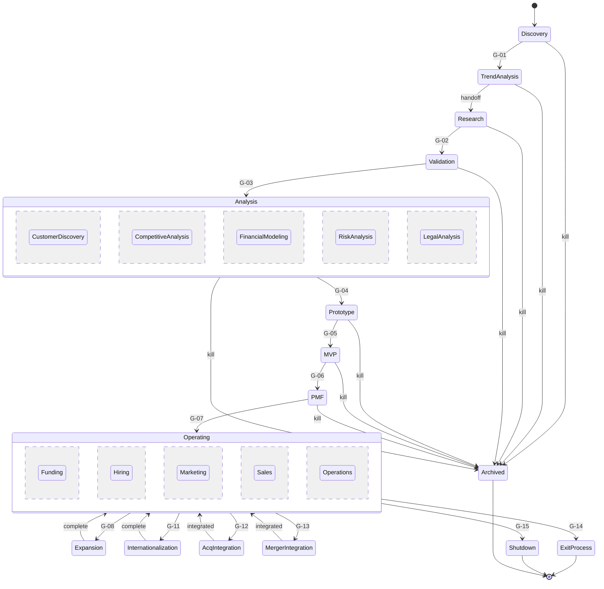

# EvolveOS Specification — Part V: Business Creation Pipeline

**Status:** Draft v0.1 · **Change class:** R3 (standard amendment process, Part XII)

Part V defines the venture lifecycle as a **gated state machine**: 23 stages, 15 pipeline gates (G-01…G-15, Appendix C), explicit kill semantics from every stage, and a portfolio-level throughput model. It consumes the taxonomies of `00-overview.md` (R1–R4, A0–A4), the agent registry (`appendix-b-agent-registry.md`), and the gate table (`appendix-c-decision-gates.md`, which **owns all dollar thresholds cited here**). The decision mechanics inside each gate (scoring, uncertainty, consensus) are defined in `07-decision-engine.md`; budget envelope accounting in `08-finance.md`; memory obligations in `06-knowledge-system.md`; human approver bodies in `11-governance.md`.

---

## 1. Design rationale: why a gated state machine

**[DECISION]** The lifecycle is a single explicit state machine with pre-registered kill criteria at every gate, rather than (a) a free-form agent-planned lifecycle, (b) a stage-gate checklist without formal states, or (c) a continuous scoring system with no discrete stages.

- (a) *Free-form planning* was rejected because autonomy control requires a **computable** answer to "what is this venture allowed to do right now?" The Kernel can only enforce envelopes it can look up; a state machine gives every venture exactly one macro-state, and every macro-state a bounded envelope granted by its entry gate.
- (b) *Checklists without formal states* were rejected because they permit ambiguous "between stages" conditions where spend authority is contested — the classic failure mode of human stage-gate processes.
- (c) *Continuous scoring without stages* was rejected because human oversight (Part 0 §6) is cadence-based: named humans approve R3/R4 transitions. Humans cannot approve a continuum; they approve transitions.

WHY pre-registered kill criteria: agents (and humans) exhibit sunk-cost drift. Kill criteria written **before** capital release (Appendix C, gate mechanics rule 1, Kernel-enforced) convert "should we keep going?" from a motivated-reasoning question into a measurement question. This is the single highest-leverage anti-failure mechanism in the pipeline.

### 1.1 Binding invariants

1. Every venture `V-<yyyy>-<seq>` **MUST** be in exactly one macro-state at any instant (glossary: *Venture*). Parallel work inside a macro-state (§3.2, §3.3) is sub-state concurrency, not multi-state membership.
2. Every macro-state transition **MUST** cite the gate that authorized it, and every gate pass **MUST** attach a Decision Record (DR) with pre-registered kill criteria and success metrics for the next stage (Appendix C mechanics 1–2).
3. Spend within a stage **MUST NOT** exceed the envelope granted at the entry gate; excess actions queue at the appropriate gate (Appendix C mechanics 3; the Kernel converts autonomy to A1 automatically).
4. **Kill is possible from any stage.** Pre-entity kills (before G-07) terminate to **Archived**; post-entity kills route through **G-15** to **Shutdown**. G-00 (Emergency Stop) may freeze any venture at any time; a G-00 stop is not a kill — restart requires the owning gate's approver set (Appendix C mechanics 6).
5. Rejected gate submissions may be resubmitted only with materially new evidence, flagged as resubmissions with a DR diff (Appendix C mechanics 5). WHY: prevents gate shopping and evidence laundering.

### 1.2 Actors

- `PORTFOLIO` (T1, A2) owns pipeline flow: stage transitions, WIP limits, cohort scheduling, kill execution within its autonomy–reversibility bounds.
- `VENTURE-ORCH@V-…` (T1, A3 within venture envelope) runs a single venture. **[DECISION]** It is instantiated at **G-04 pass** (when cross-functional build coordination begins) rather than at intake (too early: 97% of intake items die before Prototype and a per-item orchestrator is waste) or at G-07 (too late: Prototype→PMF already needs one coordinating owner).
- Human approvers per gate: Appendix C approver column, bodies defined in `11-governance.md`. Part V never names an approver different from Appendix C.
- Venture IDs are minted at G-01 pass. **[ASSUMPTION]** Pre-G-01 opportunity briefs are not ventures; they are knowledge items (Part VI) in the opportunity backlog.

---

## 2. The 23 stages and their macro-state structure

| # | Stage | Macro-state grouping | Entry authorization |
|---|---|---|---|
| 1 | Opportunity Discovery | EXPLORATION (sequential 1–4) | standing (continuous scan) |
| 2 | Trend Analysis | EXPLORATION | G-01 |
| 3 | Research | EXPLORATION | intra-envelope handoff (under G-01 grant) |
| 4 | Validation | EXPLORATION | G-02 |
| 5 | Customer Discovery | ANALYSIS BLOCK (parallel 5–9) | G-03 |
| 6 | Competitive Analysis | ANALYSIS BLOCK | G-03 |
| 7 | Financial Modeling | ANALYSIS BLOCK | G-03 |
| 8 | Risk Analysis | ANALYSIS BLOCK | G-03 |
| 9 | Legal Analysis | ANALYSIS BLOCK | G-03 |
| 10 | Prototype | BUILD (sequential 10–12) | G-04 |
| 11 | MVP | BUILD | G-05 |
| 12 | Product-Market Fit | BUILD | G-06 |
| 13 | Funding | OPERATING (concurrent tracks 13–17) | G-07 |
| 14 | Hiring | OPERATING | G-07 |
| 15 | Marketing | OPERATING | G-07 |
| 16 | Sales | OPERATING | G-07 |
| 17 | Operations | OPERATING | G-07 |
| 18 | Expansion | GROWTH OPTION | G-08 |
| 19 | Internationalization | GROWTH OPTION | G-11 |
| 20 | Acquisition | INORGANIC OPTION | G-12 |
| 21 | Merger | INORGANIC OPTION | G-13 |
| 22 | Exit | TERMINAL | G-14 |
| 23 | Shutdown | TERMINAL | G-15 |

Macro-states for invariant 1: `EXPLORATION:<stage>`, `ANALYSIS`, `BUILD:<stage>`, `OPERATING`, `EXPANSION`, `INTERNATIONALIZATION`, `ACQ-INTEGRATION`, `MERGER-INTEGRATION`, `EXIT-PROCESS`, `SHUTDOWN`, `ARCHIVED`. Stages 5–9 are concurrent sub-states of the single macro-state ANALYSIS; stages 13–17 are concurrent tracks (orthogonal regions) of the single macro-state OPERATING. Stages 18–21 are macro-states entered **from** OPERATING that return to OPERATING on completion; the operating tracks continue running inside them as inherited regions. WHY this modeling: it preserves "exactly one macro-state" (so the Kernel has one envelope lookup per venture) while acknowledging that a real company does five things at once.

### 2.1 State diagram

Diagram notes: (i) every pre-entity state has a kill edge to Archived; post-entity kill from any OPERATING/GROWTH/INORGANIC state routes through G-15 to Shutdown (edges drawn from Operating for legibility; the kill authority applies inside Expansion/Internationalization/AcqIntegration/MergerIntegration identically). (ii) G-00 freeze is orthogonal to this diagram — it halts activity without changing macro-state.

---

## 3. Stage catalog

Format for every stage: **Purpose · Inputs · Activities · Outputs · Metrics · Decision gate · Approval process · Kill criteria · Failure handling · Duration & envelope.** All kill criteria below are the **default pre-registration templates**; the concrete numeric values for a given venture are fixed in the DR at the entry gate (Appendix C mechanics 1) and MAY be tightened, never loosened, without a gate resubmission. All durations are **[ASSUMPTION]** medians for a software-first portfolio and are owned by this Part; all dollar envelopes are cited from Appendix C, which owns them.

### Phase A — EXPLORATION (stages 1–4, strictly sequential)

WHY sequential: each stage is a cheap falsification filter for the next, and the cost gradient ($0 → ≤$2k → ≤$10k) only works if cheaper filters run first.

#### Stage 1 — Opportunity Discovery

- **Purpose:** Continuously generate a high-volume, provenance-tagged stream of candidate opportunities so the portfolio never depends on episodic human ideation.
- **Inputs:** Market memory and failure memory (Part VI); external feeds (filings, forums, job postings, technology releases, funding announcements); standing portfolio theses from `STRAT-DIR`.
- **Activities:** `SCOUT` (A4, R1 output only) runs continuous scans and drafts opportunity briefs; `TRENDS` supplies early signal scores; `W-RESEARCH` workers execute single-question lookups; `RSRCH-DIR` owns the quality bar and dedupes against prior briefs and failure memory. Humans: none required (R1 throughout); the IC delegate MAY seed theses.
- **Outputs:** **Opportunity brief** (problem, actor, wedge, signal sources with provenance, similarity check against failure memory, prior-art pointer set) — filed as a KI (Part VI).
- **Metrics:** briefs/week (**[ASSUMPTION]** target ≥ 20); provenance completeness = 100% (Kernel-checkable); duplicate rate < 10%; downstream G-02 pass rate of admitted briefs ≥ 20% (measures brief quality, not volume); failure-memory collision flag rate (tracked, no target — collisions are information).
- **Decision gate:** **G-01** (Opportunity Intake: Discovery → Trend Analysis/Research).
- **Approval process:** `PORTFOLIO` at A3, automatic, per Appendix C; decisions logged as R1 DRs and sampled post-hoc by the IC delegate.
- **Kill criteria (per brief):** duplicate of an active or archived venture without materially new evidence; provenance incomplete; direct match to a failure-memory pattern with no stated differentiator. Kill here = non-admission (R1).
- **Failure handling:** Non-admitted briefs are archived as KIs with rejection reason — they are queryable negative space, feeding `SCOUT` re-ranking. No post-mortem (nothing was funded). No capital recovery needed.
- **Duration & envelope:** continuous; per-brief cost is `SCOUT` inference only. G-01 pass grants **research budget ≤ $2k** (Appendix C).

#### Stage 2 — Trend Analysis

- **Purpose:** Establish *timing*: is the underlying trend real, measurable, and at the right point of its curve? Kills "true but early" and "true but over" ideas cheaply.
- **Inputs:** Opportunity brief; market memory time series; external quantitative sources.
- **Activities:** `TRENDS` (A4, R1) fits growth/adoption curves, computes timing models, and stress-tests the signal against base rates; `DEEP-RES` spot-verifies the two most load-bearing data points; `RSRCH-DIR` reviews outliers. Humans: none required (R1).
- **Outputs:** **Trend dossier**: quantified trend curves, timing verdict (early/on-time/late) with confidence, top three disconfirming signals.
- **Metrics:** timing-verdict calibration (Brier score vs. 12-month-later reality, target improving QoQ per Part XII); dossier turnaround ≤ 5 business days (**[ASSUMPTION]**); ≥ 3 independent data sources per trend claim; disconfirming-evidence section non-empty (Kernel-checkable).
- **Decision gate:** none — Trend Analysis → Research is an intra-envelope handoff inside the G-01 research grant. WHY: Appendix C defines G-01 as admitting to "Trend Analysis/Research" jointly; splitting the ≤ $2k envelope with another gate would add latency without adding control (both stages are R1).
- **Approval process:** handoff auto-executes when the dossier is complete; `PORTFOLIO` (A3) MAY kill at any time (R1 kill).
- **Kill criteria:** trend not detectable in ≥ 2 independent quantitative sources; timing verdict "late" with confidence ≥ 0.7; signal explained by a confound (seasonality, single-vendor promotion, bot activity).
- **Failure handling:** kill → Archived with a **timing memo** KI ("real trend, wrong time" items get a re-scan trigger date so `SCOUT` re-surfaces them); no capital recovery (spend is inference + data cost inside the $2k grant).
- **Duration & envelope:** **[ASSUMPTION]** 3–7 days; within the G-01 **≤ $2k** research budget (shared with Stage 3; Appendix C).

#### Stage 3 — Research

- **Purpose:** Build the full evidence base: market structure, sizing, customer segments, willingness-to-pay indicators, substitute analysis — deep enough to design a falsifiable validation experiment.
- **Inputs:** Opportunity brief + trend dossier; market memory; prior research dossiers on adjacent markets.
- **Activities:** `DEEP-RES` (A3) runs long-form multi-source research with adversarial source verification, spawning `W-RESEARCH` workers for parallel sub-questions; `COMP-INTEL` contributes a preliminary competitor scan; `RSRCH-DIR` enforces the research quality bar and signs the dossier. Humans: none required; `RSRCH-DIR` MAY request human expert interviews (booked via `CUST-DISC`) if the domain is opaque to open sources.
- **Outputs:** **Research dossier** with initial market sizing (G-02 input per Appendix C); a **pre-registered validation design** (hypotheses, sample, success thresholds, kill thresholds) — written now so G-02 can pre-register it.
- **Metrics:** ≥ 90% of material claims traceable to evidence-pack entries (Kernel-checkable via Part VI provenance); source triangulation ≥ 2 independent sources per sizing input; dossier completion ≤ 10 business days (**[ASSUMPTION]**); post-hoc claim survival rate ≥ 80% when re-audited by `CURATOR` after 6 months.
- **Decision gate:** **G-02** (Research Commit: Research → Validation).
- **Approval process:** per Appendix C — `PORTFOLIO` at A3 for validation budgets ≤ $10k; anything above queues at A2 for human review. DR attached; validation kill criteria pre-registered at the gate.
- **Kill criteria:** serviceable market below portfolio floor (**[ASSUMPTION]** floor: $10M SAM at entry; concrete value fixed in the G-01 thesis and re-ratified with capital base per Part 0 §5 note); no identifiable buyer with budget authority; structural blocker found (regulatory prohibition, platform dependency with hostile terms); validation design cannot be made falsifiable for ≤ $10k.
- **Failure handling:** kill → Archived; dossier retained as a market-memory KI (research is never wasted — it prices future adjacent opportunities); `CURATOR` extracts reusable market facts; rejection reason feeds `SCOUT`/`TRENDS` re-ranking.
- **Duration & envelope:** **[ASSUMPTION]** 1–2 weeks; remainder of the G-01 **≤ $2k** grant. G-02 pass grants **validation budget ≤ $10k** (Appendix C).

#### Stage 4 — Validation

- **Purpose:** Buy the cheapest possible *behavioral* evidence that real customers want this — demand signals, not opinions — against the pre-registered thresholds.
- **Inputs:** Research dossier; pre-registered validation design (locked at G-02); validation playbooks (procedural memory, Part VI).
- **Activities:** `VALIDATOR` (A2) executes landing tests, interview programs at scale, and pre-sales/LOI attempts within the envelope; `CUST-DISC` runs structured interviews; `INSIGHT` produces the experiment readout against pre-registered thresholds; `PROTO` MAY build throwaway demo assets (R1, sandbox only). Public-facing test assets MUST use pre-approved templates to stay inside the G-17 template exemption; anything beyond templates queues at **G-17**. Humans: none required for template-conformant tests.
- **Outputs:** **Validation DR**: results vs. pre-registered kill/success criteria, effect sizes with uncertainty, raw evidence pack (recordings, analytics exports, signed LOIs if any).
- **Metrics (defaults; concrete values pre-registered at G-02):** signup or waitlist conversion ≥ **[ASSUMPTION]** 5% on qualified traffic; ≥ 40% of interviewed prospects describe the problem unprompted as top-3 pain; ≥ 3 pre-sales/LOIs or equivalent deposit-grade commitment; CAC proxy from test channels within 3× of the modeled sustainable CAC; experiment completed within envelope.
- **Decision gate:** **G-03** (Validation Verdict: Validation → Customer Discovery, or Kill).
- **Approval process:** per Appendix C — `PORTFOLIO` at A2, with the weekly human IC-delegate batch review; retroactive human veto within 7 days for anything still R2 (Appendix C mechanics 4).
- **Kill criteria:** any pre-registered kill threshold breached; evidence of demand only at a price below unit-economic floor; validation channel signal not reproducible across two independent channels.
- **Failure handling:** kill → Archived with a **mini post-mortem** (what the design predicted vs. observed; which research claims failed) filed to failure memory (Part VI) and to the counterfactual ledger (glossary); unspent validation budget returns to the portfolio pool same-week (`FIN-DIR` sweep); `VALIDATOR`'s prediction error feeds its calibration score.
- **Duration & envelope:** **[ASSUMPTION]** 2–4 weeks; **validation budget ≤ $10k** (G-02 grant, Appendix C). G-03 pass grants **discovery budget ≤ $15k** (Appendix C).

### Phase B — ANALYSIS block (stages 5–9, parallel between G-03 and G-04)

WHY parallel: these five analyses are mutually independent given the validation result (different agents, different sources, no sequential data dependency), and running them serially would triple time-to-Prototype while the demand signal decays. WHY a *block gate* (single G-04) instead of five mini-gates: the decision "build a prototype" needs all five perspectives simultaneously — a venture that passes four analyses and fails one MUST NOT proceed, so the gate is conjunctive by construction. All five stages share the G-03 **discovery budget ≤ $15k** envelope; `VENTURE-ORCH` is not yet instantiated, so `PORTFOLIO` coordinates the block. The block completes when all five outputs are filed; the slowest track (usually Legal Analysis, human-gated) sets block latency.

#### Stage 5 — Customer Discovery

- **Purpose:** Convert validated demand into a precise ICP, jobs-to-be-done map, and willingness-to-pay distribution that Prototype and MVP scope against.
- **Inputs:** Validation DR; interview corpus; customer memory from adjacent ventures (Part VI, privacy classes respected per G-18).
- **Activities:** `CUST-DISC` (A2) schedules and runs 15–25 structured interviews (**[ASSUMPTION]**) via `W-OUTREACH` workers within the approved messaging envelope; transcript analysis and insight extraction; `PROD-DIR` reviews the JTBD map. Humans: optional founder-type domain advisor sits in on ≥ 3 interviews (**[ASSUMPTION]** recommended, not required).
- **Outputs:** **ICP definition**, JTBD map, willingness-to-pay curve, ranked feature-necessity list, interview evidence pack.
- **Metrics:** ≥ 15 completed interviews across ≥ 3 sub-segments; inter-rater agreement on coded insights ≥ 0.7 (checked by a second `W-RESEARCH` coding pass); ≥ 60% of interviewees consent to MVP-stage re-contact; WTP interquartile range narrow enough to price (ratio ≤ 3:1, **[ASSUMPTION]**).
- **Decision gate:** **G-04** (block-level; see Stage 9 for the joint gate description).
- **Approval process:** joint at G-04 — `PORTFOLIO` (A2) per Appendix C, weekly human batch review per gate mechanics 4.
- **Kill criteria (block-feeding):** no coherent ICP (demand smeared across segments with incompatible needs); WTP median below unit-economic floor; re-contact consent < 30% (proxy for real pain).
- **Failure handling:** block kill → Archived; interview corpus is anonymized per `PRIVACY` rules and retained as customer/market memory; post-mortem records which validation signal failed to survive contact with named customers.
- **Duration & envelope:** **[ASSUMPTION]** 2–3 weeks; shared **≤ $15k** discovery budget (G-03 grant, Appendix C).

#### Stage 6 — Competitive Analysis

- **Purpose:** Map the competitive field well enough to state a defensible wedge and predict incumbent response.
- **Inputs:** Research dossier's preliminary scan; competitor filings, pricing pages, hiring signals, product teardowns.
- **Activities:** `COMP-INTEL` (A3) produces teardown analyses, positioning maps, pricing/packaging matrix, and an incumbent-response wargame (with `STRAT-DIR` adjudicating the wargame); `TRENDS` supplies competitor momentum data.
- **Outputs:** **Competitive map**, wedge statement, incumbent-response scenarios with probabilities, monitored-competitor watchlist (feeds standing `COMP-INTEL` monitoring).
- **Metrics:** 100% of named competitors verified alive/funded within 30 days of report; wedge statement falsifiable (states what incumbents *cannot* copy cheaply and why); response scenarios scored later against reality (calibration feed, Part XII); coverage: ≥ 90% of competitors later encountered in deals were on the map (**[ASSUMPTION]** target, measured at PMF stage).
- **Decision gate / Approval:** joint **G-04** (see Stage 9).
- **Kill criteria (block-feeding):** wedge depends on incumbent inaction that the wargame rates < 12 months durable; a well-funded competitor already executing the identical wedge with > 12-month head start and no structural differentiator.
- **Failure handling:** block kill → Archived; the competitive map is high-value market memory regardless of kill — `CURATOR` promotes it to the shared market-memory graph; the watchlist persists (competitors of dead ideas are signals for future ideas).
- **Duration & envelope:** **[ASSUMPTION]** 1–2 weeks; shared **≤ $15k** discovery budget (Appendix C).

#### Stage 7 — Financial Modeling

- **Purpose:** Produce the venture's first full economic model: unit economics, capital plan to PMF, and the sensitivity structure that later gates will test evidence against.
- **Inputs:** WTP data (Stage 5), pricing matrix (Stage 6), validation CAC proxies (Stage 4), portfolio cost baselines from `FIN-DIR`.
- **Activities:** `FIN-MODEL` (A3; models are R1) builds the driver-based model with scenario/sensitivity analysis; `UNIT-ECON` supplies portfolio-comparable CAC/LTV/margin benchmarks; `RISK-QUANT` runs Monte Carlo over the driver distributions (service defined in `07-decision-engine.md`); `FIN-DIR` reviews model integrity.
- **Outputs:** **Venture financial model v1** (drivers, scenarios, tornado sensitivity chart), capital-to-PMF estimate with confidence interval, unit-economics floor used by later kill criteria.
- **Metrics:** model passes `FIN-DIR` integrity checklist (100%); all top-5 sensitivity drivers tied to a measurable early indicator; capital-to-PMF P50 within the G-05+G-06 envelope path (else the venture is flagged as structurally over-budget); forecast-vs-actual error tracked from MVP onward (calibration feed).
- **Decision gate / Approval:** joint **G-04** (see Stage 9).
- **Kill criteria (block-feeding):** no scenario within plausible driver ranges reaches contribution-margin positive unit economics; capital-to-PMF P50 exceeds **[ASSUMPTION]** 2× the standard G-05→G-07 envelope path with no staged de-risking structure.
- **Failure handling:** block kill → Archived; the model's driver benchmarks are extracted into procedural memory (they improve every future model); the counterfactual ledger records the modeled outcome for later scoring.
- **Duration & envelope:** **[ASSUMPTION]** 1 week; shared **≤ $15k** discovery budget (Appendix C).

#### Stage 8 — Risk Analysis

- **Purpose:** Enumerate, quantify, and pre-plan mitigations for the venture's specific risk surface before capital scales; register venture risks into the portfolio register (Part XIII).
- **Inputs:** All prior stage outputs; portfolio risk register (`13-failure-analysis.md`); failure memory of similar ventures (Part VI).
- **Activities:** `RISK-QUANT` (A3) scores risks quantitatively (probability × impact with uncertainty); `RISK-DIR` maps them into the register format and sets monitoring limits; `FRAUD-WATCH` reviews fraud surface for the proposed business model; `SEC-DIR` delegate reviews the security surface class of the planned product.
- **Outputs:** **Venture risk register** (`RISK-<category>-<seq>` entries per Part XIII format), top-3 risks with mitigation/rollback plans (required later for every R3+ gate DR per Appendix C mechanics 2), monitoring limit set for `RISK-DIR`.
- **Metrics:** 100% of top-10 risks have detection indicators wired to data that will exist by MVP; risk-score calibration vs. realized incidents (Part XII feed); failure-memory coverage — ≥ 80% of failure patterns from similar archived ventures explicitly addressed or accepted (**[ASSUMPTION]**).
- **Decision gate / Approval:** joint **G-04** (see Stage 9).
- **Kill criteria (block-feeding):** any single risk rated existential-to-portfolio (R4-class exposure) without a credible mitigation; aggregate risk-adjusted return below portfolio hurdle (computed per `07-decision-engine.md`).
- **Failure handling:** block kill → Archived; risk patterns feed the portfolio register and failure memory; if the killing risk was *discovered here rather than at Research*, `RSRCH-DIR` receives a quality-bar defect report (learning loop on the research stage itself).
- **Duration & envelope:** **[ASSUMPTION]** 1 week; shared **≤ $15k** discovery budget (Appendix C).

#### Stage 9 — Legal Analysis

- **Purpose:** Determine the legal/regulatory shape of the venture — licensing, data protection, IP position, contract structures — before any build spend.
- **Inputs:** All block outputs; jurisdiction map for intended initial market; regulatory KIs from `REG-WATCH` monitoring.
- **Activities:** `LEGAL-DIR` (A1, always under General Counsel supervision) produces the legal memo; `COMPL-DIR` (A1) maps regulatory obligations and license requirements; `REG-WATCH` (A3 alerts) attaches pending regulatory changes; `PRIVACY` (A1) classifies intended data uses — any personal-data use beyond approved classification triggers **G-18** before Prototype; `CONTRACTS` drafts the template stack the venture will need (ToS, DPA, MSA skeletons) from approved templates.
- **Outputs:** **Legal & compliance memo** (GC-reviewed), data-classification decision (and G-18 record if triggered), required-license list with lead times, IP strategy note.
- **Metrics:** memo covers 100% of the checklist classes (entity, licensing, data, IP, consumer protection, sector-specific); zero build activities started before data classification issued; regulatory lead-time items on the critical path identified with dates; later "surprise regulation" incidents traceable to this memo = 0 target.
- **Decision gate:** **G-04** (Prototype Commit) — the joint block gate. **Inputs per Appendix C:** full analysis pack (stages 5–9 outputs) + DR.
- **Approval process:** `PORTFOLIO` at A2 per Appendix C; weekly human batch review with 7-day retroactive veto (mechanics 4). Human General Counsel sign-off is embedded in the legal memo itself (because `LEGAL-DIR` and `COMPL-DIR` are A1 agents under GC per Appendix B), so G-04 never passes on unreviewed legal analysis.
- **Kill criteria (block-level, all five stages, evaluated conjunctively at G-04):** any stage's block-feeding kill criterion fires; legal: required license lead time > 12 months for the wedge market; data use that cannot pass G-18; IP position hopeless (blocking patents with hostile holders).
- **Failure handling:** block kill → Archived with full analysis pack retained; jurisdiction/regulatory findings are the longest-lived KIs produced pre-build — `CURATOR` promotes them to market memory with long TTLs (Part VI §12).
- **Duration & envelope:** **[ASSUMPTION]** 1–2 weeks agent time; human GC review adds up to 5 business days. Shared **≤ $15k** discovery budget. G-04 pass grants **prototype budget ≤ $25k** (Appendix C).

### Phase C — BUILD (stages 10–12, sequential)

`VENTURE-ORCH@V-…` is instantiated at G-04 pass and owns coordination from here.

#### Stage 10 — Prototype

- **Purpose:** Prove the riskiest product assumption with the cheapest artifact that generates real usage evidence — not to build a small product.
- **Inputs:** Full analysis pack; ranked feature-necessity list; prototype playbooks (procedural memory).
- **Activities:** `PROTO` (A3) builds rapid prototypes and concierge tests inside sandbox cells (`INFRA-DIR` provisions the sandbox cell); `W-CODE` workers execute scoped tasks; `CUST-DISC` recruits testers from the consented re-contact pool; `QA` smoke-checks anything user-facing; `VENTURE-ORCH` sequences the riskiest-assumption tests. Humans: none required; all activity is R2-bounded inside the sandbox.
- **Outputs:** **Prototype evidence pack** (usage recordings, task-completion data, concierge-test economics), updated financial model (G-05 input per Appendix C), MVP scope proposal with explicit "what we now know vs. still assume" register.
- **Metrics (defaults; pre-registered at G-04):** ≥ **[ASSUMPTION]** 10 target-ICP users complete the core task; task-completion ≥ 60% unassisted; ≥ 40% of testers state willingness to pay at modeled price when asked post-task; concierge unit cost within 5× of modeled automated cost.
- **Decision gate:** **G-05** (MVP Commit: Prototype → MVP). **R3** per Appendix C.
- **Approval process:** per Appendix C — **named human Portfolio Review lead (A1), weekly cadence**; approver acknowledges top-3 risks and rollback plan in writing in the DR (Appendix C mechanics 2). WHY human here: ≤ $150k committed build spend is the first R3-scale commitment.
- **Kill criteria:** pre-registered usage thresholds missed; core assumption falsified with no viable pivot inside the analysis pack; pivot requiring new ICP → not a kill but a **regression transition** back to Customer Discovery via a fresh G-03 submission (WHY: a new ICP invalidates the analysis block; re-entering mid-pipeline with stale analysis is how zombie ventures form).
- **Failure handling:** kill → Archived; post-mortem DR filed to failure memory; sandbox cell torn down by `INFRA-DIR` (capital recovery: unused prototype budget swept back by `FIN-DIR`); prototype code archived to cold storage (Part VI §13) — never deleted, occasionally harvested by `BUILDER` for future ventures.
- **Duration & envelope:** **[ASSUMPTION]** 2–4 weeks; **prototype budget ≤ $25k** (G-04 grant). G-05 pass grants **MVP budget ≤ $150k** (Appendix C).

#### Stage 11 — MVP

- **Purpose:** Build the minimum production-grade product that can be sold, supported, and measured — the instrument with which PMF will be searched.
- **Inputs:** MVP scope (G-05 DR), prototype evidence pack, template contract stack (Stage 9).
- **Activities:** `BUILDER` (A2) implements in the venture's production cell (provisioned by `INFRA-DIR`; cell isolation per `09-technology.md`/`10-security.md`); `QA` (A3) builds regression suites and release verification; `RELEASE` (A3) operates CI/CD with progressive rollout; `SRE` (A3) wires monitoring and SLOs; `PROD-DIR` owns scope discipline (scope additions beyond the G-05 DR require `VENTURE-ORCH` sign-off and count against the envelope); `PRICER` prepares launch pricing (A1 — live prices are R3); `SEC-DIR` delegate performs pre-launch review; `SUPPORT` builds the initial knowledge base. Early-access customers under template agreements are permitted (template-conformant, else G-17/G-10 as applicable).
- **Outputs:** Launch-ready product in an isolated cell; **launch readiness checklist** (QA, security, legal, support — the G-06 input per Appendix C); GTM plan (`GROWTH-DIR` + `MKT-DIR`); instrumented analytics baseline (`INSIGHT`).
- **Metrics:** scope creep ≤ 15% story-point growth from G-05 DR (**[ASSUMPTION]**); readiness checklist 100% before G-06 submission; time-to-first-external-user ≤ 6 weeks from G-05 (**[ASSUMPTION]**); crash-free/error-budget baseline met for 2 consecutive weeks; early-access activation ≥ 40%.
- **Decision gate:** **G-06** (Launch / GTM: MVP → PMF search). **R3** per Appendix C.
- **Approval process:** per Appendix C — **named human Portfolio Review lead**, plus **G-17** for the public communications component (launch announcement, non-template social/PR). Written top-3-risk acknowledgment per mechanics 2.
- **Kill criteria:** build cost trajectory > 130% of envelope at 50% scope (**[ASSUMPTION]** — the classic overrun signature); early-access activation < 20%; a Stage-8 registered risk fires at existential level; security review failure that cannot be remediated within envelope.
- **Failure handling:** kill → Archived (still pre-entity); full post-mortem (build post-mortems are among the highest-value failure KIs — they price future G-05 decisions); reusable components extracted by `ENG-DIR` into the platform library; unspent envelope swept; early-access customers wound down per their template agreements with `SUPPORT` handling communication (G-17 template).
- **Duration & envelope:** **[ASSUMPTION]** 4–8 weeks; **MVP budget ≤ $150k** (G-05 grant). G-06 pass grants **GTM budget ≤ $100k/quarter** (Appendix C).

#### Stage 12 — Product-Market Fit

- **Purpose:** Publicly search for repeatable, economically sound demand — the evidence pack that justifies entity formation and seed capital at G-07.
- **Inputs:** Launched product; GTM plan; **pre-registered PMF criteria** (fixed in the G-06 DR).
- **Activities:** `GROWTH-DIR` (A2) deploys the GTM budget across channels; `ADS` runs paid acquisition within channel envelopes; `CONTENT` and `LIFECYCLE` execute organic and CRM motions; `OUTBOUND` runs ICP outreach where the motion is sales-led; `PRICER` runs elasticity experiments (live price changes are R3 → A1 per Appendix B); `INSIGHT` + `UNIT-ECON` produce the weekly PMF scorecard; `SUPPORT`/`ONBOARD` hold quality; `PROD-DIR` iterates against retention evidence; `VENTURE-ORCH` steers. All public comms beyond templates → **G-17**; contracts > $100k or > 12 months → **G-10**.
- **Outputs:** **PMF evidence pack** (retention cohorts, unit economics, channel repeatability, NPS/sell-through evidence), 18-month plan and entity structure memo (GC) — the G-07 inputs per Appendix C.
- **Metrics (defaults; pre-registered at G-06):** **[ASSUMPTION]** M3 logo retention ≥ 80% (B2B) / M3 usage retention ≥ 35% (B2C); LTV:CAC ≥ 3 modeled on ≥ 2 quarters of cohort data with CAC from ≥ 2 independent channels; payback ≤ 12 months; organic/referral share ≥ 20% of new revenue; weekly active growth sustained ≥ 8 weeks without paid-spend growth.
- **Decision gate:** **G-07** (Venture Formation & Seed). **R4** per Appendix C.
- **Approval process:** per Appendix C — **IC quorum (≥ 3 humans) + General Counsel**; inputs: PMF evidence pack, 18-month plan, entity structure memo, DR. This is the pipeline's hardest gate by design: entity formation is R4 (Part 0 §5) and capital steps up an order of magnitude.
- **Kill criteria:** PMF criteria unmet after **[ASSUMPTION]** 2 quarters of GTM spend (extension possible only via G-06 resubmission with materially new evidence per mechanics 5); CAC rising with scale in every tested channel; retention decaying cohort-over-cohort; channel concentration > 80% in a platform-risk channel with no mitigation.
- **Failure handling:** kill → Archived (pre-entity — WHY Archived not Shutdown: there is no legal entity to dissolve, but there ARE live customers: `SUPPORT` executes the customer wind-down playbook, refunds per `FIN-DIR` policy, data disposition per `PRIVACY`/`ARCHIVIST`). Full post-mortem mandatory — PMF-stage failures are the most expensive pre-entity failures and the highest-value failure KIs. Counterfactual ledger records the G-07 case that was never made.
- **Duration & envelope:** **[ASSUMPTION]** 1–2 quarters; **GTM budget ≤ $100k/quarter** (G-06 grant). G-07 pass grants **seed ≤ $1M and legal entity formation** (Appendix C).

### Phase D — OPERATING (stages 13–17, concurrent tracks after G-07)

At G-07 pass the venture becomes a legal entity with a **venture envelope** (glossary) of ≤ $1M seed. Stages 13–17 are **not sequential steps**: a real company funds, hires, markets, sells, and operates simultaneously. They are five standing tracks inside the single macro-state OPERATING, each owned by a director instance reporting to `VENTURE-ORCH@V-…`, each with its own standing gates that fire on events rather than on stage exit. WHY tracks not stages: modeling them sequentially would force fictitious transitions ("the venture is now in Marketing") that correspond to no real-world commitment boundary; the real commitment boundaries are the event gates (G-08, G-09, G-10, G-17, G-18) that Appendix C already defines as standing/event-triggered.

Track descriptions use the same template; "Decision gate" lists the standing gates the track fires.

#### Stage 13 — Funding (track)

- **Purpose:** Manage the venture's capital: seed deployment, runway discipline, and the evidence case for subsequent internal tranches.
- **Inputs:** Seed envelope (G-07); rolling forecast; portfolio capital plan (`08-finance.md`).
- **Activities:** `FIN-DIR` owns venture budgeting policy; `FPA` (A3) runs budget-vs-actuals and rolling forecasts; `TREASURER` (A1 for movements — R3+) manages cash positioning; `FIN-MODEL` maintains the venture model; `LEDGER` (A2) keeps books close-ready from day one; `PORTFOLIO` prepares capital-reallocation proposals to the IC. Humans: CFO oversight per `FIN-DIR` reporting line.
- **Outputs:** Monthly close ≤ 5 business days; rolling 18-month forecast; **tranche case** (cohort economics, capacity plan, updated valuation — the G-08 inputs per Appendix C).
- **Metrics:** runway ≥ 9 months at all times (**[ASSUMPTION]** hard floor 6 months triggers `RISK-DIR` limit alert); forecast error ≤ 15% at one quarter (**[ASSUMPTION]**); close ≤ 5 days; zero unexplained reconciliation breaks.
- **Decision gate:** **G-08** (Scale Funding) per tranche event; treasury movements per their reversibility class.
- **Approval process:** G-08 per Appendix C — **IC quorum + CFO**; tranche per IC resolution.
- **Kill criteria (track-level trip to venture review):** runway < 6 months with no approved tranche case; two consecutive quarters of forecast miss > 30%. Track trips escalate to `PORTFOLIO`, which convenes a venture review that can propose G-15.
- **Failure handling:** funding-track failure is the canonical path into G-15 (Shutdown, §3-Stage 23) or G-14 (Exit, if the asset is salable); orderly options are evaluated in the venture review before capital is exhausted — WHY: a shutdown with 4 months of runway is orderly; with 4 weeks it destroys creditor/customer relationships and knowledge capture.
- **Duration & envelope:** continuous; **seed ≤ $1M** (G-07), subsequent **tranches per IC resolution at G-08** (Appendix C).

#### Stage 14 — Hiring (track)

- **Purpose:** Add human capability where agents are insufficient — regulated roles, physical-world work, relationship-heavy sales, and named-officer positions.
- **Inputs:** Hiring plan derived from the 18-month plan; comp bands from `PEOPLE-DIR`.
- **Activities:** `PEOPLE-DIR` (A1) owns workforce planning and the performance process; `RECRUITER` (A2) sources, screens, and runs logistics — **never makes offers** (Appendix B); hiring manager is always a named human; `FIN-DIR` budget check per requisition. Every individual offer is R3; executive hires are R4 (Appendix C).
- **Outputs:** Approved hiring plan; signed offers; onboarding into venture cell access model (`10-security.md`).
- **Metrics:** time-to-fill ≤ 45 days for non-exec roles (**[ASSUMPTION]**); offer-accept ≥ 70%; 6-month regretted attrition < 10%; 100% of offers within approved comp bands (Kernel-checkable via G-09 records).
- **Decision gate:** **G-09** (Hiring) — plan (R3), each individual offer (R3), executive hires (R4).
- **Approval process:** per Appendix C — plan/offers: **Head of People + hiring manager (human)**; executives: **Executive Committee**.
- **Kill criteria (track-level):** none kill the venture; a frozen hiring plan (G-09 revocation) is a standard instrument of the venture review. Layoffs/RIF are **not** hiring-track actions — they are **G-13** restructuring events (Appendix C).
- **Failure handling:** failed searches and mis-hires generate People KIs (which sourcing channels, comp bands, and role definitions fail) — de-identified per `PRIVACY` policy before entering shared memory.
- **Duration & envelope:** continuous; **headcount per approved plan** (G-09, Appendix C).

#### Stage 15 — Marketing (track)

- **Purpose:** Build durable demand: brand, positioning, content compounding, and lifecycle revenue expansion.
- **Inputs:** GTM learnings from PMF stage; brand assets; editorial calendar.
- **Activities:** `MKT-DIR` (A2) owns positioning and calendar; `CONTENT` (A2) executes SEO/content; `LIFECYCLE` (A2) runs email/CRM flows and churn-save campaigns; `ADS` (A2) continues paid acquisition inside channel budget envelopes set by `GROWTH-DIR`; `INSIGHT` attributes. All non-template public communication → **G-17**; any new personal-data use for targeting → **G-18**.
- **Outputs:** Channel performance ledger; content asset base; attribution model maintained with `DATA-DIR` methodology standards.
- **Metrics:** blended CAC within model (**[ASSUMPTION]** ≤ 110% of modeled); organic share trending up QoQ; email/CRM revenue share ≥ 15% by month 12 (**[ASSUMPTION]**); zero G-17 bypass incidents (Kernel-audited).
- **Decision gate:** **G-17** per public-comms event; **G-18** per data-use expansion; spend within the venture envelope, marketing budget per `08-finance.md` allocation.
- **Approval process:** G-17 — named human comms owner (A1), ≤ 24h SLA per Appendix C; G-18 — GC or delegated privacy officer, ≤ 5 days.
- **Kill criteria (track-level):** sustained CAC > pre-registered ceiling across all channels for 2 quarters trips the venture review; single-channel dependency > 80% is a standing `RISK-DIR` limit.
- **Failure handling:** channel failures are cheap, frequent, and valuable — every paused channel experiment files a channel-economics KI (the portfolio's cross-venture channel memory is a core moat, Part VI §10).
- **Duration & envelope:** continuous; within venture envelope per `08-finance.md`; comms events per **G-17**.

#### Stage 16 — Sales (track)

- **Purpose:** Convert demand into contracted revenue with pricing discipline and clean contractual posture.
- **Inputs:** ICP and pipeline from Marketing track; price book; template contract stack.
- **Activities:** `SALES-DIR` (A2) owns pipeline and deal strategy; `OUTBOUND` (A2) builds ICP lists and personalized outreach within the approved messaging envelope (`W-OUTREACH` workers); `DEALDESK` (A1) assembles quotes and enforces discount policy; `PRICER` (A1 for live changes — R3) proposes pricing evolution; `CONTRACTS` handles paper from approved templates; human account executives (hired via G-09) own relationship-heavy segments. Any contract > $100k or > 12 months → **G-10**.
- **Outputs:** Contracted ARR/revenue; pipeline forecast feeding `FPA`; discount and win/loss ledgers.
- **Metrics:** forecast accuracy ≥ 80% at quarter start (**[ASSUMPTION]**); discount policy exceptions = 0 outside `DEALDESK` authority; win rate vs. named competitors tracked (feeds `COMP-INTEL`); ≥ 95% of closed contracts on approved templates.
- **Decision gate:** **G-10** (Major Commitment) per qualifying contract; pricing changes per their R3 class (A1 human approval, `PRICER` never autonomous on live prices).
- **Approval process:** G-10 per Appendix C — **named human budget owner + GC delegate**, per contract.
- **Kill criteria (track-level):** win rate collapse (< half of modeled) for 2 consecutive quarters, or sales-cycle length > 2× model, trips venture review.
- **Failure handling:** win/loss analyses are mandatory KIs; lost-deal patterns feed `COMP-INTEL` and `PRICER`; a failing sales motion with healthy product retention triggers a motion pivot (sales-led ↔ product-led) inside the venture envelope, not a kill.
- **Duration & envelope:** continuous; per-contract authority per **G-10** (Appendix C).

#### Stage 17 — Operations (track)

- **Purpose:** Run the business machine: vendors, fulfillment, support, reliability, and back-office integrity at venture scale.
- **Inputs:** Operational baselines from MVP stage; vendor stack; SLO definitions.
- **Activities:** `OPS-DIR` (A2) owns business operations; `VENDOR` (A1 for signing — R3) manages procurement and renewals; `SUPPORT` (A3) runs tier-1/2 with escalation; `ONBOARD` (A3) drives activation and health scoring; `SRE` (A3) enforces SLOs in the venture cell; `LEDGER` (A2) AP/AR and reconciliation; `FRAUD-WATCH` (A3, blocking holds auto / releases A1) monitors transactions; `QA`/`RELEASE` maintain delivery quality. Vendor contracts > $100k or > 12 months → **G-10**.
- **Outputs:** SLO compliance record; support quality ledger; vendor register with renewal calendar; clean audit trail (Part VI audit-log obligations).
- **Metrics:** SLO attainment ≥ 99.5% of error budget policy (**[ASSUMPTION]**); support first-response and resolution SLAs per `CS-DIR` standards; cost-to-serve trending down per unit; fraud loss < 0.5% of revenue (**[ASSUMPTION]**); zero unreconciled aging > 30 days.
- **Decision gate:** **G-10** per qualifying commitment; incidents may invoke **G-00** (any Watchdog or authorized human).
- **Approval process:** per Appendix C for G-10; G-00 stop is single-human/Watchdog, restart per owning gate approver.
- **Kill criteria (track-level):** structural negative contribution margin at scale (cost-to-serve floor above price floor) trips venture review — this is the "business physics" kill signal that marketing/sales cannot fix.
- **Failure handling:** operational failures generate runbook and playbook updates (procedural memory); repeated cross-venture operational failure patterns escalate to `EVOLVE` as evolution-proposal candidates (Part XII).
- **Duration & envelope:** continuous; within venture envelope; commitments per **G-10**.

### Phase E — GROWTH options (stages 18–19, entered from OPERATING, return to OPERATING)

#### Stage 18 — Expansion

- **Purpose:** Deliberately scale a working machine — new segments, products, or capacity — with tranche-gated capital rather than ambient budget creep.
- **Inputs:** Cohort economics, capacity plan, updated valuation (the G-08 inputs per Appendix C); expansion thesis from `STRAT-DIR`.
- **Activities:** `VENTURE-ORCH` drafts the expansion plan; `FIN-MODEL` + `UNIT-ECON` prove the marginal economics; `GROWTH-DIR` and `SALES-DIR` scale their motions; `PEOPLE-DIR` scales the hiring plan (each increment still G-09); `INFRA-DIR` scales the cell; `PORTFOLIO` sequences expansion against portfolio capital constraints.
- **Outputs:** Expansion DR; tranche deployment plan with stage-internal milestones and pre-registered tranche kill criteria.
- **Metrics:** marginal LTV:CAC of expansion cohorts ≥ 3 (**[ASSUMPTION]**, consistent with PMF floor); capacity plan attainment ≥ 85%; expansion payback within the G-08 case ± 20%; no degradation of core-business retention during expansion (guard metric).
- **Decision gate:** **G-08** (Scale Funding). **R4** per Appendix C.
- **Approval process:** per Appendix C — **IC quorum + CFO**; tranche per IC resolution.
- **Kill criteria:** tranche milestones missed per pre-registered criteria → tranche stops (not venture kill); expansion unwound back to core; two failed expansion attempts in sequence freeze G-08 eligibility for **[ASSUMPTION]** 2 quarters.
- **Failure handling:** failed expansion → return to OPERATING with the expansion post-mortem filed; capital recovery = undeployed tranche returns to portfolio treasury; the marginal-economics model error is scored in the counterfactual ledger (expansion forecasts are the most systematically overoptimistic artifact class — tracking this bias is a Part XII calibration input **[ASSUMPTION]**).
- **Duration & envelope:** **[ASSUMPTION]** 2–4 quarters per tranche; **tranche per IC resolution** (G-08, Appendix C).

#### Stage 19 — Internationalization

- **Purpose:** Enter new legal jurisdictions deliberately — the option with the highest hidden-liability density in the pipeline.
- **Inputs:** Regulatory map (`REG-WATCH`), tax/entity memo, localized compliance plan (the G-11 inputs per Appendix C); localized market research (`DEEP-RES`).
- **Activities:** `COMPL-DIR` (A1) builds the jurisdiction compliance plan; `LEGAL-DIR` (A1) the entity/tax structure with GC; `REG-WATCH` activates monitoring for the new jurisdiction; `MKT-DIR`/`CONTENT` localize positioning (G-17 for public launch comms); `OPS-DIR` establishes local vendors (G-10 as applicable); `PRIVACY` re-classifies data flows (cross-border transfers frequently trigger **G-18**); `PEOPLE-DIR` handles local employment law with human counsel.
- **Outputs:** Jurisdiction entry DR; local entity/registration as approved; localized compliance calendar; jurisdiction market-memory KIs.
- **Metrics:** zero operating activity before G-11 pass in the jurisdiction (Kernel-enforced geo-fence on venture tooling **[ASSUMPTION]** — enforcement design in `10-security.md`); time-to-first-local-revenue vs. plan; local compliance calendar adherence 100%; local unit economics within 2× home-market at month 12 converging to parity plan.
- **Decision gate:** **G-11** (New Jurisdiction). **R4** per Appendix C.
- **Approval process:** per Appendix C — **IC + General Counsel**; per expansion plan.
- **Kill criteria:** local traction below pre-registered floor at 12 months; regulatory change making the model non-viable (from `REG-WATCH` alert); compliance cost exceeding the jurisdiction P&L path permanently.
- **Failure handling:** jurisdiction exit is itself R3/R4 work: `LEGAL-DIR`/`COMPL-DIR` execute the wind-down obligations, `SUPPORT` migrates or terminates local customers per local law, and the jurisdiction post-mortem becomes a **long-TTL market-memory KI** — jurisdiction knowledge outlives any single venture and is reused portfolio-wide (Part VI §12).
- **Duration & envelope:** **[ASSUMPTION]** 1–3 quarters to operational; **per expansion plan** (G-11, Appendix C).

### Phase F — INORGANIC options (stages 20–21)

These stages differ structurally from all others: the acquired/merged business **enters the pipeline mid-state** rather than at Discovery — see §7 for the integration sub-pipeline that governs how.

#### Stage 20 — Acquisition

- **Purpose:** Buy capabilities, market position, or cash flows that would be slower or costlier to build — priced against the portfolio's own build-cost knowledge.
- **Inputs:** Valuation (`MNA-ANALYST`), DD pack, integration plan, financing plan (the G-12 inputs per Appendix C); target screen from `CORPDEV-DIR`.
- **Activities:** `CORPDEV-DIR` (A1) sources and coordinates; `MNA-ANALYST` (A1) runs screening, valuation models, and the DD checklist; `LEGAL-DIR` + `CONTRACTS` paper the deal under GC; `FIN-MODEL` builds the combined model; `RISK-QUANT` prices integration risk; `SEC-DIR` runs technical DD on target systems; `PRIVACY` reviews target data assets (inherited data uses may trigger **G-18** post-close). Two-step approval: LOI, then close (both under G-12).
- **Outputs:** LOI; DD report with red-flag register; signed purchase agreement; **integration plan** (mandatory G-12 input — no close without it); day-0 control checklist.
- **Metrics:** DD checklist completion 100% before close recommendation; valuation vs. comparable-transaction band documented; post-close: integration milestones on time ≥ 80%, acquired-revenue retention ≥ 90% at month 12, synergy realization ≥ 70% of underwritten case (**[ASSUMPTION]** all three).
- **Decision gate:** **G-12** (Acquisition). **R4**. LOI: **IC quorum**; Close: **Board majority** (Appendix C).
- **Approval process:** per Appendix C exactly; DR with written top-3-risk acknowledgment; counterfactual ledger records rejected targets and passed deals for later scoring.
- **Kill criteria:** DD red flag in a pre-registered kill class (undisclosed liabilities, revenue concentration > threshold, unresolvable IP defects, sanctions/AML exposure); financing terms breaching portfolio leverage limits (`08-finance.md`); target re-trade beyond pre-approved band → automatic return to IC.
- **Failure handling:** broken deals are cheap relative to bad deals — DD costs are written off, and the **target dossier is retained** as market memory (targets recur; a priced dossier is an option on future deals). Post-close integration failure is handled inside the integration sub-pipeline (§7), with divestiture via G-14 or wind-down via G-13/G-15 as last resorts.
- **Duration & envelope:** **[ASSUMPTION]** LOI-to-close 2–4 months + 100-day integration (§7); **per IC/Board resolution** (G-12, Appendix C).

#### Stage 21 — Merger

- **Purpose:** Combine two portfolio ventures (or restructure materially) when shared economics beat separate execution — including the painful cases: spin-outs and reductions in force.
- **Inputs:** Rationale DR, people impact plan, legal memo (the G-13 inputs per Appendix C).
- **Activities:** `CORPDEV-DIR` (A1) structures; `PORTFOLIO` models portfolio-level effects; `FIN-MODEL` the combined entity; `PEOPLE-DIR` (A1) the people plan; `LEGAL-DIR` the legal mechanics under GC; both `VENTURE-ORCH` instances execute the combination plan, then one is retired (its audit trail preserved per Part VI). Layoffs/RIF, if any, are additionally approved per Appendix C (CEO + Head of People + GC on top of Board majority).
- **Outputs:** Merger DR; combined venture with a single `VENTURE-ORCH@V-…` and merged venture envelope; consolidated knowledge namespaces (§7); people transition record.
- **Metrics:** synergy case realization ≥ 70% at 12 months (**[ASSUMPTION]**); customer churn attributable to merger ≤ 5%; systems consolidation complete ≤ 2 quarters; zero compliance gaps during transition (both ventures' calendars maintained until formally merged).
- **Decision gate:** **G-13** (Merger / Restructuring). **R4**. **Board majority**; layoffs additionally require CEO + Head of People + GC (Appendix C).
- **Approval process:** per Appendix C exactly; people-impacting components carry the strictest quorum in the pipeline by design — WHY: layoffs are the R4 action where agent optimization pressure and human welfare most directly conflict, so the human quorum is maximal.
- **Kill criteria (of the merger itself):** integration cost re-estimate > 150% of DR case before point-of-no-return → abort and unwind (pre-registered abort point in every merger plan); key-customer consent failures above threshold where contracts require consent.
- **Failure handling:** aborted merger → both ventures return to OPERATING with an abort post-mortem; completed-but-failed merger is handled as an OPERATING venture in trouble (venture review → G-13 re-restructure, G-14, or G-15). Merger post-mortems are mandatory regardless of outcome.
- **Duration & envelope:** **[ASSUMPTION]** 1–2 quarters; **per Board resolution** (G-13, Appendix C).

### Phase G — TERMINAL states (stages 22–23)

#### Stage 22 — Exit

- **Purpose:** Realize value: sale of a venture or IPO process — converting portfolio knowledge and operating results into capital and reputation.
- **Inputs:** Banker/valuation analysis, tax memo, board deck (the G-14 inputs per Appendix C); exit-readiness assessment.
- **Activities:** `CORPDEV-DIR` (A1) runs the process; `FIN-DIR` + `LEDGER` produce diligence-grade financials; `LEGAL-DIR` + `CONTRACTS` the data room and agreements under GC; `MNA-ANALYST` buyer/underwriter analysis; `VENTURE-ORCH` maintains business performance during the process (deal-period underperformance is the classic exit-value destroyer — the operating tracks continue at full discipline); `ARCHIVIST` prepares the knowledge disposition: what transfers with the asset vs. what the portfolio retains (IP and data boundaries per the sale agreement, reviewed by `PRIVACY` where customer data transfers — **G-18** if any transfer exceeds approved classification).
- **Outputs:** Signed sale / completed IPO step; **knowledge disposition record** (retained playbooks, de-identified learnings, full counterfactual ledger entry with realized price vs. modeled valuations at every prior gate).
- **Metrics:** realized value vs. last three internal valuations (calibration gold: the pipeline's valuation error is measured here); process length vs. plan; business performance during process ≥ 95% of pre-process trajectory; post-close obligations (escrow, TSA) tracked to zero.
- **Decision gate:** **G-14** (Exit). **R4**. **Board majority** (Appendix C).
- **Approval process:** per Appendix C; the DR includes the counterfactual: hold-value estimate vs. exit value, so future exit timing improves (Part XII learning input).
- **Kill criteria (of the exit process):** bids below pre-registered walk-away floor (set in the G-14 DR before process launch — WHY before: anchoring); material adverse change clauses triggered; process leak damaging the business beyond a pre-set threshold.
- **Failure handling:** failed process → venture returns to OPERATING; the process post-mortem (buyer objections, diligence findings) is filed — buyer objections are a free external audit and rank among the most objective venture-quality KIs available.
- **Duration & envelope:** **[ASSUMPTION]** 2–4 quarters; **per Board resolution** (G-14, Appendix C).

#### Stage 23 — Shutdown

- **Purpose:** Wind down a venture with its obligations honored, capital recovered, and every learnable fact extracted. A well-executed shutdown is a system success, not only a venture failure.
- **Inputs:** Post-mortem draft, customer/creditor obligations plan, data disposition plan (the G-15 inputs per Appendix C).
- **Activities:** `PORTFOLIO` initiates via venture review (or a kill criterion firing); `VENTURE-ORCH` executes the wind-down plan; `SUPPORT` + `LIFECYCLE` handle customer communication and migration (G-17 templates for public notice); `LEDGER` + `TREASURER` settle obligations and recover cash (asset sales of components MAY route value through `CORPDEV-DIR`); `LEGAL-DIR` + `COMPL-DIR` execute dissolution and final filings under GC; `PRIVACY` + `ARCHIVIST` execute the data disposition plan (customer data deleted or ported per obligations and classification — G-18 governs any non-standard disposition); `CURATOR` runs the **post-mortem protocol**: structured failure KIs, counterfactual ledger closure (every gate's prediction scored against the final outcome), playbook updates. Any human staff impact routes through **G-13** approvals in parallel per Appendix C.
- **Outputs:** Dissolved entity; final **post-mortem DR** (root causes, gate-by-gate prediction audit, "what we'd pre-register differently"); recovered capital returned to treasury; failure-memory KI set; archived audit trail (immutable, Part VI §13 retention).
- **Metrics:** obligations honored 100% (creditor, customer, employee, regulatory); capital recovery vs. wind-down-plan estimate; time-to-dissolution ≤ plan; post-mortem completeness score per `CURATOR` rubric ≥ threshold; knowledge extraction: ≥ **[ASSUMPTION]** 10 validated KIs per shutdown (failure data is the moat — Part VI §10).
- **Decision gate:** **G-15** (Shutdown). **R4**. **IC quorum; entity dissolution adds GC** (Appendix C).
- **Approval process:** per Appendix C; the post-mortem *draft* is a gate input — WHY: writing the post-mortem before approval forces the kill decision to be made on articulated causes, not fatigue.
- **Kill criteria:** not applicable (terminal); the wind-down plan itself carries milestones with escalation to IC on slippage.
- **Failure handling:** a botched shutdown (obligation missed, data mishandled) is a portfolio-level incident: `RISK-DIR` files it in the register, and G-15 gate inputs are amended via the Part XII process if a pattern emerges.
- **Duration & envelope:** **[ASSUMPTION]** 1–2 quarters; **wind-down budget** granted at G-15 (Appendix C).

---

## 4. Portfolio throughput model

**[ASSUMPTION]** The funnel below is the planning baseline for the first two operating years, calibrated to ~$10M deployable capital (Part 0 §5 note). Conversion rates are set from venture-studio and pre-seed base rates, deliberately conservative at early gates and aggressive on kill discipline; they MUST be re-fitted quarterly by `PORTFOLIO` from observed data, and the model is a named input to G-08-level capital planning in `08-finance.md`.

| Funnel step | Annual volume | Conversion | Rationale |
|---|---|---|---|
| Opportunity briefs generated | ~1,000 | — | `SCOUT` continuous scan; volume is cheap (R1 inference) |
| Pass G-01 → Trend/Research | 400 | 40% | Provenance + dedup + failure-memory screens are strict but cheap |
| Pass G-02 → Validation | 100 | 25% | Research kills on sizing/buyer/structure; cheapest deep filter |
| Pass G-03 → Analysis block | 30 | 30% | Behavioral evidence is brutal; most ideas die here **by design** |
| Pass G-04 → Prototype | 20 | 67% | Analysis block mostly *shapes* survivors; validation already killed weak demand |
| Pass G-05 → MVP | 8 | 40% | Prototype falsifies the riskiest assumption; human A1 gate adds discipline |
| Pass G-06 → PMF search | 6 | 75% | MVP failures are mostly execution, partially recoverable |
| Pass G-07 → Venture formed | 2 | 33% | PMF base rate for launched products; IC quorum is the hardest gate |

**Implied capital consumption** (envelope ceilings per Appendix C; actuals assumed at ~70% of ceiling on average): 400 × $2k + 100 × $10k + 30 × $15k + 20 × $25k + 8 × $150k + 6 × $100k/quarter × ~2.5 quarters + 2 × $1M ≈ **$7.9M/year at ceiling, ~$5.5M expected** — consistent with a $10M base carrying pipeline plus 2 seeded ventures plus reserves. **[UNCERTAIN]** The G-04→G-05 (67%) and G-06→G-07 (33%) rates have the widest error bars; both are re-fitted first.

WHY publish the funnel: (i) it makes WIP limits derivable rather than arbitrary; (ii) each gate's realized pass rate vs. planned is a standing calibration metric for `PORTFOLIO` and the gate approvers (a gate passing 90% of submissions is not a gate); (iii) it lets `FIN-DIR` treat the pipeline as a capital-consumption process with confidence intervals.

**Gate pass-rate guardrails [ASSUMPTION]:** if any gate's trailing-quarter pass rate exceeds 1.5× or falls below 0.5× the planning rate, `PORTFOLIO` MUST file a review DR to the IC delegate — drift means either the filter broke or the input mix changed; both demand attention.

---

## 5. WIP limits

WIP limits are per **macro-state**, enforced by `PORTFOLIO` (the Kernel blocks gate submissions that would exceed them; excess queues in priority order).

| Macro-state | WIP limit **[ASSUMPTION]** | Binding constraint (WHY this limit) |
|---|---|---|
| EXPLORATION: Trend/Research | 40 concurrent | `RSRCH-DIR` quality-bar review capacity; research quality collapses silently under load |
| EXPLORATION: Validation | 12 concurrent | `VALIDATOR` experiment integrity + IC-delegate weekly batch review bandwidth at G-03 (a human meaningfully reviews ~12 verdicts/week) |
| ANALYSIS block | 8 concurrent | GC review throughput on Stage-9 legal memos — the block's human-gated slowest track sets the limit |
| Prototype | 6 concurrent | Sandbox cell capacity (`INFRA-DIR`) and tester-pool depth from consented re-contact lists |
| MVP | 4 concurrent | G-05/G-06 are weekly A1 decisions by the Portfolio Review lead; > 4 concurrent MVPs degrades that human's decision quality — the limit protects the *approver*, not the builders |
| PMF search | 4 concurrent | GTM budget concentration (4 × $100k/quarter is the portfolio's sustainable burn share) + `GROWTH-DIR` attention |
| OPERATING ventures | 6–8 | IC governance bandwidth (quarterly reviews, G-08/G-09 events) and treasury depth; beyond this, add human governance capacity before adding ventures |
| GROWTH/INORGANIC options in flight | 2 | Board/IC R4 quorum bandwidth; two simultaneous R4 processes is the realistic ceiling for careful human quorums |

WHY WIP limits at all, in a system of elastic agents: agent capacity is elastic; **human approval capacity, capital, and knowledge-feedback latency are not**. Three specific mechanisms: (1) R3/R4 gates are human-throughput-bound — exceeding review bandwidth converts "named human approves" into rubber-stamping, silently voiding the Part 0 §6 oversight matrix; (2) capital-at-risk concentration limits are portfolio risk policy (`08-finance.md`); (3) learning latency — post-mortems and stage KIs from cohort N materially improve cohort N+1's gate decisions only if N+1 starts after they land; unlimited WIP destroys the compounding-learning loop that is the point of EvolveOS (Part I).

---

## 6. Cohort scheduling

- **Intake is continuous**; G-01 runs automatically (A3). Everything downstream is cohort-scheduled.
- **Validation cohorts form monthly [ASSUMPTION]:** G-02 passes accumulate and start as a monthly cohort. WHY: shared experiment infrastructure amortizes; cross-venture comparison within a cohort sharpens G-03 verdicts (relative signal quality is informative); the IC-delegate weekly batch (Appendix C mechanics 4) gets comparable items.
- **G-05/G-06 decisions land in the Portfolio Review lead's weekly slot** (per Appendix C cadence), max **[ASSUMPTION]** 3 decisions per session — decision quality research and gate integrity both argue for a hard cap; overflow queues to the next session in priority order set by `PORTFOLIO`.
- **G-07/G-08 align to the IC's scheduled windows** (**[ASSUMPTION]** monthly IC sessions; calendar owned by `11-governance.md`). Ventures nearing PMF criteria are flagged one window ahead so IC materials mature properly. Emergency off-cycle IC sessions are possible but tracked as exceptions.
- **Cohort telemetry:** `PORTFOLIO` publishes per-cohort funnel dashboards (via `INSIGHT`); cohort-over-cohort improvement in stage conversion at equal spend is a portfolio learning-rate metric (glossary; Part I).
- **Anti-starvation rule:** a queued item that misses two consecutive scheduling windows for capacity (not merit) reasons gets a priority bump; kill criteria for queued items keep running against fresh data — an item CAN be killed while queued (markets move while ventures wait).

---

## 7. Inorganic entry: the integration sub-pipeline

Acquisition (Stage 20) and Merger (Stage 21) differ from all other stages in a structural way: **the business already exists**. It enters the pipeline **mid-state** — directly into OPERATING — after G-12 (close) or G-13 approval, without traversing stages 1–12. WHY this is safe: the gates it skipped exist to establish evidence that, for an operating business, reality has already established (demand, unit economics, legal viability) — and G-12/G-13 diligence packs are precisely the substitute evidence, reviewed at Board/IC level, a *stricter* standard than G-03…G-07.

What it MUST NOT skip is **systems citizenship**. An acquired business is not a pipeline citizen until it passes the integration sub-pipeline — a sub-state sequence inside macro-state ACQ-INTEGRATION / MERGER-INTEGRATION:

| Sub-phase | Target timeline **[ASSUMPTION]** | Content | Exit check |
|---|---|---|---|
| **I-0 Day-0 control** | close + 72h | Signing authority, bank control (`TREASURER` under A1), access inventory, G-00 capability wired over target systems | `SEC-DIR` confirms stop-authority works |
| **I-1 Containment** | ≤ 2 weeks | Target systems fenced into a dedicated cell (`INFRA-DIR`); no data commingling; `PRIVACY` classifies all inherited data (uses beyond approved classification queue at **G-18**) | Cell isolation verified; data classes assigned |
| **I-2 Observability** | ≤ 4 weeks | `LEDGER` parallel books; `INSIGHT` metric definitions mapped to portfolio standards; `UNIT-ECON` baseline; `RISK-DIR` register entries | First portfolio-standard monthly close and KPI pack |
| **I-3 Knowledge ingestion** | ≤ 8 weeks | Target's documents, contracts (`CONTRACTS` obligation extraction), customer history, and tribal knowledge ingested as provenance-tagged KIs (Part VI); `CURATOR` validates against portfolio memory — contradictions between target beliefs and portfolio KIs are surfaced, not silently merged | Ingestion coverage report; contradiction register triaged |
| **I-4 Playbook alignment** | ≤ 100 days | Operating tracks (13–17) instantiated with portfolio agent instances alongside inherited human staff; playbook substitutions only where benchmarked better (Part XII discipline — the target may know things the portfolio doesn't; integration is bidirectional learning) | `VENTURE-ORCH@V-…` assumes full coordination; macro-state → OPERATING |

Integration failure handling: milestone slippage > 50% at I-2/I-3 checkpoints escalates to the IC; terminal options are divestiture (**G-14**) or restructuring/wind-down (**G-13**/**G-15**). The integration post-mortem is mandatory for every deal, successful or not — acquisition-integration KIs are among the scarcest and most valuable in the knowledge system because each observation costs seven figures.

Merger integration follows the same sub-pipeline with I-0/I-1 largely trivial (both parties are already citizens); its hard phases are I-3/I-4 (knowledge-namespace consolidation and playbook conflict resolution between two `VENTURE-ORCH` histories — resolution rules in Part VI §7).

---

## 8. Cross-references

- Gate definitions, approvers, envelope amounts: `appendix-c-decision-gates.md` (sole owner of all dollar thresholds cited above).
- Agent capabilities and autonomy ceilings: `appendix-b-agent-registry.md`, cards in `04-multi-agent-system.md`.
- DR schema, scoring, uncertainty, consensus at gates: `07-decision-engine.md`.
- Envelope accounting, treasury sweeps, portfolio capital model: `08-finance.md`.
- Post-mortem protocol, failure memory, KI schema, counterfactual ledger storage: `06-knowledge-system.md`.
- Cell provisioning and isolation: `09-technology.md`, `10-security.md`.
- Human bodies, review cadences, committee calendars: `11-governance.md`.
- Playbook benchmarking and pipeline-parameter evolution (conversion rates, WIP limits are R3 amendments via EP): `12-self-evolution.md`.
- Venture-level risk register format: `13-failure-analysis.md`.
