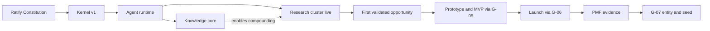

# EvolveOS Specification — Part XIV: Implementation Roadmap

**Status:** Draft v0.1 · **Change class:** R3 (standard amendment process, Part XII)

This part turns the architecture defined in `00-overview.md` through `13-failure-analysis.md` into a dated, resourced, dependency-ordered plan: from a 10-year phase arc down to the first week's daily tasks. It also owns the initial resourcing plan, including the **$10M initial deployable capital** figure that Part 0 §5 and `appendix-c-decision-gates.md` calibrate their thresholds against.

**[ASSUMPTION]** Build start is **2026-Q4** (first workday 2026-10-01). Rationale: the specification (Parts 0–XV) reaches ratifiable draft state in 2026-Q3; founding capital and the founding team (§13.1) are assumed committed by 2026-09-30. Every date below is anchored to this start and MUST be re-baselined by the same amendment that moves it.

---

## 1. The nested-horizon refinement rule (binding)

The roadmap is a set of **nested horizons**: 10-year → 5-year → 3-year → 12-month → quarterly → monthly → weekly → daily.

1. Each shorter horizon **MUST** be a strict refinement of its parent: it decomposes its parent's objectives for the covered period and **MUST NOT** introduce objectives absent from, or contradicting, the parent. WHY: without this rule, short-horizon urgency silently rewrites long-horizon strategy — the exact drift failure mode `13-failure-analysis.md` catalogs for human organizations, which EvolveOS must not inherit.
2. Changing a longer horizon **MUST** cascade: all child horizons are re-derived within one review cycle (§9) of the change.
3. Horizon documents beyond this file (operational quarterly/monthly plans) are maintained by `PORTFOLIO` and `PRIME` as R1 artifacts, but any change that alters a **milestone** in §10 or the **critical path** in §12 is R3 and follows the Part XII amendment process for this file.
4. Dates use `YYYY-Qn` or `YYYY-MM`. "Year N" (Y1…Y5) means the 12 months beginning at the build-start anniversary: Y1 = 2026-Q4→2027-Q3, Y2 = 2027-Q4→2028-Q3, and so on.

---

## 2. Horizon 1 — 10-year roadmap (2026–2036)

Five phases. Each phase's **exit criteria are measurable and MUST be met before the phase is declared complete** by the Executive Committee on `PRIME`'s evidence pack; declaring a phase complete without meeting exit criteria requires an explicit EC waiver recorded as a DR. WHY: phase inflation ("we're basically in Phase 2") is the roadmap version of gate shopping.

| Phase | Window | Name | One-line arc |
|---|---|---|---|
| **0** | 2026-Q4 → 2027-Q4 | Foundation | Kernel, agent runtime, knowledge core, gates live; first ventures run manual-heavy end-to-end |
| **1** | 2028-Q1 → 2029-Q2 | Pipeline proving | The validation factory works as a factory; first PMF; first entity (G-07) |
| **2** | 2029-Q3 → 2031-Q4 | Portfolio operations | 10–25 concurrent ventures; first exits and first acquisition; portfolio-level capital allocation real |
| **3** | 2032-Q1 → 2034-Q4 | Compounding | Knowledge moat visible in metrics; 25–100 ventures; self-evolution mature |
| **4** | 2035-Q1 → 2036-Q4 | Institution | External capital; possibly franchising the OS **[UNCERTAIN]** |

### 2.1 Phase 0 — Foundation (2026-Q4 → 2027-Q4)

**Objectives.**
- Ratify the Constitutional Layer (`00-overview.md`, `10-security.md`, `11-governance.md`, `appendix-c-decision-gates.md`) via the G-16 approval path **before any agent-initiated external spend**.
- Ship Kernel v1 (policy engine, identity, immutable audit log, Watchdogs — per `09-technology.md`, `10-security.md`) and the agent runtime.
- Stand up the knowledge core (`06-knowledge-system.md`): KI store, evidence packs, DR store, counterfactual ledger.
- Bring the spine and research cluster live (§4 waves 1–2) and push 2 ventures to MVP with humans doing everything the agents cannot yet do ("manual-heavy": humans execute, agents draft — effectively A0/A1 across the board regardless of registered ceilings).

**Exit criteria (all measurable).**
1. Milestones M1–M5 (§10) accepted.
2. ≥ 100 opportunities through G-01; ≥ 25 through G-02; ≥ 10 G-03 verdicts, each with pre-registered kill criteria (Kernel-verified).
3. ≥ 1 venture in PMF search with real revenue (M4).
4. Kernel audit: zero envelope violations that reached an external effect; 100% of R2+ decisions have DRs.
5. Weekly human A2 batch reviews (G-03/G-04 per `appendix-c-decision-gates.md` mechanics rule 4) have run ≥ 12 consecutive weeks without a skipped week.

**Dominant risks.** Platform-before-product death spiral (building the Kernel forever, launching nothing); founding-team key-person loss; spec ratification delay pushing all agent spend right; AI cost overrun **[UNCERTAIN]** (§13.3).

### 2.2 Phase 1 — Pipeline proving (2028-Q1 → 2029-Q2)

**Objectives.**
- Prove the pipeline is a repeatable factory, not artisanal: throughput and verdict quality measured per `01-philosophy.md` metrics (validation-verdict precision, cost per validated learning).
- First G-07: venture formation + seed (M6).
- Self-evolution loop live: `EVOLVE` running EPs through shadow mode to rollout (M7).
- Finance/legal/security hardening (§4 wave 5) so that money-touching automation is safe.

**Exit criteria.**
1. ≥ 300 cumulative G-01 intakes; ≥ 30 G-03 verdicts/quarter sustained for 2 quarters.
2. **Validation-verdict precision** (per `01-philosophy.md`) ≥ 0.6 on the trailing 12-month cohort of "proceed" verdicts (measured: proportion that reach their next-stage pre-registered success bar).
3. First entity formed at G-07 with IC quorum + GC (M6); ≥ 1 additional venture with PMF evidence pending G-07.
4. ≥ 10 EPs through the full Part XII loop; ≥ 1 measurable agent-performance improvement attributable to an EP (per `12-self-evolution.md` benchmark protocol).
5. Red-team (`RED-CELL`) hardening pass completed; `TREASURER` operating at A1 on live rails (dependency D7, §11).

**Dominant risks.** False-positive verdicts scaling faster than learning (precision below bar at volume); knowledge system producing plausible-but-stale KIs; first-entity legal/compliance surprises; over-automation of growth spend before unit economics instrumentation (`UNIT-ECON`) is trustworthy.

### 2.3 Phase 2 — Portfolio operations (2029-Q3 → 2031-Q4)

**Objectives.**
- Operate 10–25 concurrent ventures across pipeline stages with per-venture `VENTURE-ORCH` instances and cell isolation (`09-technology.md`).
- First acquisition (G-12, M8) and first exit (G-14, M9); corp-dev cluster (§4 wave 6) live.
- Portfolio-level capital allocation (`08-finance.md`) driving real reallocation: G-08 tranches and G-15 shutdowns both exercised routinely.
- External revenue covers a growing share of operating cost (§13.2 sensitivity).

**Exit criteria.**
1. 10–25 ventures active simultaneously for ≥ 2 consecutive quarters; ≥ 3 entities formed (G-07).
2. ≥ 1 acquisition closed (G-12, Board) and ≥ 1 exit or shutdown-with-asset-sale (G-14/G-15) completed with full post-mortem KIs.
3. **Portfolio learning rate** (Appendix A definition) positive on ≥ 2 of its 3 component measures (validation-verdict precision, forecast error, CAC efficiency at equal spend) for 4 consecutive quarters.
4. **Human-hours per active venture per week** (per `01-philosophy.md`) declining quarter-over-quarter while gate compliance stays at 100%.
5. Portfolio contribution margin positive (revenue + realizations exceed venture opex, excluding platform R&D) **[ASSUMPTION]** — the affordability bar for Phase 3 scale-up.

**Dominant risks.** Coordination collapse at 15+ ventures (T1 orchestrator contention); human-approver saturation at G-05/G-06 weekly cadence; correlated-bet concentration (many ventures sharing one hidden assumption — `13-failure-analysis.md` register); integration failure on the first acquisition.

### 2.4 Phase 3 — Compounding (2032-Q1 → 2034-Q4)

**Objectives.**
- Scale to 25–100 ventures with sublinear human growth; the knowledge moat becomes *externally visible in metrics*, not asserted: new-venture ramp time, CAC, and validation precision all better than public benchmarks and better than EvolveOS's own Phase 1 baselines.
- Self-evolution mature: majority of playbook improvements originate from `EVOLVE`/`PROMPT-SMITH` EPs, not human redesign; agent calibration scores drive automatic consensus re-weighting (`07-decision-engine.md`).
- Governance scales: committee structures per `11-governance.md` staffed independently (ARC fully independent of operators).

**Exit criteria.**
1. 25–100 ventures; ≥ 10 entities; ≥ 3 exits cumulative.
2. Median Discovery→G-03 cycle time ≤ 50% of Phase 1 median at equal or better precision.
3. New-venture time-to-first-revenue ≤ 50% of Phase 1 median (the compounding signature).
4. ≥ 60% of adopted EPs machine-originated; zero G-16 violations across the phase.
5. Portfolio net cash-flow positive including platform R&D **[ASSUMPTION]**.

**Dominant risks.** Knowledge poisoning at scale (bad KIs compounding as fast as good ones — `CURATOR` contradiction-detection load); regulatory regime shifts targeting autonomous commercial systems **[UNCERTAIN]**; model-capability plateau or cost inversion **[UNCERTAIN]** (§13.3); success-driven complacency in human oversight (rubber-stamping A1 gates).

### 2.5 Phase 4 — Institution (2035-Q1 → 2036-Q4)

**Objectives.**
- Accept external capital (fund structure or evergreen holding per `08-finance.md`; Board + IC decision, R4) with audited multi-year track record (M11).
- Evaluate **franchising the OS** — licensing the Kernel + Constitution + playbook corpus to external operators **[UNCERTAIN]**: this is attractive (capital-light scaling of the moat) but may be strategically wrong (moat dilution, liability surface). A dedicated DR with `STRAT-DIR`/`CORPDEV-DIR` analysis is the Phase 4 deliverable either way; the default is **not** to franchise until the compounding metrics of Phase 3 have held for 8+ quarters.
- Institutional durability: the system survives planned founder-role rotation without metric degradation (succession test per `11-governance.md`).

**Exit criteria.** External capital closed under LP-grade audit **or** an explicit, evidenced DR declining it; franchising DR decided; succession test passed.

**Dominant risks.** LP governance demands conflicting with the Constitutional Layer (external capital MUST NOT acquire the ability to bypass G-16 — a binding term sheet constraint); franchisee misuse of the OS creating portfolio-level liability; institutional ossification (the anti-principle set of `01-philosophy.md`).

---

## 3. Horizon 2 — 5-year roadmap (Y1–Y5: 2026-Q4 → 2031-Q3)

Refines Phases 0–2 into yearly objectives. Success/failure metrics cite `01-philosophy.md` scope by name; numeric bars here are **[ASSUMPTION]** (calibrated to the §13 funnel model) and are re-baselined yearly by the IC.

| Year | Phase | Objectives (refinement of §2) | Success metrics (names per `01-philosophy.md`) | Failure line (triggers §9 re-plan) |
|---|---|---|---|---|
| **Y1** 2026-Q4→2027-Q3 | 0 | Constitution ratified; Kernel v1 + runtime + knowledge core live; waves 1–3 agents live (§4); 120 intakes, 2 MVPs, first revenue | M1–M4 accepted; 100% DR coverage on R2+; decision latency at G-03 ≤ 7 days; cost per validated learning ≤ $12k **[ASSUMPTION]** | No M2 by 2027-Q2, or no revenue by 2027-Q4 |
| **Y2** 2027-Q4→2028-Q3 | 0→1 | Manual-heavy → A2 operation of pipeline gates G-01–G-04; growth cluster live; security hardening + treasury A1; first G-07; EP pipeline live | Validation-verdict precision ≥ 0.5; ≥ 20 G-03 verdicts/quarter; kill discipline: median time-from-kill-signal-to-kill ≤ 14 days; M5–M7 accepted | Precision < 0.35 on Y2 cohort, or zero G-07 candidates by 2028-Q3 |
| **Y3** 2028-Q4→2029-Q3 | 1→2 | Factory throughput: 30 verdicts/quarter sustained; 6–10 concurrent ventures; second/third G-07; corp-dev cluster spin-up (screening only, A0/A1) | Validation-verdict precision ≥ 0.6; portfolio learning rate positive on validation precision + forecast error; human-hours per venture ↓ QoQ | Learning rate flat/negative for 3 consecutive quarters |
| **Y4** 2029-Q4→2030-Q3 | 2 | 10–18 ventures; first acquisition (M8); first G-08 scale tranche; first routine G-15 shutdowns with KI harvest | CAC efficiency at equal spend improving QoQ; portfolio MOIC on realized+marked ≥ 1.0 **[ASSUMPTION]**; G-05/G-06 human review cycle ≤ 1 week sustained | Approver saturation (G-05 queue > 2 weeks) unresolved for a quarter |
| **Y5** 2030-Q4→2031-Q3 | 2 | 15–25 ventures; first exit (M9); portfolio contribution margin positive; Phase 2 exit-criteria evidence pack assembled | Portfolio learning rate positive on all 3 components; forecast error (revenue, 2-quarter horizon) ≤ 25% median absolute; ≥ 1 exit | Contribution margin negative with < 24 months reserve runway |

WHY yearly failure lines: Part 0 §5 requires computable kill criteria for ventures; the roadmap holds itself to the same standard. A failure line does not auto-kill EvolveOS — it forces an EC-level re-plan DR within 30 days.

---

## 4. Horizon 3 — 3-year capability roadmap (2026-Q4 → 2029-Q3)

Refines Y1–Y3 into **agent go-live waves**. "Live" means: agent card ratified (Part IV), envelope registered in the Kernel, operating at its intended autonomy inside the autonomy–reversibility matrix, with `EVALUATOR` benchmarks attached. Before an agent is live, its function is performed by humans (manual-heavy mode) — the *function* never waits for the *agent*.

**Sequencing logic (binding order, WHY per wave):**
1. **Spine first** — `PRIME`, `PORTFOLIO`, Kernel, knowledge core. Nothing else can act safely: the Kernel is the enforcement point for every later envelope, and without the knowledge core, early lessons (the cheapest ever available) are lost. Orchestrators precede specialists because task contracts (Appendix A) need issuers before executors.
2. **Research cluster second** — `SCOUT`, `TRENDS`, `DEEP-RES`, `VALIDATOR`. Highest value per risk: outputs are R1/R2, spend is small (G-01/G-02 envelopes), and the pipeline's front end generates the demand signal every later cluster serves. It also exercises gates G-01–G-03 while stakes are low.
3. **Build cluster third** — prototypes/MVPs only matter once validated opportunities exist; building before validating recreates the classic startup failure the pipeline exists to prevent.
4. **Growth cluster fourth** — paid spend (`ADS`) and outbound messaging (`OUTBOUND`) create external/brand exposure (R2→R3); they need live products, `UNIT-ECON` instrumentation, and G-17 discipline first.
5. **Finance/legal/security hardening fifth** — these run from day one at A0/A1 (books MUST be kept from the first dollar: `LEDGER` live early at A1), but *hardening to their registered ceilings* — and especially any treasury automation — waits for `RED-CELL` adversarial passes. WHY: money movement is the highest-severity abuse surface (`10-security.md`); automating it before hardening is sequencing malpractice.
6. **Corp-dev cluster last** — acquisitions require operating track record, trusted valuation models (`FIN-MODEL` calibration history), and Board-grade governance maturity. Doing M&A early maximizes both price paid and integration failure probability.

| Wave | Window | Goes live | Autonomy at go-live → target | Capability milestone (measurable) |
|---|---|---|---|---|
| **1 Spine** | 2026-Q4 | Kernel v1 + Watchdogs (non-agents); `PRIME`, `PORTFOLIO`; knowledge core with `KNOW-DIR`, `CURATOR`, `ARCHIVIST`; `EVALUATOR` (benchmark harness); `LEDGER` at A1 (books from first dollar) | A0/A1 shadow → registered ceilings in sandbox | **M1**: Kernel enforces envelopes in sandbox; audit log immutable; G-00 stop drill passes |
| **2 Research** | 2027-Q1 | `RSRCH-DIR`, `SCOUT`, `TRENDS`, `DEEP-RES`, `VALIDATOR`; `STRAT-DIR` + `COMP-INTEL` (thesis context); `INSIGHT` (readouts) | `SCOUT`/`TRENDS` A4-on-R1 immediately (outputs only); `VALIDATOR` A1→A2 | **M2**: first real Discovery→G-03 kill; ≥ 25 intakes/month sustained |
| **3 Build** | 2027-Q2 | `VENTURE-ORCH` (first instances), `PROD-DIR`, `ENG-DIR`, `INFRA-DIR`, `PROTO`, `BUILDER`, `QA`, `RELEASE`, `SRE`; `CUST-DISC`, `FIN-MODEL`, `PIPELINE-ENG`, `DATA-DIR` | A1 → A2/A3 inside sandbox cells, then venture cells | **M3**: first G-05 human-approved MVP built in a venture cell with QA + rollback proven |
| **4 Growth** | 2027-Q3→Q4 | `GROWTH-DIR`, `MKT-DIR`, `SALES-DIR`, `CS-DIR`, `ADS`, `CONTENT`, `LIFECYCLE`, `OUTBOUND`, `DEALDESK`, `PRICER`, `SUPPORT`, `ONBOARD`; `OPS-DIR` + `VENDOR` | A1 → A2 inside channel envelopes; `PRICER` stays A1 (live prices are R3) | **M4**: first revenue; paid channel running ≥ 4 weeks inside envelope with zero G-17 violations |
| **5 Hardening** | 2028-Q1→Q3 | To full ceilings: `FIN-DIR`, `TREASURER`, `FPA`, `UNIT-ECON`, `FRAUD-WATCH`; `LEGAL-DIR`, `COMPL-DIR`, `CONTRACTS`, `REG-WATCH`, `PRIVACY`; `SEC-DIR`, `RED-CELL`, `BLUE-CELL`; `RISK-DIR`, `RISK-QUANT`; `EVOLVE`, `AI-DIR`, `PROMPT-SMITH`; `PEOPLE-DIR`, `RECRUITER` | Finance/legal remain A1-heavy by ceiling; `TREASURER` A1 on live rails **only after** `RED-CELL` pass | **M6/M7**: first G-07 entity; EP pipeline live end-to-end (shadow → rollout → rollback drill) |
| **6 Corp-dev** | 2028-Q4→2029-Q3 | `CORPDEV-DIR`, `MNA-ANALYST` (A0/A1 screening first; LOI/close remain G-12 human decisions always) | A0 screening → A1 DD execution | First G-12 LOI-grade DD pack produced and IC-reviewed (dry run acceptable), by 2029-Q3 |

Re-tiering or ceiling changes discovered necessary during waves follow Part IV §7–§9 and gate G-16 — never this roadmap alone.

---

## 5. Horizon 4 — 12-month roadmap (2026-Q4 → 2027-Q3)

Refines Y1 into quarterly objectives.

| Quarter | Objectives (strict refinement of Y1) | Quarter-exit evidence |
|---|---|---|
| **2026-Q4** | Ratify Constitutional Layer (G-16 path); Kernel v1 + agent runtime + audit log; knowledge core schema live; wave-1 agents in sandbox; hire to 8 humans (§13.1); zero agent-initiated external spend until ratification | **M1** accepted; ratification DR signed (TSC quorum ≥3 + CEO); G-00 drill log |
| **2027-Q1** | Wave-2 research cluster live on real markets; G-01/G-02 flowing at `PORTFOLIO` A3-auto within envelopes; first G-03 verdicts incl. kills; weekly human A2 batch review cadence starts and never stops | **M2** accepted; ≥ 60 cumulative intakes; ≥ 5 G-03 verdicts with pre-registered kill criteria |
| **2027-Q2** | Wave-3 build cluster live; 2 ventures through G-04 into prototype; first G-05 (named human: Portfolio Review lead); venture cells provisioned per `09-technology.md` | **M3** accepted; 2 prototypes; 1 MVP in build; DR coverage audit clean |
| **2027-Q3** | First public launch (G-06 + G-17); wave-4 growth cluster starts; first revenue; Y1 retro drives Y2 re-baseline per §1 rule 2 | **M4** accepted; 1 venture in PMF search; Y1 metrics report vs §3 table published to EC |

---

## 6. Horizon 5 — First quarter in detail (2026-Q4, monthly)

| Month | Objectives (strict refinement of 2026-Q4) |
|---|---|
| **2026-10** | Team assembled (8 humans); dev infrastructure, repos, CI, cloud accounts under human-held credentials; Kernel design frozen (policy engine, identity model, audit-log schema) as ADRs per `09-technology.md`; ratification review of Parts 0/X/XI/Appendix C begins with TSC-designates; knowledge-core schema (KI, DR, evidence pack, counterfactual ledger) drafted |
| **2026-11** | Kernel v0 running in sandbox: envelope registration, tool-call interception, audit writes; **Constitutional Layer ratified** (target 2026-11-30) — the founding G-16-path act, prerequisite to any agent-initiated external spend (dependency D1, §11); `PRIME`/`PORTFOLIO` skeletons issue and receive task contracts in sandbox; `LEDGER` A1 bookkeeping live on real (human-executed) platform spend |
| **2026-12** | **M1** (2026-12-18 target): Kernel enforces envelopes in sandbox incl. A→A1 queue conversion (Appendix C mechanics rule 3) and G-00 stop drill; knowledge core ingesting sandbox DRs/KIs; wave-2 agent cards drafted for Part IV review; 2027-Q1 plan re-derived per §1 rule 2; holiday freeze 12-24→01-04 (no ceiling changes, Watchdogs on) |

---

## 7. Horizon 6 — First month in detail (2026-10, weekly)

Weeks are Monday-anchored; 10-01 (Thu) and 10-02 (Fri) form a W0 stub.

| Week | Objectives (strict refinement of 2026-10) |
|---|---|
| **W0** 10-01→10-02 | Founding kickoff: charter read-through of `00-overview.md` + appendices; roles/officer assignments confirmed; comms + credential hygiene bootstrapped (password vault, hardware keys — `10-security.md` day-zero controls) |
| **W1** 10-05→10-09 | Detailed in §8. Kernel architecture spike; environment bootstrap; ratification workplan; hiring pipeline for remaining platform engineer(s) opened via human process (G-09 plan) |
| **W2** 10-12→10-16 | Kernel ADR set drafted (policy engine choice, identity, audit store); agent-runtime ADR (orchestration substrate, task-contract schema); knowledge-core schema v0 review; CI/CD + sandbox cell pattern working |
| **W3** 10-19→10-23 | Kernel v0 skeleton: envelope registry + tool-call proxy in sandbox; audit log write-path with integrity checks (`ARCHIVIST` design input); TSC-designate ratification review session 1 (Parts 0 + Appendix C) |
| **W4** 10-26→10-30 | First `PRIME`→`PORTFOLIO` task contract executed in sandbox through the Kernel proxy; ratification review session 2 (Parts X + XI); month retro; November plan re-derived per §1 rule 2 |

---

## 8. Horizon 7 — First week in detail (W1: 2026-10-05 → 2026-10-09, daily)

| Day | Priorities |
|---|---|
| **Mon 10-05** | Full-team spec walkthrough: Part 0 taxonomies (R1–R4, A0–A4, the autonomy–reversibility matrix) until every human can classify actions unaided — this matrix is the load-bearing rule and everyone enforces it; assign ratification readers (TSC-designates) |
| **Tue 10-06** | Cloud org + account structure (portfolio root, sandbox cells, IAM boundaries per `09-technology.md`); repo + CI bootstrap; secrets management live before any credential is created anywhere else |
| **Wed 10-07** | Kernel design spike day 1: policy-engine evaluation (candidates per `09-technology.md`), audit-log storage options; decision framework drafted as ADR skeletons |
| **Thu 10-08** | Kernel design spike day 2: identity model for agents (per-agent identities, worker-class inheritance per `appendix-b-agent-registry.md` T4 rules); task-contract schema v0 |
| **Fri 10-09** | Week retro (30 min, becomes standing); W2 plan re-derived; hiring: platform-engineer role cases approved by CEO + CTO (G-09 hiring-plan path, human-executed); ratification calendar locked with TSC-designates |

---

## 9. Daily and weekly operating rhythm

Two distinct rhythms. Switching a venture (or the portfolio) from BUILD to OPERATE rhythm is an explicit `PORTFOLIO` action, logged.

### 9.1 BUILD-phase dailies (Phase 0, pre-M3)

| Cadence | Ritual | Who |
|---|---|---|
| Daily | Standup: milestone burn-down vs §10, blockers, spec-conflict triage | All humans; `PRIME` (once live) prepares the burn-down |
| Daily | Sandbox audit-log review: every Kernel interception from the prior day sampled | CTO + 1 rotating engineer |
| Weekly | Ratification/architecture review (ADRs, agent cards) | CTO, CISO(f), TSC-designates |
| Weekly | Capital burn vs §13.2 plan | CFO(f) + CEO |
| Weekly | Retro + next-week re-derivation (§1 rule 2) | All |

### 9.2 OPERATE-phase rhythm (from first live pipeline flow, 2027-Q1 onward)

| Cadence | Ritual | Who / gate basis |
|---|---|---|
| Daily | `PORTFOLIO` stage review: every venture's stage, envelope consumption, kill-criteria proximity; exceptions queued | `PORTFOLIO` (A2 output), Portfolio Review lead reads the digest |
| Daily | Incident review: security (`SEC-DIR`/`BLUE-CELL`), reliability (`SRE`), fraud holds (`FRAUD-WATCH`); any G-00 invocation from prior 24h reviewed first | CISO or delegate + CTO |
| Daily | Human A1 queue service: G-05/G-06 items, `TREASURER` movements, `PRICER` changes, `DEALDESK`/`CONTRACTS` items — SLA: nothing R3 waits > 5 business days (WHY: A1 queues that rot become rubber stamps or bottlenecks; both are failure modes) | Named approvers per `appendix-c-decision-gates.md` |
| Weekly | **A2 batch review** of G-03/G-04 decision lists with 7-day retroactive veto (Appendix C mechanics rule 4) — this cadence is constitutionally mandatory (A2 requires ≤ weekly review, Part 0 §6) and MUST NOT be skipped; a skipped week auto-downgrades affected agents to A1 (Kernel-enforced) | IC-delegate (Portfolio Review lead) |
| Weekly | Portfolio Review: G-05/G-06 approvals, venture deep-dives (2/week rotating) | Portfolio Review lead + `PORTFOLIO` |
| Weekly | Evolution review: EP queue, shadow-mode results, calibration drift (`EVALUATOR`) | CTO + `EVOLVE`; TSC items flagged |
| Monthly | IC session: G-02-above-envelope items, G-07/G-08 pipeline, capital reallocation | IC |
| Monthly | Risk & audit: register review (`RISK-DIR`), audit-log sampling, envelope-violation stats | ARC (or designates pre-Phase 2) |
| Quarterly | EC phase/roadmap review vs §2–§3; re-baseline cascade if needed | EC + Board observer |

---

## 10. Milestones

Acceptance is by DR with the named approver; a milestone slipping > 1 quarter triggers a §9 EC review and a re-baseline of child horizons.

| # | Milestone | Acceptance criteria (all required) | Target | Approver |
|---|---|---|---|---|
| **M1** | Kernel enforcing envelopes in sandbox | Envelope registry live; tool-call interception 100% of sandbox calls; A→A1 queue conversion demonstrated; immutable audit trail verified by replay; G-00 stop drill < 60s to halt | 2026-12 | CTO + CISO; TSC informed |
| **M2** | First end-to-end Discovery→G-03 kill on a real opportunity | Real (non-synthetic) opportunity through G-01→G-02→G-03 ending in a kill verdict against pre-registered criteria; DR + counterfactual-ledger entry + ≥ 1 KI written; weekly A2 batch review saw it | 2027-03 | Portfolio Review lead |
| **M3** | First G-05 human-approved MVP | G-05 passed by Portfolio Review lead with written top-3-risks + rollback acknowledgment (Appendix C mechanics rule 2); MVP deployed in an isolated venture cell; `QA` gate + `RELEASE` rollback proven | 2027-06 | Portfolio Review lead |
| **M4** | First revenue | ≥ 1 external customer paid real money on live rails; booked by `LEDGER`, reconciled; cohort instrumentation (`UNIT-ECON`) capturing from day one | 2027-09 | CFO |
| **M5** | First venture killed by pre-registered criteria, with post-mortem KI | A post-G-04 venture killed strictly on its pre-registered criteria (no override, no extension); post-mortem produces ≥ 3 validated KIs + counterfactual entry; kill executed ≤ 14 days from signal | 2027-11 | IC-delegate |
| **M6** | First G-07 entity formation | PMF evidence pack per `05-business-creation-pipeline.md`; IC quorum (≥3) + GC approval; entity formed, seed ≤ $1M allocated; venture envelope re-issued at entity scope | 2028-05 | IC + GC |
| **M7** | Self-evolution EP pipeline live | ≥ 1 EP full cycle: proposal → benchmark → shadow mode → staged rollout → post-rollout evaluation; rollback drill executed on a deliberate dud EP; Constitutional-Layer changes provably excluded (G-16 test) | 2028-09 | TSC |
| **M8** | First acquisition | G-12 both steps (LOI: IC quorum; close: Board majority); DD pack by `MNA-ANALYST` under `CORPDEV-DIR` A1; 100-day integration plan pre-registered with kill criteria; financing within `08-finance.md` limits | 2030-06 | Board |
| **M9** | First exit | G-14 Board majority; realized proceeds booked; full venture-lifecycle post-mortem corpus (formation→exit) versioned as playbooks | 2031-09 | Board |
| **M10** | Compounding evidenced | Phase 2 exit-criteria 3–4 (§2.3) met: portfolio learning rate positive on all components for 4 quarters; 25+ ventures | 2032-12 | EC + Board |
| **M11** | External capital **[UNCERTAIN]** | Audited multi-year track record; LP terms preserving Constitutional Layer inviolability (no external bypass of G-16); Board approval | 2035 | Board |

---

## 11. Dependencies

Binding dependency set. The Kernel MUST encode D1, D5, and D7 as enforceable preconditions (not conventions) — WHY: dependencies that live only in documents get skipped under schedule pressure; these three are the ones whose violation is unrecoverable or abusable.

| ID | Before | After | WHY (consequence of violating) |
|---|---|---|---|
| **D1** | Constitutional Layer ratified by humans (G-16 path) | ANY agent-initiated external spend or external action | Unratified gates mean agents act under rules no human has accepted; every later audit and approval inherits an illegitimate foundation. (Human-executed platform build spend under officer control is outside agent envelopes and may precede ratification.) |
| **D2** | Platform (Kernel + runtime + audit) | Any agent goes live | An agent without Kernel interception has no enforced envelope — its "autonomy ceiling" is fictional |
| **D3** | Knowledge core live | Scaling venture count past ~5 concurrent | Without memory, ventures don't compound — each venture re-pays full tuition and the portfolio is just a slower incubator. The moat (Part I) is the *delta* between venture N and venture N+1; no KI store, no delta |
| **D4** | Research cluster + G-01–G-03 flowing | Build cluster live | Building without a validated-opportunity queue optimizes construction of the wrong things |
| **D5** | Security hardening (`RED-CELL` pass, key management per `10-security.md`) | Treasury automation (`TREASURER` beyond A0 on live rails); `FRAUD-WATCH` auto-holds on real money | Money movement is the highest-severity abuse surface; automating it pre-hardening converts any compromise into direct capital loss |
| **D6** | `UNIT-ECON` + `INSIGHT` instrumentation live per venture | Growth cluster spend beyond G-06 test envelopes | Spending on acquisition without cohort economics is unmeasurable burn; CAC-efficiency learning requires the meter installed before the flow |
| **D7** | Pre-registered kill criteria at each gate | Capital release at that gate | Constitutional (Appendix C mechanics rule 1, Kernel-enforced); listed here because the roadmap's funnel math (§13.2) assumes kills actually execute |
| **D8** | PMF evidence + revenue history | G-07 entity formation | Entities are R4; forming them on validation-stage evidence converts cheap R2 kills into expensive R4 wind-downs (G-15) |
| **D9** | EP pipeline (M7) + `EVALUATOR` benchmarks | Scaling live agent count past wave 4 breadth | Without regression detection and calibration tracking, more agents means more unmeasured drift |
| **D10** | Operating track record + calibrated `FIN-MODEL`/`RISK-QUANT` | Corp-dev cluster activation (wave 6) | M&A priced by uncalibrated models is systematic overpayment; integration without operating playbooks is the classic acquirer failure |

---

## 12. Critical path

The critical path — the dependency chain whose slippage moves every milestone — is:

**Kernel → agent runtime → research cluster → first validated opportunity → first MVP (G-05) → PMF evidence → G-07.**

Everything else — growth automation, finance hardening, self-evolution, corp-dev — has float: it can slip weeks without moving M6. The chain above cannot.

**Biggest schedule risks, in order:**

1. **Kernel scope creep (threat to M1).** The Kernel is constitutionally load-bearing, which tempts gold-plating. Mitigation: M1's acceptance criteria are the *whole* v1 scope; everything else is post-M1 EPs. The Kernel team MUST ship the enforcing subset first.
2. **Ratification delay (threat to D1 and all live flow).** TSC-designate review of Parts 0/X/XI/Appendix C slipping past 2026-11 blocks every downstream date. Mitigation: ratification sessions calendar-locked in W1 (§8); scope disputes resolved by narrowing v1 policy content, never by skipping review.
3. **Validation throughput shortfall (threat to M2–M3).** If the research cluster produces too few credible opportunities, the build cluster starves. Mitigation: intake breadth is cheap (G-01 ≤ $2k); run wide. The funnel model (§13.2) assumes 4–5% intake→MVP conversion **[ASSUMPTION]** — monitored monthly from 2027-01.
4. **PMF is not schedulable (threat to M6).** The plan can guarantee shots on goal, not goals. Mitigation: 2 concurrent MVPs in Y1, 4–6 in Y2, so M6 needs one success from 6–8 attempts; M6's date is the roadmap's single widest confidence interval and is flagged as such to the IC.
5. **Human approver bandwidth (threat to Y3–Y4 throughput).** G-05/G-06 are named-human A1 gates by design; the Portfolio Review lead becomes the bottleneck near 15+ ventures. Mitigation: second Portfolio Review lead hired Y3 (§13.1); gate *thresholds* are never raised to relieve load without G-16.
6. **Model capability/cost trajectory [UNCERTAIN]** — see §13.3. Both directions are risks: a plateau extends manual-heavy operation (raising human cost); a rapid capability jump makes the waves conservative and invites unsafe shortcut pressure. The autonomy–reversibility matrix absorbs both: ceilings move only through G-16, never through enthusiasm.

---

## 13. Resource estimates

### 13.1 Team plan (humans by role by year)

**[ASSUMPTION]** Founding team of **8** (within the 6–10 envelope). Rationale: below 6, officer roles required by `11-governance.md` and Appendix C approver seats (IC quorum ≥ 3, TSC quorum ≥ 3) cannot be legitimately staffed even with fractional officers; above 10, Phase 0 burn shortens runway past the M6 confidence interval. "(f)" = fractional.

| Role | Y1 | Y2 | Y3 | Y4 | Y5 | Notes |
|---|---|---|---|---|---|---|
| CEO | 1 | 1 | 1 | 1 | 1 | EC chair; G-16 co-signer |
| CTO / chief architect | 1 | 1 | 1 | 1 | 1 | Kernel + platform owner; TSC |
| CFO | (f) | (f) | 1 | 1 | 1 | Full-time at first G-07/G-08 flow **[ASSUMPTION]** |
| General Counsel | (f) | (f) | (f) | 1 | 1 | Full-time when entities ≥ 3 |
| CISO | (f) | (f)→1 | 1 | 1 | 1 | Full-time before wave-5 treasury automation (D5) |
| Platform engineers | 3 | 4 | 5 | 6 | 6 | Kernel, runtime, knowledge core, cells |
| Portfolio Review lead | 1 | 1 | 2 | 2 | 3 | Named G-05/G-06 approver; second seat Y3 (risk 5, §12) |
| Head of People | — | (f) | (f) | 1 | 1 | G-09 approver; fractional until venture hiring starts |
| Data/AI platform engineer | — | 1 | 1 | 2 | 2 | Eval infra with `AI-DIR`/`EVALUATOR` |
| Independent committee members (ARC/TSC seats) | 2 (advisory) | 2 | 3 | 3 | 4 | Compensated externals; ARC independence hard requirement by Phase 2 |
| **Total FTE-equivalent** | **~7.5** | **~10** | **~13.5** | **~17** | **~18** | Sublinear vs venture count — the design point |

WHY sublinear: the `01-philosophy.md` human-hours-per-venture metric falls only if headcount does not track venture count; hiring linearly would concede the core thesis.

### 13.2 Capital plan — the $10M

**[ASSUMPTION]** $10.0M initial deployable capital, committed at build start. This is the figure Part 0 §5 and `appendix-c-decision-gates.md` calibrate R-class dollar thresholds and gate envelopes against; if the actual raise differs by > 2×, the IC MUST re-ratify all thresholds (Appendix C rule) before first agent spend. Rationale for $10M: it funds the platform build **plus** a statistically meaningful venture funnel (≥ 6 MVP attempts before M6) **plus** ≥ 20% reserves; at $5M the funnel shrinks below meaningful sample size, and above $20M the discipline pressure that makes kill criteria bite is diluted.

| Bucket | Amount | Contents | Justification |
|---|---|---|---|
| Platform build | **$3.2M** | Y1–Y2 platform/eng compensation share, Kernel + runtime + knowledge core + cell infra, security tooling | The moat's substrate; front-loaded because everything on the critical path (§12) sits here |
| Venture experiments | **$3.0M** | The gate-envelope funnel: Y1–Y3 spend through G-01…G-06 (model below) | Buys the shots on goal; sized to ≥ 6 MVP attempts and 2+ GTM programs before M6 |
| First seeds (G-07/G-08) | **$1.0M** | First entity seed (≤ $1M per Appendix C) | Reserved, not pooled with experiments — seeds are R4 and IC-gated |
| AI/compute + tooling opex | **$0.8M** | Model API/inference, eval runs, data, SaaS | Bracketed in §13.3 **[UNCERTAIN]**; overruns draw on reserves first |
| Reserves & contingency | **$2.0M** | Unallocated (20%) | Covers §13.3 high-scenario AI costs, M6 slip, or one legal/security incident; release is an IC decision |
| **Total** | **$10.0M** | | |

**Funnel model behind the venture bucket [ASSUMPTION]** (3-year cumulative, average spend below envelope caps because kills terminate spend early): ~350 G-01 intakes @ avg $1.5k = $0.53M; ~90 G-02 validations @ avg $7k = $0.63M; ~28 G-03 passes into discovery @ avg $10k = $0.28M; ~14 G-04 prototypes @ avg $20k = $0.28M; ~7 G-05 MVPs @ avg $120k = $0.84M; ~3 G-06 GTM programs @ avg $150k total = $0.45M. Sum ≈ **$3.0M**. Implied intake→MVP conversion 2%, MVP→G-07 1-in-6 — deliberately conservative vs `05-business-creation-pipeline.md` targets; if actuals beat the model, surplus stays in the bucket and widens the funnel rather than deepening any single bet (anti-concentration rule, `08-finance.md`).

**[ASSUMPTION]** From 2028 onward, venture revenue and G-15 asset recoveries partially recycle into the experiment bucket; the plan does **not** assume profitability before Y5 (§2.3 exit criterion 5) and does not assume a follow-on raise before Phase 4 — if either assumption breaks, the cut order below executes.

### 13.3 AI/compute cost model [UNCERTAIN]

The dominant unknown over 10 years is the joint trajectory of model capability and cost. Committing a point estimate would be false precision; the plan brackets:

| Scenario | Assumption | Y1 monthly AI spend | Y3 monthly | Y5 monthly | Consequence |
|---|---|---|---|---|---|
| **Low** | Cost per unit of useful cognition falls ~40%/yr; capability gains let mid-tier models handle T3/T4 work | $12k | $25k | $45k | AI opex stays inside the $0.8M bucket through Y3; autonomy waves may run *ahead* of plan capability-wise (ceilings still G-16-gated) |
| **High** | Frontier-model dependence persists for T1/T2 reasoning; token volume grows faster than prices fall; eval/shadow-mode overhead ~2× production inference | $35k | $90k | $180k | Bucket exhausted mid-Y2; reserves cover through Y3; §13.4 cut order triggers by Y3 without revenue offset |

**Sensitivity.** The single largest driver is **`DEEP-RES`/`VALIDATOR` token volume × funnel width** (research is the highest-volume cognition in the system), followed by `EVALUATOR`/`EVOLVE` benchmark and shadow-mode overhead (which scales with EP cadence, not venture count). The controllable lever is therefore funnel width — which is also the first venture-side cut (§13.4). `AI-DIR` owns a monthly cost-per-stage report from 2027-Q1; a 2-consecutive-month breach of the high-scenario curve is an automatic IC agenda item. Ten-year extrapolation is not attempted: **[UNCERTAIN]** — any figure past Y5 would be theater; instead the EC re-brackets this table annually.

### 13.4 What gets cut first if capital tightens (binding order)

If reserves fall below 12 months of committed burn, cuts execute in this order — pre-committed now, WHY: cut decisions made during a crunch systematically sacrifice long-term assets (memory, safety) for short-term optics; ordering them in advance while calm is the only defense.

1. **Corp-dev cluster** (wave 6) — deferred entirely. M&A is optional; organic pipeline is not.
2. **Funnel width** — G-01 intake rate and parallel validation count halved. Slows learning linearly; destroys nothing.
3. **Growth-cluster automation depth** — `ADS`/`OUTBOUND`/`LIFECYCLE` scope frozen; growth executed manual-heavy by humans within smaller G-06 envelopes.
4. **Self-evolution cadence** — EP throughput reduced to safety-critical EPs only; `PROMPT-SMITH` optimization paused.
5. **New MVP starts** — existing MVPs continue to their pre-registered kill/success criteria; no new G-05 submissions.

**Never cut, in any scenario:** the Kernel and Watchdogs; the audit log; the knowledge core and `CURATOR`/`ARCHIVIST` operation; security operations (`SEC-DIR`/`BLUE-CELL`); human gate reviews and A2 batch cadences; `LEDGER` integrity. WHY: these are the components whose absence is unrecoverable (lost memory, lost auditability) or catastrophic (unenforced envelopes, unwatched money). A version of EvolveOS without them is not a smaller EvolveOS; it is a different and indefensible system.

---

## 14. Roadmap governance

- This file is owned by the Founding Architecture Group and amended as class R3 via the Part XII process (`12-self-evolution.md`), except: any change that weakens a dependency in §11 (D1, D5, D7 especially) or relaxes §13.4's "never cut" list touches Constitutional-Layer guarantees and MUST route through **G-16**.
- `PRIME` maintains the live burn-down against §10 milestones and reports variance to the EC quarterly (§9.2).
- Every milestone acceptance and every re-baseline is a DR, with the counterfactual ledger recording the schedule not taken.

*End of Part XIV.*
